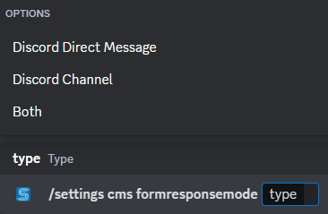

# Form Status Updates

Sonoran Bot can now ping users on Discord when their form or application statuses are updated in CMS.&#x20;

To change these settings, do `/settings cms formresponsemode <type>` as shown:

<figure><figcaption>
Sonoran CMS - Discord Bot Form Response Mode
</figcaption></figure>

`Type` can be set to ping in Discord via Direct Message, in a specified Discord channel, or both.
