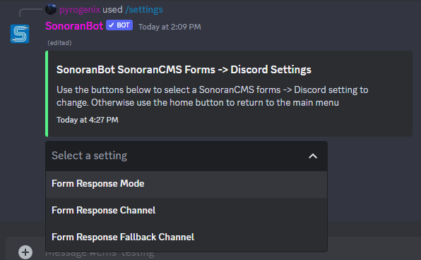
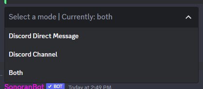

# Form Status Updates

Sonoran Bot can now ping users on Discord when their form or application statuses are updated in CMS.&#x20;

To change these settings, open the `/settings` menu, then in the dropdown click `CMS Settings`, and from there select `SonoranCMS Forms -> Discord`. Here you can set the form response mode, channel and fallback channel.

<figure><figcaption>
Sonoran CMS - Discord Bot Form Settings
</figcaption></figure>

`Form Response Mode` can be set to ping in Discord via Direct Message, in a specified Discord channel, or both. If set to `Discord Channel` or `Both`, the `Form Response Channel` is the channel where this message will be posted.

<figure><figcaption>
Sonoran CMS - Discord Bot Form Response Mode
</figcaption></figure>
