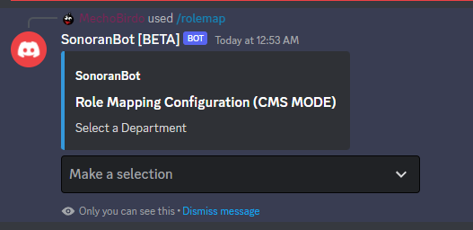
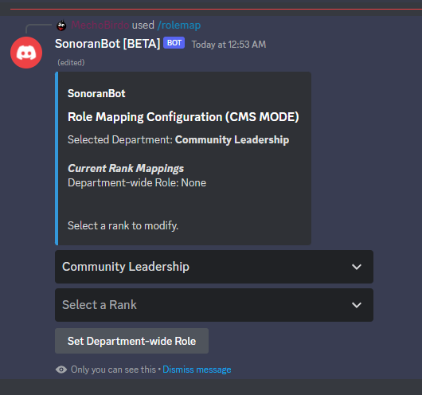
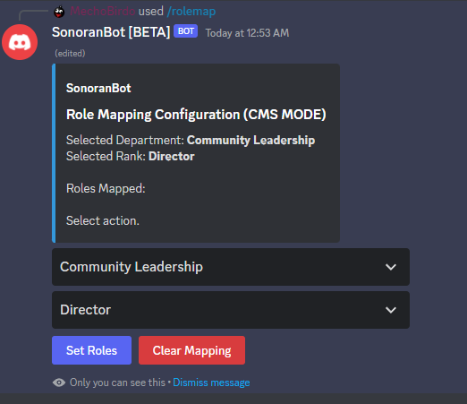
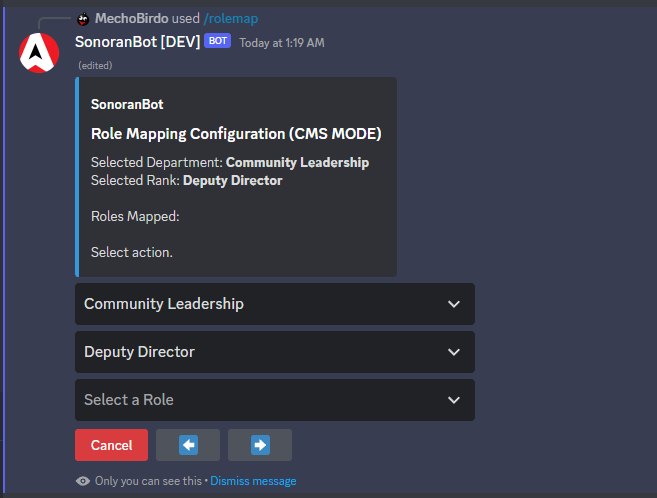
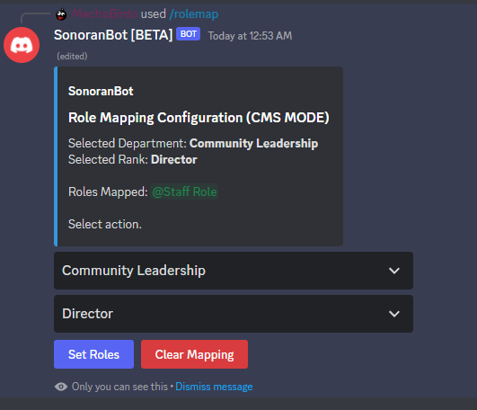

# Permissions Synchronization



## Getting Started


By default, **only Administrators of the Discord guild can access the commands** below. These can be changed in the Settings menu of the server.


### 1. Discord SSO Linking

Users must link their Discord to their Sonoran account. This will also automatically add their Discord [API ID](../../../developer-api-documentation/api-integration/getting-started/api-id-system.md).

#### Enable Discord Sync

* In the Administration panel select `Advanced` -> `API Integration`
* Toggle the `Discord Bot Integration` box

<figure><figcaption>
Sonoran CMS - Enable Discord Bot
</figcaption></figure>

#### Link your Discord Account

Once enabled in the CMS, users who do not yet have their Discord account linked with their Sonoran account will see the following banner:

<figure><figcaption>
Sonoran CMS - Link Your Discord Account
</figcaption></figure>

### 2. Role Mapping

The command `/rolemap` can now be used.

The following image is when a CMS mode is selected.

<figure><figcaption>
Options when set to To CMS or Bi Directional CMS
</figcaption></figure>

Select a department, rank you wish to modify, and the role you wish to apply to the rank.

<figure><figcaption></figcaption></figure>

The "Set Department-wide Role" button will automatically assign the Department (in this example, Community Leadership) to anyone with the role you select.

<figure><figcaption>
Click "Select Roles"
</figcaption></figure>

<figure><figcaption>
Use the left and right arrows to page if you have more than 25 roles.
</figcaption></figure>

<figure><figcaption></figcaption></figure>

The "Staff Role" will get the rank "Director" in the CMS.

This is only an example! At any time, you can change the dropdowns to select another Department or Rank.

## Role Syncing


Unlike the CAD sync mode, users will not use the `/linkme` command - this is handled within the Sonoran Account SSO.


After setting up the above, the command `/syncroles` will set up everyone's permissions.
