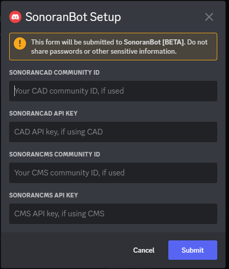

# Getting Started

<figure><figcaption>
Sonoran CMS - Discord Sync
</figcaption></figure>


Sonoran Bot x Sonoran CMS - Setup


## Setup


Setting up the bot requires you to have the "Manage Server" permissions on the Discord server for security reasons. You must also have access to your server's [API Key information](../../developer-api-documentation/api-integration/getting-started/retrieving-your-credentials.md).


### 1. Invite the Bot to Your Server

[Invite the bot to your Discord server.](https://discord.com/api/oauth2/authorize?client\_id=1060274480930361424\&permissions=9395241984\&scope=bot%20applications.commands)

You must have the "Manage Server" permission to add bots; plus any permissions the bot requires to function.

### 2. Run the Setup command

* After inviting the bot, run the `/setup` command.
* Enter your [Sonoran CMS ID and API key](../../developer-api-documentation/api-integration/getting-started/#gather-your-credentials).
* (OPTIONAL) Enter your [Sonoran CAD ID and API key](https://info.sonorancad.com/sonoran-cad/api-integration/getting-started/retrieving-your-credentials).

<figure><figcaption></figcaption></figure>

You will then be presented with the results of the setup.

<figure><figcaption></figcaption></figure>

Note: When setting up the bot, it will automatically be set to CMS sync mode if you opted to link your CMS community.

### **3. Invite to Additional Servers**

If your community uses multiple discord servers, you can link them all to the same community to utilize the permissions sync easily using the `/guildlink` command, as shown below. (2).png>)

<figure><figcaption></figcaption></figure>

Fill out the information (using either your CAD or CMS information), and you will receive a confirmation. At this point, you can use the other commands just like on the primary server.

 (3).png>)

## Command Reference

Learn more about the available slash commands with Sonoran Bot:


[commands-reference.md](commands-reference.md)

