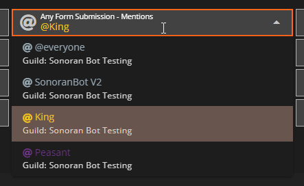

# Discord Webhooks




**Notice:** Managing Discord Webhooks now requires Sonoran Bot as of [v0.5.56](../roadmap/changelog.md#v0.5.56-beta-pending-release)!


### 1. Invite & Configure Sonoran Bot

In the Sonoran CMS Administrator Panel, under Advanced select `Integrations`> `Discord`\
In order to configure your Sonoran CMS Webhooks you must invite and configure Sonoran Bot. Follow each step in the setup process stepper directly in the Sonoran CMS UI.

<figure><figcaption>
Sonoran CMS - Discord Webhook Setup - Sonoran Bot Setup
</figcaption></figure>

### 2. Configure the Sonoran CMS Webhook

Select the channel you want your webhook logs to send to for each log type\
When you are done editing, click anywhere outside and it will automatically save any changes.

### 3. Role Mention

In the middle drop down menu you can select any roles you would like to be mentioned in the webhook. You can select as many roles as you wish and this will mention these roles at the beginning of the message.

<figure><figcaption>
Sonoran CMS - Discord Webhook Mentions Menu
</figcaption></figure>

Alternatively, if you would like to integrate the mention into the content message, you can also manually mention roles.


Copying IDs in Discord requires Developer mode to be enabled.

\
Go to `User Settings` > `Advanced` > `enable Developer Mode`


To tag and mention a role in the webhook edit the `Webhook Content` box and format the mention as `<@&ID>` with `ID` being the Discord Role ID.

You can copy a Discord Role ID in your Discord server's `Settings` > `Roles` > Right-Click on the role > `Copy ID`

You can also right-click on any user's role in their profile popup and copy the Role ID from there.

Example: `<@&1234567890>`

<figure><figcaption>
Discord Role ID Copy
</figcaption></figure>

### 4. User Mention


Copying IDs in Discord requires Developer mode to be enabled.

\
Go to `User Settings` > `Advanced` > `enable Developer Mode`


To tag and mention a user in the webhook edit the `Webhook Content` box and format the mention as `<@ID>` with `ID` being the Discord User ID.

You can copy a Discord User ID in your Discord. Right-Click on the user > `Copy ID`

Example: `<@1234567890>`
