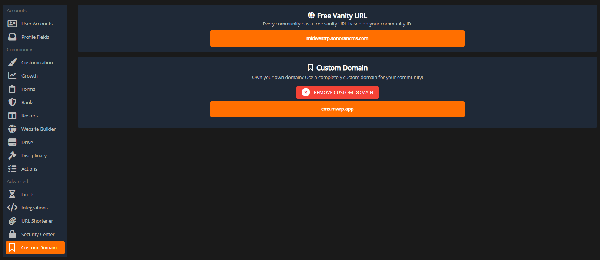

# Vision

## What Is ER:LC Vision?

CMS Vision for ER:LC lets users hover over a player’s in-game name, press a keybind, and instantly open an overlay displaying that player’s latest activity with the ability to create [custom records](player-records.md) on the spot. By eliminating the need to leave the game to access or manage records, it streamlines workflows and significantly reduces response time.

## Using Vision

### Vision Settings

Keybinds

Vision keybinds and other settings are available under **Community Settings** > **Vision**

By default, the vision keybind is **Command/Control + Shift + O**. This can be customized by clicking on the keybind to record, pressing a new keybind combination, and clicking to save it.

<figure><figcaption></figcaption></figure>

Capture Zone

Vision captures a small area around your cursor to detect and search for usernames. The capture box can be adjusted in size and vertically offset from the cursor for precise alignment. Use the eye icon to preview the exact dimensions and position of the capture area in real time.

<figure><figcaption></figcaption></figure>

Server Selection

The CMS ER:LC panel supports configuring multiple servers under a single community. By default, Vision selects the first server in the list. If your community has multiple servers configured, a server selection option will appear in the Vision settings—make sure to choose the server you are currently playing in to ensure accurate data.

### Mac OSX Permissions

Granting Vision Access on OSX

On Mac OSX, Vision requires explicit permissions to access your screen. If not granted, a red notice will appear in the settings menu. Select **Open System Settings** > **Select the + Symbol** > Select **Sonoran CMS** from your **Applications** folder.

<figure><figcaption></figcaption></figure> <figure><figcaption></figcaption></figure>

### Vision In-Game

#### 1. Open the CMS Community

Open the CMS desktop application for OSX or Windows, then open the CMS community that you are in.

#### 2. Hover and Hotkey

Once in-game, with the CMS application and community open, move your cursor just below a username and press your hotkey combination.

#### 3. Access the Player Menu

Once the hotkey is pressed, the player card popup will display on your screen.

* Press **ESC** to close this menu
* Press **Left Arrow Key** to access the [new record panel](player-records.md)
* Press **Right Arrow Key** to access the player's [recent activity](dashboard.md#latest-activity)

<figure><figcaption></figcaption></figure>
