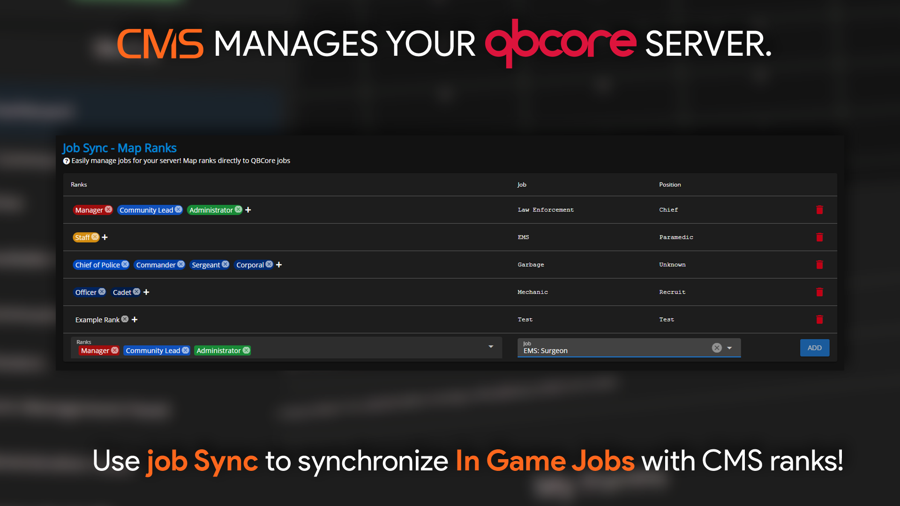
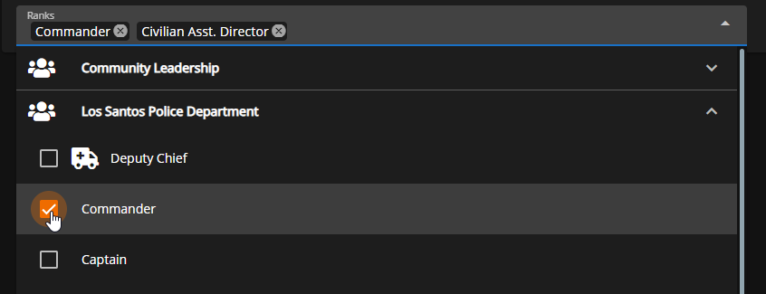
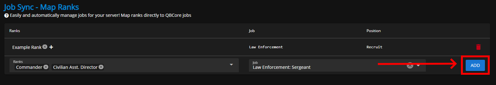

# Job Sync

<figure><figcaption>
Sonoran CMS - QBCore Game Panel Promotional Image
</figcaption></figure>

## Managing Job Sync

Select the rank(s) which you would like to associate with a given job in-game on the left box, then select the job in the right box.

When a player has the job in-game, they will be granted the associated CMS ranks. This allows you to restrict permissions for Sonoran CAD, Radio, etc. to specific character jobs only.

<figure><figcaption>
Sonoran CMS - QBCore Game Panel - Job Sync - Select Rank
</figcaption></figure>

Click `ADD` to add that mapping to the Job Sync list. Repeat for however many jobs you need to sync. If needed, you can delete a mapping with the red trash button on the right.

<figure><figcaption>
Sonoran CMS - QBCore Game Panel - Job Sync - Add Mapping
</figcaption></figure>
