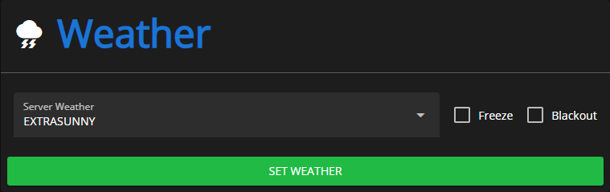
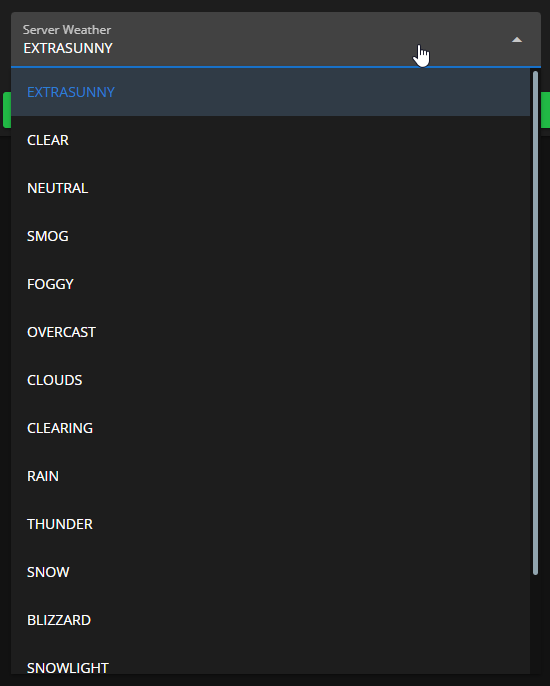
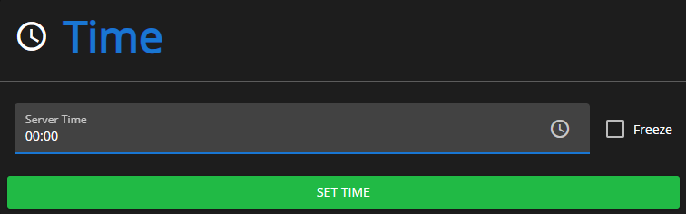

# Environment

<figure><figcaption>
Sonoran CMS - VMenu Game Panel Promotional Image
</figcaption></figure>

## Manage Weather

Here you can set the current weather on your server. Open the dropdown menu and choose from 15 different weather options! You can also toggle `Freeze` and `Blackout` on the side.

`Freeze` forces the weather to stay as what you set it to, if toggled, it will not change on its own.

`Blackout` simulates a power outage, and all buildings will show as if they don't have electricity.

<figure><figcaption>
Sonoran CMS - VMenu Game Panel - Weather
</figcaption></figure>

<figure><figcaption>
Sonoran CMS - VMenu Game Panel - Weather Options
</figcaption></figure>

## Manage Time

You can also set the time to any time of day using the time selector. You can also toggle `Freeze` which locks the time to whatever you've set it to.

<figure><figcaption>
Sonoran CMS - VMenu Game Panel - Time
</figcaption></figure>

## Weather Flickering Issue

Sometimes, having CMS installed can cause an issue where the weather and time in the server seem to rapidly "flicker". This occurs when another resource is also trying to manage weather.

If you are encountering this issue and would like to disable CMS's weather management, then please set `Config.EnableWeatherSync` to `false` in the resource's `config.lua`.
