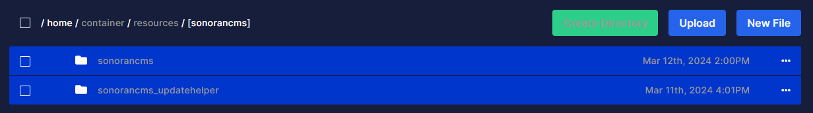

# FiveM Installation

## A. One-Click Installation (RocketNode)

We've partnered with Rocket Node to bring you one-click Sonoran CMS installation for FiveM — making it easier than ever to host your community and connect with Sonoran CMS.

* [Purchase your FiveM Game Server!](https://sonoran.link/FA2ZbwUb)
* Use code `SONORAN` to save big!



After installation, learn about configuring the submodule features.


[free-plugin-installation-next-steps.md](free-plugin-installation-next-steps.md)


***

## B. Pre-Configured Resource Installation <a href="#pre-configured-resource-installation-recommended" id="pre-configured-resource-installation-recommended"></a>

### 1. Download the Resource

Click [<mark style="color:blue;">here</mark>](https://github.com/Sonoran-Software/sonorancms_core/releases) to download the core resource.

### 2. Install the Resource

Extract the \[sonorancms] folder into your server's resources folder.



### 3. Configure and Rename

Open `sonorancms\config.CHANGEME.lua`, update the values, then save it as `config.lua`.

Default configuration is below:

#### Configuration Details

<details>

<summary>Configuration Options</summary>

| Config Option      | Description                                                                                                                                                                       |
| ------------------ | --------------------------------------------------------------------------------------------------------------------------------------------------------------------------------- |
| APIKey             | API Key found in the API Integration section of the Administrative Panel                                                                                                          |
| CommID             | Community ID found in the API Integration section of the Administrative Panel                                                                                                     |
| allowAutoUpdate    | When enabled, the resource will update itself. When disabled, it will simply show an update notification every 2 hours.                                                           |
| debug\_mode        | <p>When set to <code>true</code>, useful debugging information it outputted to the console.<br>Keep disabled in production due to console spam.</p>                               |
| apiUrl             | Default: `https://api.sonorancms.com/`                                                                                                                                            |
| apiIdType          | Type of api ID the core script should be searching for: `discord`, `steam`, `license`, etc.                                                                                       |
| serverId           | Default: `1` - ID of the Sonoran CMS server that this core resource should be tied to.                                                                                            |
| framework          | `none`, `qb-core`, or `esx`                                                                                                                                                       |
| MaxInventorySlots  | If using framework: `qb-core` you can specify the max inventory slots your inventory resource supports, this is for inventory management via the Game Panel's within Sonoran CMS. |
| restartWithPlayers | When set to `true`, it will auto-update the resource and restart it even if players are present on the server.                                                                    |

</details>

### 4. Server Config

Add the following to your `server.cfg`


It is very important that the sonorancms\_updatehelper resource is **not** started manually. Doing so may cause a server crash if updates are available due to a race condition.

**DO NOT** start the whole \[sonorancms] folder as that will also start the sonorancms\_updatehelper which might cause crashing if it is started manually.

Example of what **not** to do: `ensure [sonorancms]`


```javascript
exec @sonorancms/sonorancms.cfg
```

### 5. Configure Submodule Features

The CMS Core resource comes with a variety of submodules included by default. These handle a variety of features such as whitelisting, permission synchronization, and more.


[free-plugin-installation-next-steps.md](free-plugin-installation-next-steps.md)


***

## Updates

Sonoran CMS's core will automatically update with the latest features, fixes, and changes!

## Troubleshooting

### Server Crashes

Check to make sure `sonorancms_updatehelper` is not being started in your server.cfg.


It is very important that the `sonorancms_updatehelper` resource is not started manually. Doing so may cause a server crash if updates are available due to a race condition.


### Ensure your resource is up-to-date and download the latest release.

CMS updates are released often. Make sure your server is running on the latest release.

### Ensure your API ID is set correctly.

If your community is using recommended Discord integration, ensure your [Discord account](https://info.sonoranbot.com/en/tutorials/getting-started/sonoran-cms-integration#h-1-discord-sso-linking) is linked.

For other methods (Steam, FiveM License, etc.) ensure you have set your [API ID in the CMS](../../../developer-api-documentation/api-integration/getting-started/api-id-system.md) using the API ID that your community is looking for.

### Yarn Error

Some users will see this in their server console:

```
[ script:yarn] Error: [yarn] error @discordjs/collection@1.5.3: The engine "node" is incompatible with this module. Expected version ">=16.11.0". Got "16.9.1"
[ script:yarn] Error: [yarn] error Found incompatible module.
[ script:yarn] [yarn] info Visit https://yarnpkg.com/en/docs/cli/install for documentation about this command.
[ citizen-server-impl] Building resource sonorancms failed.
[ citizen-server-impl] Error data: yarn failed!
```

In the case of this error, please locate the file named `.yarn.installed`, open it in any editor, then save it (without modifying anything).

This updates the "date modified" value for that file, which should then allow it to build correctly.

If you are having trouble with this, feel free to[ reach out to us](https://support.sonoransoftware.com), our support team will be happy to help you!

### "config.NEW.lua was found!"

This log message means there was an update to the `sonorancms` resource that contains a configuration update. All you have to do is copy the contents from the `config.NEW.lua` file into your current configuration file then delete the `config.NEW.lua` file and restart `sonorancms` to resolve this message.

If you are having trouble with this, feel free to[ reach out to us](https://support.sonoransoftware.com), our support team will be happy to help you!
