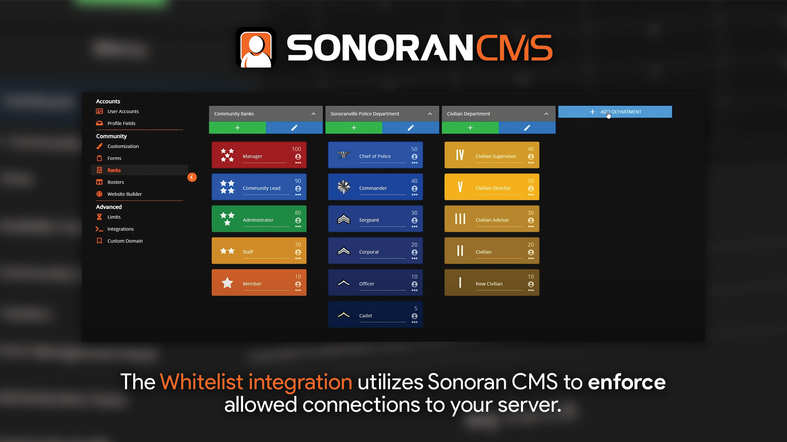
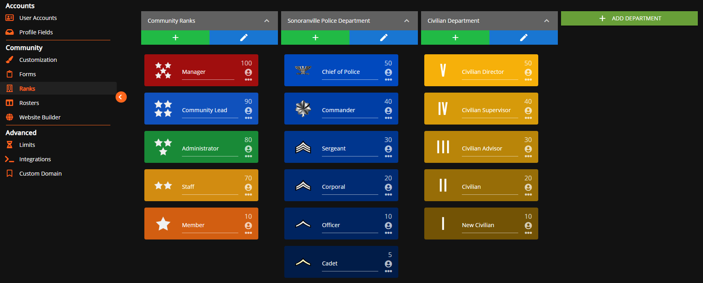
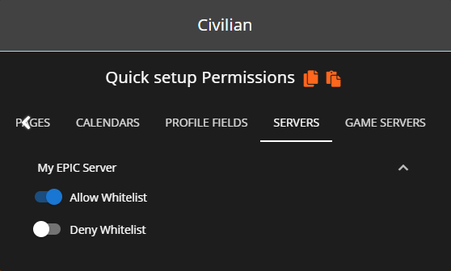

# Whitelist


Looking for VPS, web, or dedicated hosting? Check out our official [server hosting](../../../../other-products/server-hosting.md)!


This whitelist module utilizes Sonoran CMS's to enforce player connections.



## Whitelisting on QBCore / VMenu

If using QBCore or VMenu on your server, it is recommended that you control whitelisting through their respective game panels, rather than through this plugin. For more information, see the links below:\
[QBCore Game Panel - Whitelisting](../../../fivem-game-panel/qbcore-and-qbox-panel/whitelist.md)&#x20;

[VMenu Game Panel - Whitelisting](../../../fivem-game-panel/vmenu-panel/whitelist.md)

## Installation / Configuration


With core version `v1.4.0` the Whitelist resource was converted to a core module and no longer requires manual installation just configuration.


### 1. Configure Clock In Module

Locate the `whitelist` module within your `[sonorancms]/sonorancms/server/modules` folder and rename `whitelist_config.dist.json` so that it is just `whitelist_config.json`.&#x20;

Next, open the `whitelist_config.json` file and set `enabled` to `true`.

## Configuration

| Config Option | Description                                                                                                                |
| ------------- | -------------------------------------------------------------------------------------------------------------------------- |
| enabled       | If set to `true` it will enable a whitelist for your server and only individuals granted _Allow Whitelist_ as shown below. |

### 2. Setup Whitelist Permissions

Navigate to the Rank Manager within the Administrative Panel.

`Administrative Panel` > `Ranks`

For users in your Sonoran CMS community to be accepted through the whitelist, they'll need to be granted permission for the whitelist through rank permissions.

Granting each rank the permission of **Allow Whitelist** allows those members through the whitelist.

Granting each rank with the permission of **Block Whitelist** blocks users from passing through the whitelist.


**Block Whitelist** will ALWAYS overrule **Allow Whitelist**\
\
If a user is granted both **Block Whitelist** and **Allow Whitelist** through various ranks they will be blocked from the whitelist. Block will always overrule allow.


### 3. Add your API ID

Ensure all players have added their [API ID](../../../../developer-api-documentation/api-integration/getting-started/api-id-system.md) to the CMS!

## Reliability Notice

In the event that the CMS API is temporarily unavailable, this resource utilizes a local backup cache. The resource will automatically fall back to the latest saved version of the whitelist, allowing members to join as normal.
