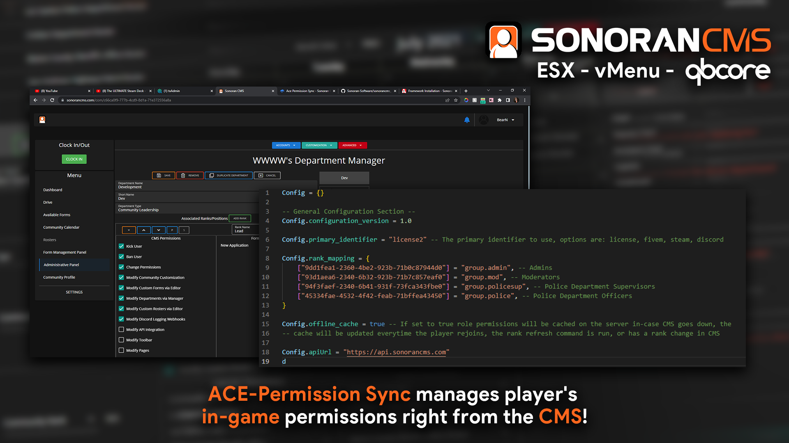

# Ace Permission Sync


This resource utilizes API endpoints that require the **standard** version of Sonoran CMS or higher. For more information, view our [pricing ](../../../../pricing/pricing-faq/)page.\
\
You must have the **Plus** version of Sonoran CMS or higher to utilize the push event functionality for live in-game syncing.



Looking for VPS, web, or dedicated hosting? Check out our official [server hosting](../../../../other-products/server-hosting.md)!


This resource manages player's in-game permissions right from the CMS!





### Installation

### 1. Download the Core Resource

This resource requires the [CMS core](core.md) for push event handling and API key configuration.

### 2. Download the Ace Permission Sync Resource

Click [<mark style="color:blue;">here</mark>](https://github.com/Sonoran-Software/cms\_ace\_perms/releases) to download the sync resource.

### 3. Install the Resource

Follow the [standard resource installation guide](../gta-rp-resource-installation/) for the whitelist resource.

### 4. Grant Resource Permissions

Add the following to your `server.cfg` (if you don't permissions won't be able to be granted)

```
add_ace resource.sonorancms_ace_perms command allow
```

### 5. Add your API ID

Ensure all players have added their [API ID](../../../../developer-api-documentation/api-integration/getting-started/api-id-system.md) to the CMS!

## Configuration

| Config Option       | Description                                                                                                                                                                                                             |
| ------------------- | ----------------------------------------------------------------------------------------------------------------------------------------------------------------------------------------------------------------------- |
| primary\_identifier | <p>Default: <code>license2</code><br>Controls which type of API ID is used by the script.<br><br>Options: <code>fivem</code>, <code>discord</code>, <code>steam</code>, <code>license2</code>, <code>license</code></p> |
| offline\_cache      | <p>Default: <code>true</code><br>Whether the server should cache permissions in case of CMS backend failure.</p>                                                                                                        |
| rank\_mapping       | A table of rank UUIDs that equal different Ace Permission groups.                                                                                                                                                       |

## Functionality

### Permissions On Join

When a player joins the server, the resource will ask the CMS for the players ranks. ACE permissions will be assigned based on the configuration.

### Permissions on Push Event


Due to restrictions in the way that some resources like vMenu are programmed, you must relog for the CMS permissions to take effect if they are altered for a user while they are online.


For communities on the **Plus** plan or higher, permissions can be synced instantly in-game when ranks are updated.

Simply add your FiveM server's public IP address and port under Admin > Advanced > API Integration > Servers.

.png>)

### Manual Sync


Due to restrictions in the way that some resources like vMenu are programmed, you must relog for the CMS permissions to take effect if they are altered for a user while they are online.


Individual players can run the `/refreshpermissions`command in-game to force a permissions update.

## Getting Rank UUIDs

### 1. Open Department Configuration Page

 (1).png>)

### 2. Select the Rank

.png>)

### 3. Copy Rank ID

.png>)

## Example Configuration

### config.lua

```lua
Config = {}

-- General Configuration Section --
Config.configuration_version = 1.0

Config.primary_identifier = "license2" -- The primary identifier to use, options are: license, fivem, steam, discord

Config.rank_mapping = {
    ["9dd1fea1-2360-4be2-923b-71b0c87944d0"] = "group.admin", -- Admins
    ["93d1aea6-2340-6b32-923b-71b7c857eaf0"] = "group.mod", -- Moderators
    ["94f3faef-2340-6b41-931f-73fca343fbe0"] = "group.policesup", -- Police Department Supervisors
    ["45334fae-4532-4f42-feab-71bffea43450"] = "group.police", -- Police Department Officers
}

Config.offline_cache = true -- If set to true role permissions will be cached on the server in-case CMS goes down, the
-- cache will be updated everytime the player rejoins, the rank refresh command is run, or has a rank change in CMS
```

### permissions.cfg/server.cfg


This example is just an example of how you may setup ace permissions and it is unlikely to work just copy and pasted.


```markdown
### Ace Permissions

## Inheritance
add_principal group.admin group.mod
add_principal group.policesup group.police

## Permissions
add_ace group.admin command allow
add_ace group.mod admin.kick allow
add_ace group.policesup police.supcar allow
add_ace group.police police.car allow
```

## Reliability Notice

In the event that the CMS API is temporarily unavailable, this resource utilizes a local backup cache. The resource will automatically fall back to the latest saved version of the permissions list, allowing members to access permissions as normal.
