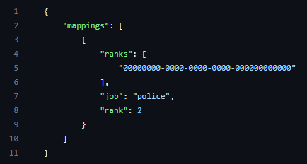

# Job Sync


Looking for VPS, web, or dedicated hosting? Check out our official [server hosting](../../../../../other-products/server-hosting.md)!


This resource is a in-game way of automatically syncing jobs and ranks to match roster information in the Sonoran CMS system/community.

## Installation / Configuration


With core version `v1.4.2` the Job Sync resource was converted to a core module and no longer requires manual installation just configuration.


### 1. Configure Job Sync Module

Locate the whitelist module within your `[sonorancms]/sonorancms/server/modules` and open the `jobsync_config.json` file

<figure><figcaption>
Sonoran CMS - In-Game Integration - JobSync Config 
</figcaption></figure>

### 2. Set Rank Mappings for Job Sync

| Config Option | Description                                                            |
| ------------- | ---------------------------------------------------------------------- |
| rank\_mapping | \["9dd1fea1-2360-4be2-923b-71b0c87944d0"] = {job = 'police', rank = 2} |

Here you must follow the format shown above to specify rank mappings, the first value ("ranks") is the Rank UUID, followed by what job and rank you would like to set it to. To find the UUID for a given Rank, follow the instructions below.

## Getting Rank UUIDs

### 1. Open Department Configuration Page

### 2. Open "Rank Settings" Menu

### 3. Select "Copy Rank ID"

