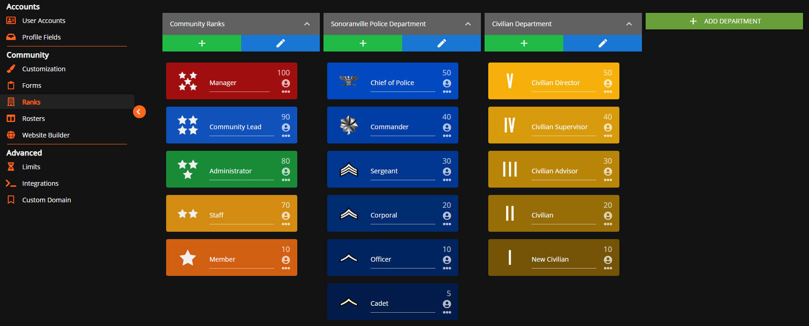
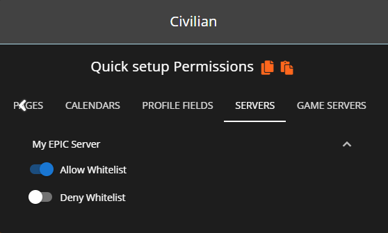

# Whitelist


All players of your server must have their [API ID](../../../../developer-api-documentation/api-integration/getting-started/api-id-system.md) setup and must be given a rank that has whitelist permissions for the specified server.



Looking for VPS, web, or dedicated hosting? Check out our official [server hosting](broken-reference)!


This resource is a whitelist system that utilizes Sonoran CMS's game whitelist system by checking against that whitelist upon each player connection.



## Installation

### 1. Download the Resource



You can download a copy [here](https://github.com/Sonoran-Software/Sonoran-CMS-Minecraft-Integration/releases/tag/1.0.0).

Ensure that you download the one that has `forge` in the name.



You can download a copy [here](https://github.com/Sonoran-Software/Sonoran-CMS-Minecraft-Integration/releases/tag/1.0.0).

Ensure that you download the one that has `fabric` in the name.



You can download a copy [here](https://github.com/Sonoran-Software/Sonoran-CMS-Minecraft-Integration/releases/tag/1.0.0).

Ensure that you download the one that has `plugin` in the name.




### 2. Install the Resource

Follow the standard resource installation guide for the whitelist resource, available [here](../minecraft-resource-installation.md).

### 3. Setup Whitelist Permissions

Navigate to the Rank Manager within the Administrative Panel.

`Administrative Panel` > `Ranks`



For users in your Sonoran CMS community to be accepted through the whitelist, they'll need to be granted permission for the whitelist through rank permissions. You will need to grant each rank the permission of **Allow Whitelist** that you want to be allowed through the whitelist. You will want to grant each rank with the permission of **Block Whitelist** if you want them to be blocked from passing through the whitelist.


**Block Whitelist** will ALWAYS overrule **Allow Whitelist**\
\
If a user is granted both **Block Whitelist** and **Allow Whitelist** through various ranks they will be blocked from the whitelist. Block will always overrule allow.




### 4. Add your API ID

Ensure all players have added their [API ID](../../../../developer-api-documentation/api-integration/getting-started/api-id-system.md) to the CMS!

## Configuration



The config file is called `cmswhitelist-common.toml` in the config folder of your Minecraft server folder.

```
[SonoranCMS]
	#This is your SonoranCMS Community ID.
	"Community ID" = ""
	#This is your SonoranCMS API key.
	"Community API Key" = ""
	#Which identifier to use, either UUID or Username. UUID is preferred.
	"Identifier Type" = "UUID"
	#The server ID found in SonoranCMS that this whitelist should check against.
	"Server ID" = 1
```

<table><thead><tr><th width="232.66666666666666">Value Name</th><th>Description</th><th>Default</th></tr></thead><tbody><tr><td>Server ID</td><td>This is the game server ID set in the CMS management panel.</td><td><code>1</code></td></tr><tr><td>Community ID</td><td>This is the community ID that is found in the API Integration section of the management panel.</td><td><code>""</code></td></tr><tr><td>Community API Key</td><td>This is the API key listed in the API Integration section of the management panel.</td><td><code>""</code> </td></tr><tr><td>Identifier Type</td><td>This controls whether a player's UUID or username is used for identifying.</td><td><code>"UUID"</code> (Recommended)</td></tr></tbody></table>



The config file is called `sonorancms.json` in the config folder of your Minecraft server folder.

```
{
  "CMS_Settings": {
    "Community_ID": "",
    "Community_API_Key": "",
    "Identifier": "UUID",
    "Server_ID": 1
  }
}
```

<table><thead><tr><th width="232.66666666666666">Value Name</th><th>Description</th><th>Default</th></tr></thead><tbody><tr><td>Server_ID</td><td>This is the game server ID set in the CMS management panel.</td><td><code>1</code></td></tr><tr><td>Community_ID</td><td>This is the community ID that is found in the API Integration section of the management panel.</td><td><code>""</code></td></tr><tr><td><code>Community_API_Key</code></td><td>This is the API key listed in the API Integration section of the management panel.</td><td><code>""</code> </td></tr><tr><td>Identifier</td><td>This controls whether a player's UUID or username is used for identifying.</td><td><code>"UUID"</code> (Recommended)</td></tr></tbody></table>



The config file is called `config.yml` in the `plugins/SonoranCMSWhitelist` folder of your Minecraft server folder.

```
CommunityID: ''
CommunityAPIKey: ''
Identifier: UUID
ServerID: 1
```

<table><thead><tr><th width="232.66666666666666">Value Name</th><th>Description</th><th>Default</th></tr></thead><tbody><tr><td>ServerID</td><td>This is the game server ID set in the CMS management panel.</td><td><code>1</code></td></tr><tr><td>CommunityID</td><td>This is the community ID that is found in the API Integration section of the management panel.</td><td><code>''</code></td></tr><tr><td>CommunityAPIKey</td><td>This is the API key listed in the API Integration section of the management panel.</td><td><code>''</code> </td></tr><tr><td>Identifier</td><td>This controls whether a player's UUID or username is used for identifying.</td><td><code>UUID</code> (Recommended)</td></tr></tbody></table>


