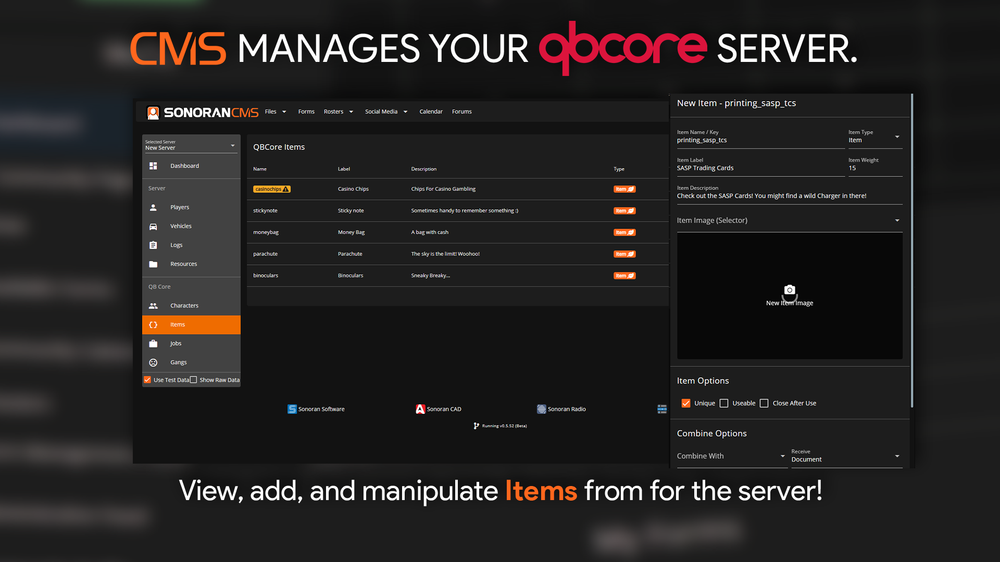

# Items

## Managing Items

Click any item row to initiate editing.

You can adjust the item label, weight, description, image, and various other options

<figure><figcaption></figcaption></figure>

## Add a New Item

You can create a new item by selecting `New Item` above the item table

<figure><figcaption></figcaption></figure>
