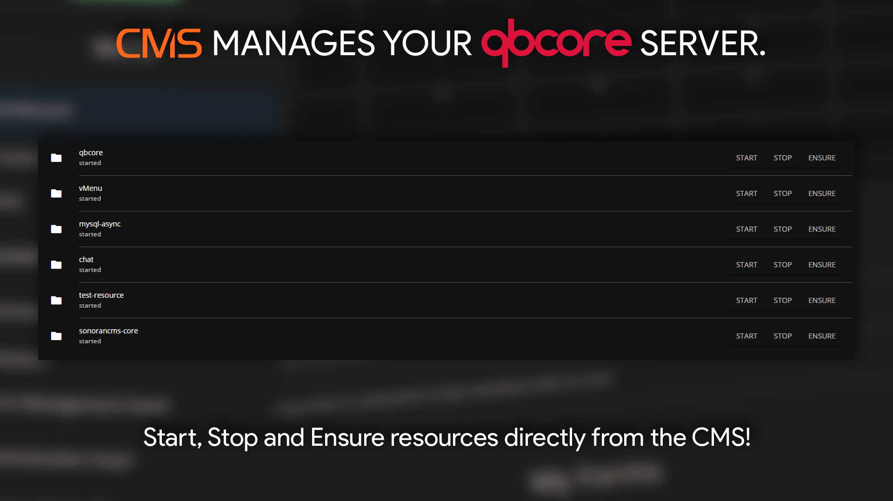

# Resources

<figure><figcaption></figcaption></figure>

## Managing Resources

All in-game resources will appear on the panel with three options:

### Start a Resource

Select the `Start` button to start an in-game resource.

### Stop a Resource

Select the `Stop` button to start an in-game resource.

### Ensure a Resource

Select the `Ensure` button to start an in-game resource.
