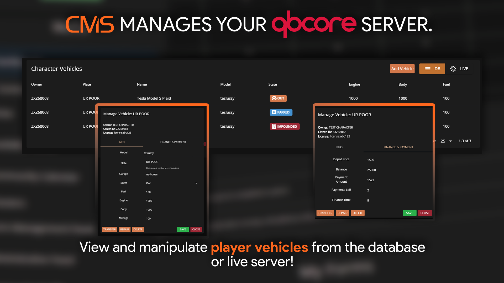

# Vehicles

<figure><figcaption><p>Sonoran CMS - QBCore Game Panel Promotional Image</p></figcaption></figure>

## Switch Between Live and DB Vehicles

You can switch to view only live vehicles active in the server, or all vehicles in the database at the top right.

<figure><figcaption></figcaption></figure>


## Add a Vehicle

Selecting `Add Vehicle` at the top right allows you to create a new vehicle and assign it's ownership to a player.

<figure><figcaption></figcaption></figure>

## Manage a Vehicle

Select any vehicle to modify it's information, transfer ownership, repair it, or delete it from the server.

<figure><figcaption></figcaption></figure>

## Supported Garage Scripts

Currently, Sonoran CMS supports the following QB Core garage scripts:

* QB (Base) Garages
* Codesign Garage
* Quasar Advanced Garages
* JG Advanced Garages

You can suggest more integrations on our [support portal](https://support.sonoransoftware.com) or if you would like to add the support yourself, simply paste this code snippet in any **SERVER-sided** file in your garage resource.&#x20;

```lua
local function getAllGarages()
    local garages = {}
    for k, v in pairs(Config.Garages) do
        garages[#garages+1] = {
            name = k,
            label = v.label,
            type = v.type,
            takeVehicle = v.takeVehicle,
            putVehicle = v.putVehicle,
            spawnPoint = v.spawnPoint,
            showBlip = v.showBlip,
            blipName = v.blipName,
            blipNumber = v.blipNumber,
            blipColor = v.blipColor,
            vehicle = v.vehicle
        }
    end
    return garages
end
exports('getAllGarages', getAllGarages)
```
