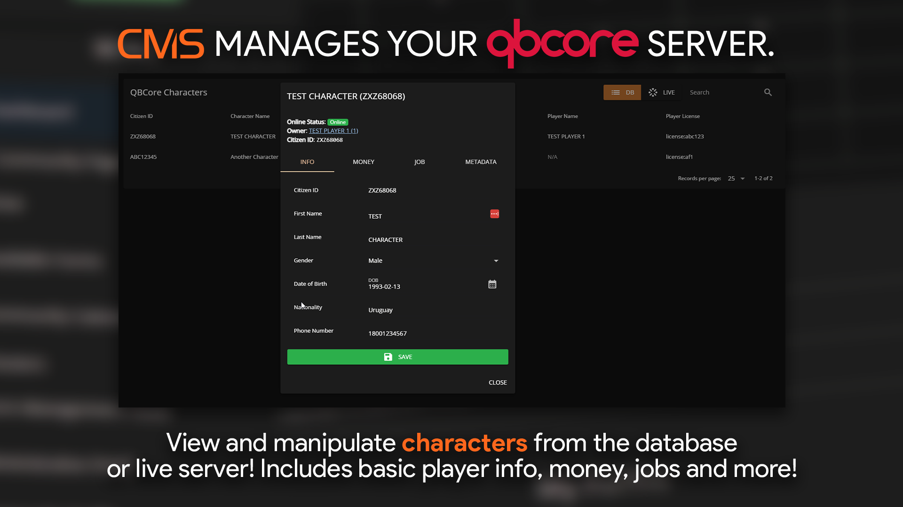

# Characters

<figure><figcaption></figcaption></figure>

## 1. Manage a Character

<figure><figcaption></figcaption></figure>

The characters tab allows you to view and edit:

* First Name
* Last Name
* Gender
* DOB
* Nationality
* Phone Number
* Cash Balance
* Bank Balance
* Crypto Balance
* and more!
