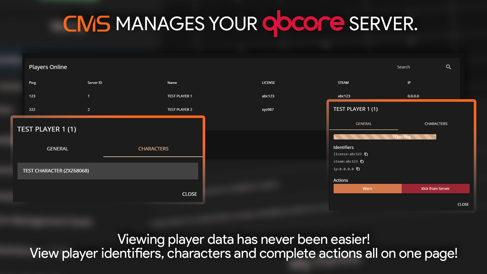
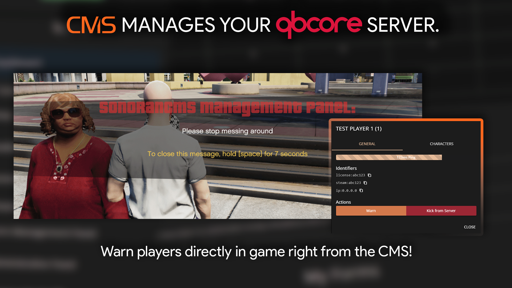

# Players

<figure><figcaption></figcaption></figure>

## Select and Manage a Player

Click on any online player to interact.

* Copy unique identifiers
* Warn the player in-game
* Kick the player from the server
* View their [characters](characters.md)

<figure><figcaption></figcaption></figure>

## Warn a Player

<figure><figcaption></figcaption></figure>

Selecting `Warn` on a player will prompt you to add a reason message. The player will then receive a warning notice in-game, requiring them to hold down `SPACE` for ten seconds to dismiss.
