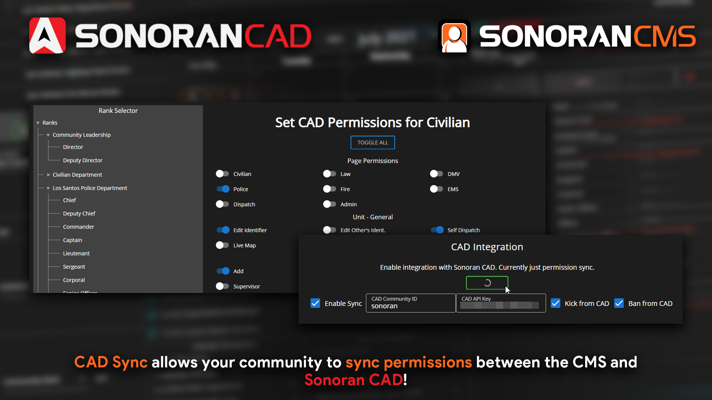

# Sonoran CAD Sync


This features requires the **standard** version of Sonoran CMS or higher. For more information, view our [pricing ](broken-reference)page.\
\
This feature also requires the **plus** version of Sonoran CAD or higher. For more information, view Sonoran CAD's [pricing](https://info.sonorancad.com/pricing/faq) page.



Sonoran CAD Sync settings can only be seen and modified by the community owner.


## Sonoran CAD Sync

Remove all the hassle of managing your community's Sonoran CAD permissions. Sonoran CMS is now your single point of management!

Sonoran CMS allows you to easily manage your community's Sonoran CAD permissions based on their Sonoran CMS rank automatically! For more information, read below.

### 1. Enter Credentials

Click the _Enable Sync_ check box and enter your Sonoran CAD community's ID & API Key.

Your Community ID and API Key are located in Sonoran CAD's Admin Panel > Advanced > In-Game Integration > Web API.\
Enter these into your Sonoran CMS as shown below.

### 2. Enable Kick & Ban Sync

Kick & Ban Sync will trigger an action to kick the same user from your Sonoran CAD community if they're kicked from your Sonoran CMS community. This also applies to bans.

Checking the "Kick from CAD" and "Ban from CAD" will enable this feature.

### 3. Save Sync Settings

Click the green _Save_ button above your Sonoran CAD credentials, this will enable and save your credentials.

### 4. Map CAD Permissions to Ranks

To edit, click any rank on the left-hand side. This tree will contain all department and ranks that your community currently has. Enable all permissions you want to grant to the individual with this rank.


Permission syncs from Sonoran CMS will set the user's permissions explicitly to what is mapped in the CMS and will wipe any non-enabled permissions.


### 5. Save CAD Permission Mapping

On the Rank Selector tree on the left-hand side, on the bottom, click the _Save_ button. This will save all permission mappings and trigger a mass sync of all permissions.

