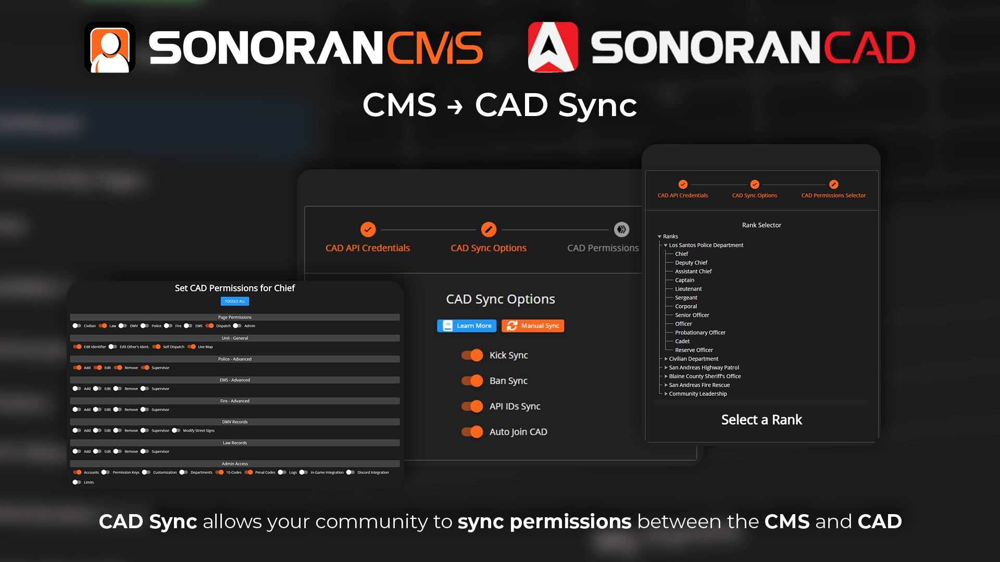

# Sonoran CAD Sync



Remove all the hassle of managing your community's Sonoran CAD permissions. Sonoran CMS is now your single point of management!

Sonoran CMS allows you to easily manage your community's Sonoran CAD permissions based on their Sonoran CMS rank automatically!

## Web Panel Sync


Sonoran CAD Sync settings can only be seen and modified by the community owner.


### 1. Add New CAD Integration

Click the _Sonoran CAD_ icon or click the plus button to sync another CAD to you community

<figure><figcaption>
Sonoran CMS - CAD Integration Setup List Area
</figcaption></figure>

### 1. Enter Credentials

Click the _Enable Sync_ check box and enter your Sonoran CAD community's ID & API Key.

.png>)

Your Community ID and API Key are located in Sonoran CAD at `Admin Panel > Advanced > In-Game Integration > Web API`.\
Enter these into your Sonoran CMS as shown below.

.png>)

### 2. Configure Sync Settings

Check the sync options that best fit your community's needs, explanation of each sync feature can be found [below](sonoran-cad-sync.md#feature-overview).

### 3. Map CAD Permissions to Ranks

To edit, click any rank on the left-hand side. This tree will contain all department and ranks that your community currently has. Enable all permissions you want to grant to the individual with this rank. When you're done setting up CAD Sync and configuring permission mappings, simply close out of the window by clicking the red X button and it will automatically save your credentials, settings, and trigger a mass sync of all permissions.


Permission syncs from Sonoran CMS will set the user's permissions explicitly to what is mapped in the CMS and will wipe any non-enabled permissions.


.png>)

## Feature Overview

### Multi-Setup Sync

Sync multiple Sonoran CAD communities with your single Sonoran CMS community. This will sync all of the below features with each community you have setup.

### Kick & Ban Sync

This will trigger an action to kick the same user from your Sonoran CAD community if they're kicked from your Sonoran CMS community. This also applies to bans.

### API ID Sync

This will sync all member's API IDs to the same user from your Sonoran CAD community, if they have a Discord account linked to their account it will sync that ID as well.


API ID Sync to CAD will overwrite any API IDs that are set by the user in Sonoran CAD upon each sync. All API IDs that are sent to the CAD from CMS will replace what is currently there.


### Auto Join CAD

This will have all new members that join your community automatically join your Sonoran CAD community under the same user ID.

## Manual Syncing

### Full Community

Community Owner's can trigger a manual community sync of CAD permissions through the **Manual SYNC** button located in the CAD Sync Options.

<figure><figcaption>
Sonoran CMS - CAD Permission Configuration Full Sync
</figcaption></figure>

### Individual Account

Individual members can re-sync their account with the community-linked CAD directly from the Community Settings menu.

<figure><figcaption></figcaption></figure>
