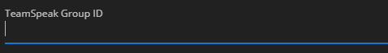
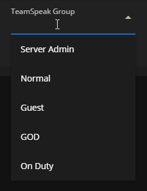

# Adding Ranks



You can enable role syncing with TeamSpeak after setting up the connection by navigating to the `Role Sync` tab and checking the `Enable Role Sync` button.

<figure><figcaption>
Sonoran CMS- TS Role Sync Enabled
</figcaption></figure>

## Adding a Rank

Steps for adding a rank that is associated with a group on your TeamSpeak server:

1. Click the **Add Mapping** button on the CMS admin panel

<figure><figcaption>
Sonoran CMS - Add Mapping
</figcaption></figure>

2. Select the CMS department and rank you'd like to use in the dropdown that just appeared

<figure><figcaption>
Sonoran CMS - Rank Selection
</figcaption></figure>

3. Input the TeamSpeak group permanent ID into the **TeamSpeak Group ID** input

<figure><figcaption>
Sonoran CMS - Input Group ID
</figcaption></figure>

* A TeamSpeak's group ID can be found by hovering over it in the permission editor
* Additionally, if you have Sonoran Radio installed you can also follow [this guide](https://info.sonoranradio.com/en/tutorials/permissions#server-group-ids)

<figure><figcaption>
TeamSpeak - Group IDs
</figcaption></figure>

Repeat this for all ranks you'd like to map to a TeamSpeak Group.

This method will soon be deprecated and be replaced by the following:

3. (Coming soon) Select a TeamSpeak group from the dropdown to the right.

<figure><figcaption>
Sonoran CMS - Group Selection
</figcaption></figure>

## Setting up Your Users

For users in your community to benefit from this feature, they must setup their TeamSpeak UID after you've setup your connection. Check out this guide for adding your UID to CMS:


[adding-your-teamspeak-uid.md](adding-your-teamspeak-uid.md)

