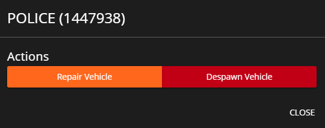

# Vehicles

<figure><figcaption>
Sonoran CMS - VMenu Game Panel Promotional Image
</figcaption></figure>

## View and Manage Vehicles

You can view information associated with all vehicles registered in your server. Additionally, if you have the corresponding perms, you can click on any entry to bring up a panel allowing you to Repair or Despawn said vehicle.

<figure><figcaption>
Sonoran CMS - VMenu Game Panel - Vehicles
</figcaption></figure>

<figure><figcaption>
Sonoran CMS - VMenu Game Panel - Vehicle Options
</figcaption></figure>
