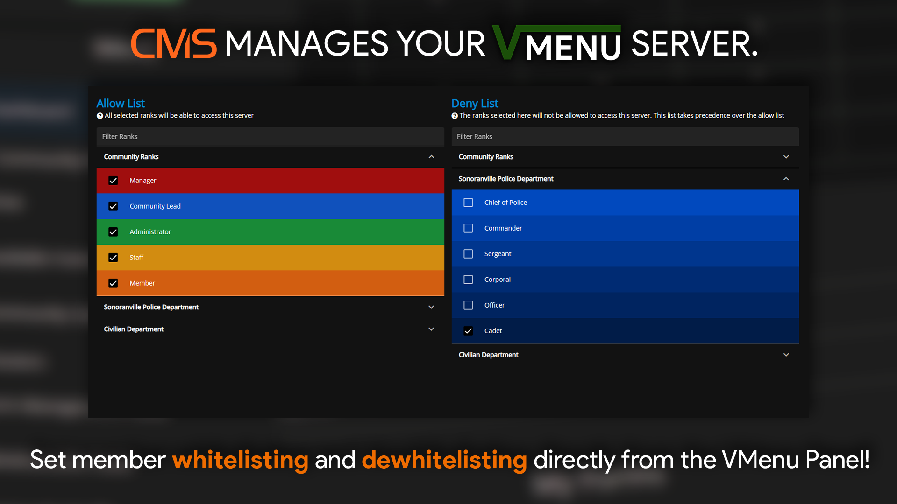
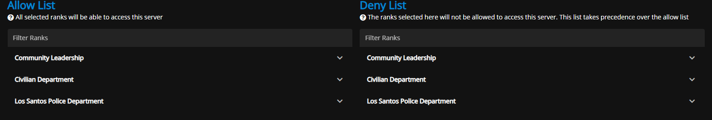
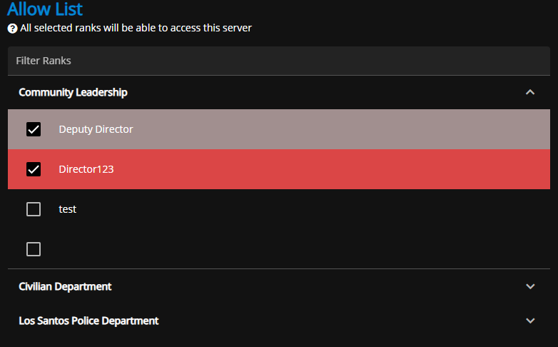

# Whitelist

<figure><figcaption>
Sonoran CMS - VMenu Game Panel Promotional Image
</figcaption></figure>

## Whitelisting Users

Here you can select ranks to either allow or deny them on the whitelist for the server you've selected.

<figure><figcaption>
Sonoran CMS - VMenu Game Panel - Whitelist
</figcaption></figure>

Within either list, each department shows as a sub-menu allowing you to toggle the ranks you wish to be added to this list.

<figure><figcaption>
Sonoran CMS - VMenu Game Panel - Whitelist Allow
</figcaption></figure>
