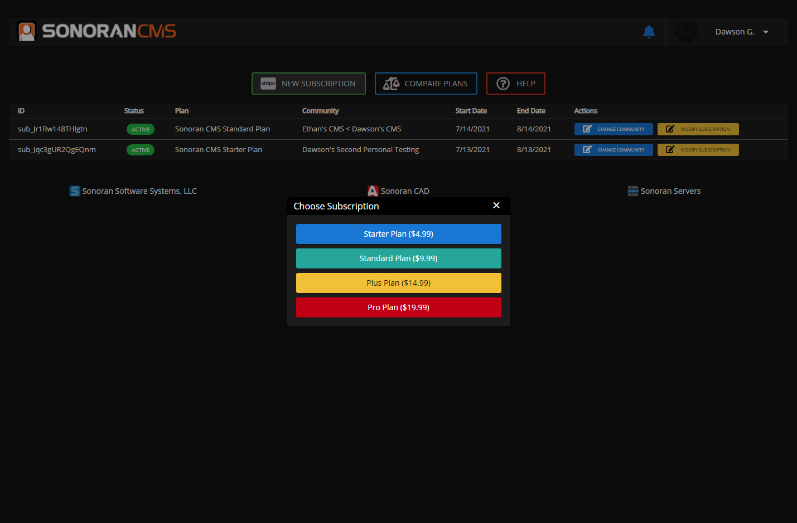
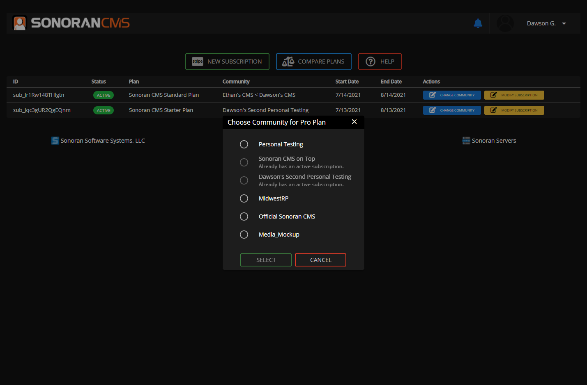
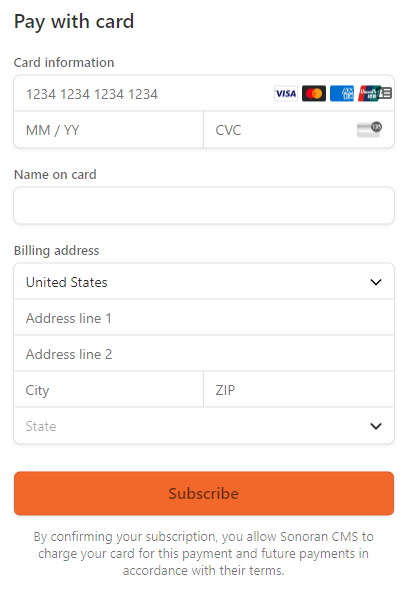
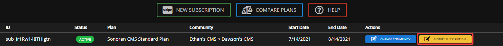
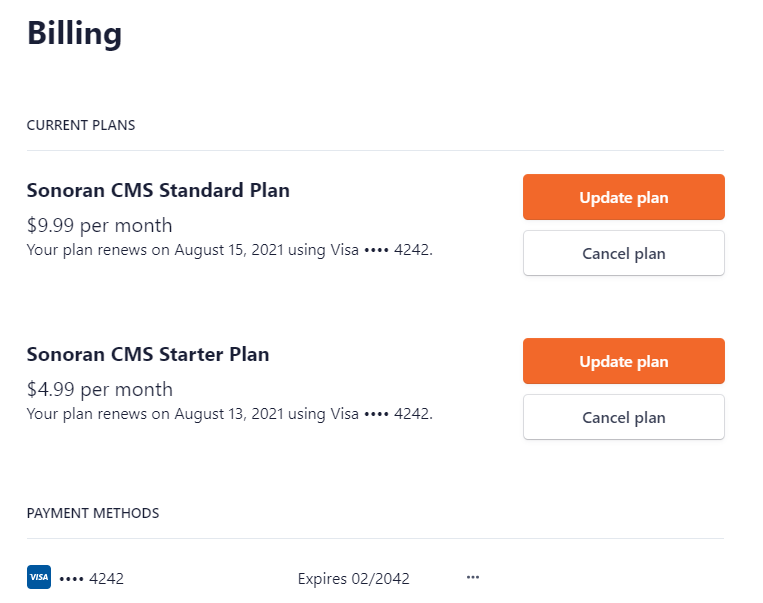

# Create and Manage a Subscription

## Create a New Subscription

### 1. Access the Payment Center

Access the payment center on the Web or Desktop version of Sonoran CMS by going to [sonorancms.com/#/billing](https://sonorancms.com/#/billing), or by viewing the guide below.


[accessing-the-payment-center.md](accessing-the-payment-center.md)


### 2. Select the Desired Subscription

In the payment center, select "New Subscription"\
From there, select the monthly subscription you would like to start.

### 3. Select the Desired Community

After selecting the desired subscription plan, you'll be prompted with a community selection modal.\
From there, select the community you would like to assign the subscription to.

### 4. Complete the Purchase

After selecting the desired subscription plan and community, you will be redirected to a Stripe checkout page.\
Here, you can enter your billing information and start the subscription.

### 5. Celebrate

Once you've completed your purchase, you can celebrate that you've successfully upgraded your community's plan.

## Manage an Existing Subscription

You can easily update the payment information, upgrade, downgrade, or cancel your Sonoran CMS subscription at anytime.

### 1. Access the Payment Center

Access the payment center on the Web or Desktop version of Sonoran CMS by going to [sonorancms.com/#/billing](https://sonorancms.com/#/billing), or by viewing the guide below.


[accessing-the-payment-center.md](accessing-the-payment-center.md)


### 2. Open the Stripe Customer Portal 

On any active subscription, select "Modify Subscription" to open the Stripe customer portal.

### 3. Utilize the Stripe Customer Portal 

Once opened, you can easily update your payment information, upgrade, downgrade, or cancel an existing subscription.

## Migrate a Subscription to Another Community

Sonoran CMS subscriptions can be easily transferred from one community to another.

### 1. Access the Payment Center

Access the payment center on the Web or Desktop version of Sonoran CMS by going to [sonorancms.com/#/billing](https://sonorancms.com/#/billing), or by viewing the guide below.


[accessing-the-payment-center.md](accessing-the-payment-center.md)


### 2. Update the Subscription's Community

Select "Set Community"/"Change Community" on the subscription in your billing center.

### 3. Select the Desired Community

Select the community you would like to set the subscription to.

