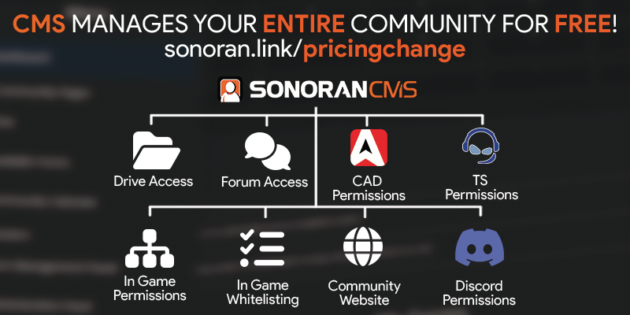

# 💳 Pricing Change Notice

<figure><figcaption></figcaption></figure>

## What's Changing?

We're making Sonoran CMS more accessible than ever before, with all functionality for **FREE**!


[Broken link](broken-reference)


### Free Plan

The free plan will now have access to&#x20;

* Unlimited Website Pages
* In-Game Integration Plugins
* API Access
* Discord Role Sync
* TeamSpeak 3 Sync
* Sonoran CAD Sync
* Unlimited Departments
* Unlimited Rosters
* Unlimited Forms
* Unlimited Discord Webhooks
* and so much more!

The free plan's **ONLY** limitations are:

* 100 User Accounts
* 10MB Drive Storage

### Paid Subscribers

We're simplifying our paid options to two: Standard and Pro.

#### Standard ($9.99/mo)

* Unlimited User Accounts
* Increased Drive Storage
* Custom Community ID
* Branding Removal

#### Pro ($19.99/mo)

* Custom Domain (cms.mycommunity.com)
* Increased Drive Storage

## I have a Starter or Plus subscription, what happens now?

### Plus Subscribers

Your plan will be automatically downgraded to the NEW Standard plan. Your account has **automatically received pro-rated credit** for the difference.

This means your community now gains access to:

* Unlimited User Accounts
* Unlimited Website Pages
* In-Game Integration Plugins
* API Access
* Discord Role Sync
* TeamSpeak 3 Sync
* Sonoran CAD Sync
* Unlimited Departments
* Unlimited Rosters
* Unlimited Forms
* Unlimited Discord Webhooks
* Branding Removal
* and so much more!

If you had a custom domain on the Plus plan, you will still have access to it for 30 days. If you wish to keep this after 30 days, you will need to subscribe to the Pro plan.

### Starter Subscribers

Your plan will be automatically downgraded to the NEW free version. Your payment method has **already been refunded a pro-rated amount** for your remaining time.

This means your community now gains access to:

* Unlimited Website Pages
* In-Game Integration Plugins
* API Access
* Discord Role Sync
* TeamSpeak 3 Sync
* Sonoran CAD Sync
* Unlimited Departments
* Unlimited Rosters
* Unlimited Forms
* Unlimited Discord Webhooks
* and so much more!

If you have a custom community ID, you will be **grandfathered** into keeping it. If you wish to update this again, you will need to subscribe to the Standard or Pro plan.
