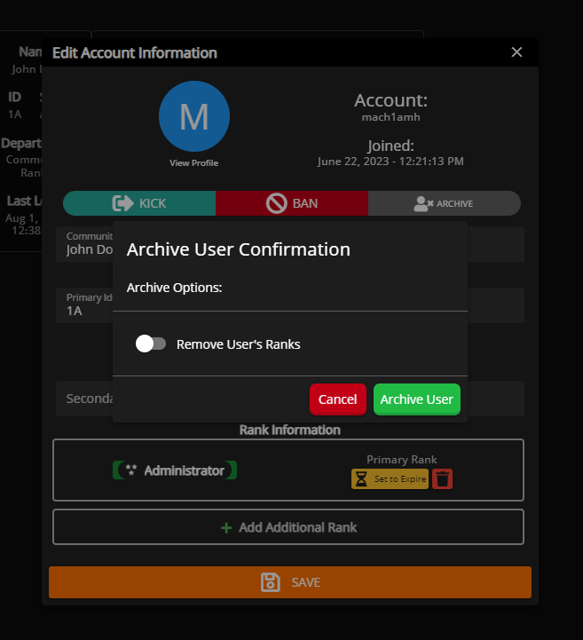

# Archive Community Member




You must have the **Archive User** permission or the Community Owner in order to archive another individual, the same checks are applied as kick and bans.


### What is Archiving a member?

Archiving a community member keeps the member within the community in a "Archived" state. They're technically kicked from the community which won't allow them to log into the community till they've rejoined. While a user is "Archived" you're still able to view their Community Profile and edit information on that user.


Archiving a member does not block them from rejoining, it's simply removing them from the community and still showing them as an accessible account.


### How to Archive a Member?

To archive a member head over to the Administrative Panel > User Accounts. Once you've located the member you'd like to archive, click their row which will provide you with a editing dialog.

Below their account name and to the right of the "Kick" and "Ban" options, there should be a grey "Archive" button, if you have permission. Click that button and it will ask you to confirm that you want to archive this user.

Additionally you're given the option to choose whether their rank and identifiers get removed or if they stay on the account. If rank(s) are not removed from their account upon archiving it does not mean they still have permission or can do anything additional, it's simply for organization.

<figure><figcaption></figcaption></figure>

### How to Unarchive a Member?


Unarchiving a member is **NOT** required for the member to rejoin the Sonoran CMS community but can help with organization.


To unarchive a member head over to the Administrative Panel > User Accounts and click the drop down in the top left to filter user accounts. You'll want to change this to the "ARCHIVED" option. This will now display all _Archived_ members.

Once you've located the archived member, click their row which will provide you with a dialog.&#x20;

Choose whether or not if their rank(s) and identifier(s) should be removed and confirm the unarchiving.

<figure><figcaption></figcaption></figure>
