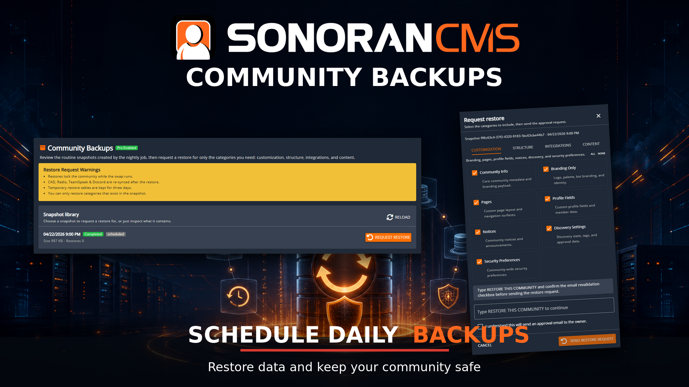
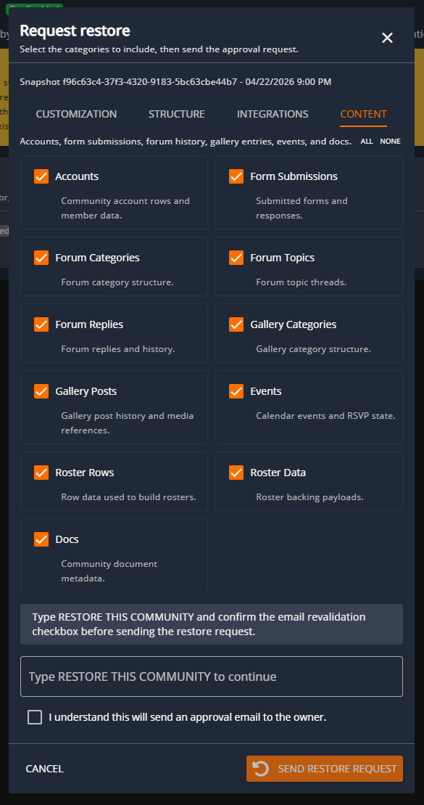
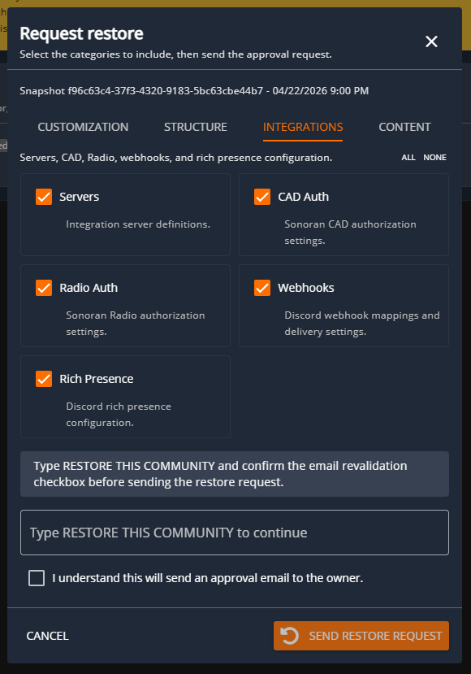
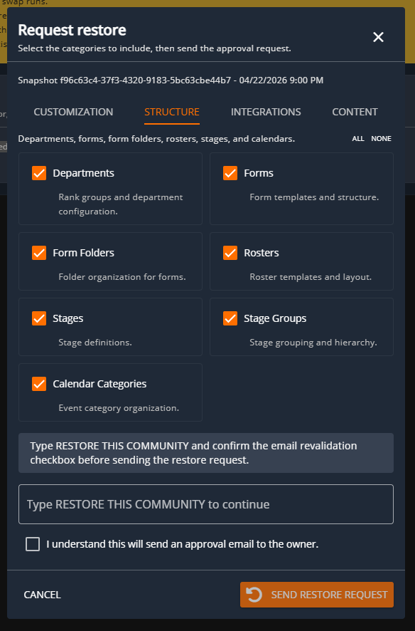
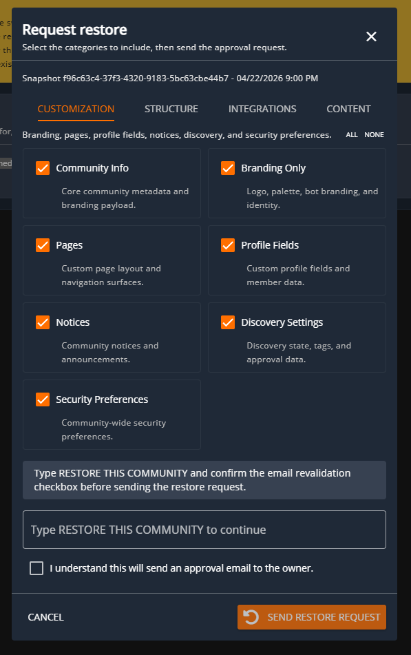
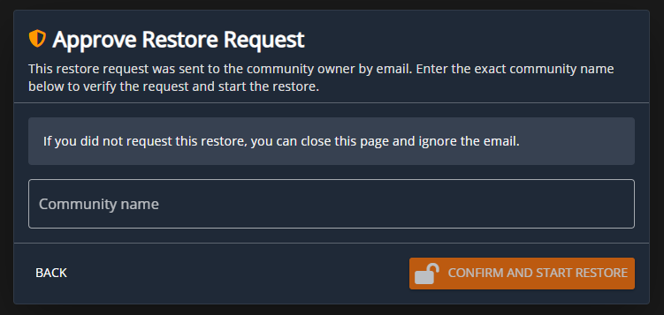

# Backups

<figure><figcaption></figcaption></figure>


**The Backup Restorations are only enabled with a Pro Subscription!**

Learn more about our [paid plans](../../pricing/pricing-faq/create-and-manage-a-subscription.md).


## What are backups?

They're full data snapshots of your community taken nightly allowing you to restore categorial data of your community in the event something is lost accidentally or maliciously.

Snapshots are stored for 7 days before they're deleted from our backend. You may restore a snapshot as many times are you wish within the 7 day period of it originally being stored.


Backup Snapshots can only be restored by the owner of the community for security reasons.


## What can I restore from a snapshot?

<figure><figcaption></figcaption></figure> <figure><figcaption></figcaption></figure> <figure><figcaption></figcaption></figure> <figure><figcaption></figcaption></figure>

You can granually restore certain aspects of the snapshots through various categories; Customization, Structure, Integrations & Content. Each category has various options that you can select to restore from form templates to departments to account rows. These will fully restore the data from when the snapshot was taken.

## How to restore a snapshot?

All restorations will require a request, once requested there will be an email sent to the owner of the community to verify the restoration is validated. The owner of the community may request a snapshot restoration through the Backups panel located within the Advanced area of the Admin Panel.

From there the owner will select the "Request Restore" button for the snapshot they desire. They can select everything that will be restored from the snapshot. Once everything is confirmed of what is to be stored you can click "Send Restore Request". This will send an email to the owner for them to finish the final steps before the snapshot is applied.

<figure><figcaption></figcaption></figure>

Once the owner receives the email they'll need to click the "Approve Restore" button from the email which will take them to the page to view the dialog above. Once they complete this step it'll start the snapshot restoration.

During the snapshot restoration the community will be locked from usage till it completes which can take some time.
