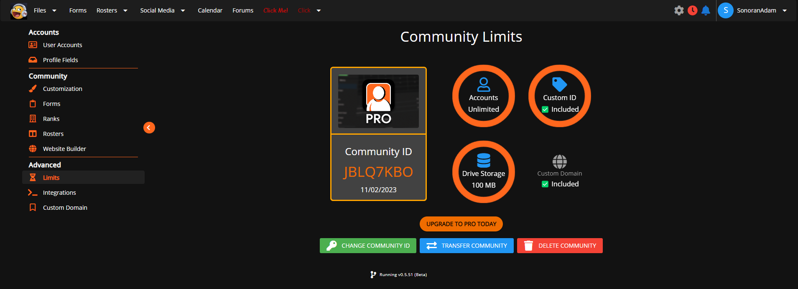

# Delete & Transfer Community




Only the community owner can delete or transfer the community.


## How-To: Deleting a Community

### 1. Access the Administrative Panel

Navigate to the `Administrative Panel`

### 2. Navigate to the Limits View

Under the `Advanced` tab, select `Limits`.

### 3. Delete Community

Select the **Delete Community** button located in the `Limits` tab and follow the steps it provides.

## How-To: Transferring a Community

### 1. Access the Administrative Panel

<figure><figcaption>
Sonoran CMS - Administrative Panel
</figcaption></figure>

### 2. Navigate to the Limits View

<figure><figcaption>
Sonoran CMS - Community Limits View
</figcaption></figure>

### 3. Transfer Community

Select the "Transfer Community" button located in the `Limits` tab and follow the steps provided.

<figure><figcaption>
Sonoran CMS - Transfer Community Selection
</figcaption></figure>

### 4. Finalize Transfer

Once you submit for the transfer in Sonoran CMS you'll receive an email regarding the transfer, this is to confirm and finalize it. Once you get the email click the button located on the bottom which will take you to Sonoran CMS to finalize it. You'll be notified upon full load if the transfer went through. The new owner will receive an email stating their new ownership.

<figure><figcaption>
Sonoran CMS - Transfer Community Initiation Email
</figcaption></figure>

<figure><figcaption>
Sonoran CMS - Transfer Community Completion Email
</figcaption></figure>


You have **30** minutes from when you initiate the transfer to use the button in the transfer confirmation email.

