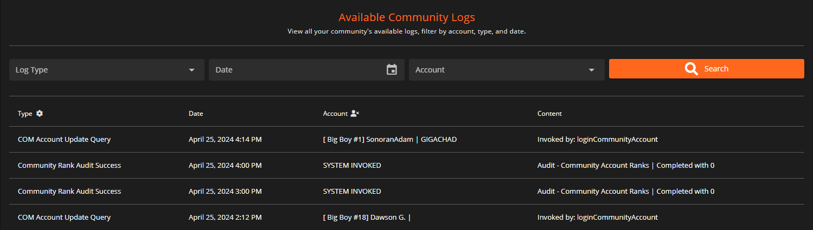

# Security Center

Located at `Administrative Panel` > `Security Center`,  the Security Center allows you to monitor your communities logs, as well as view account flags (coming soon).&#x20;

You can filter the logs by `Type`, `Date`, and by the `Account` associated with a log.

<figure><figcaption>
Sonoran CMS - Security Center - Community Logs
</figcaption></figure>
