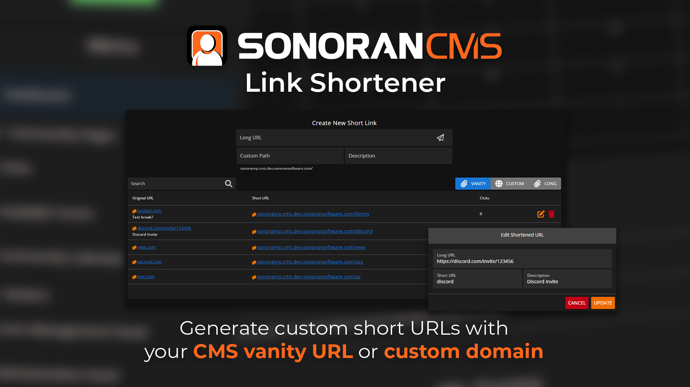

# URL Shortener

<figure><figcaption><p>Sonoran CMS - URL Shortener</p></figcaption></figure>


**The URL Shortener is only enabled with a Pro Subscription!**

Learn more about our [paid plans](../../pricing/pricing-faq/create-and-manage-a-subscription.md).


## What are Short URLs?

Create friendly, short URLs for anything in your community!

The URL shortener takes any link and converts it to a short and readable format!\
Ex: `https://discord.com/invite/123456` -> `mycommunity.com/discord`

## Creating a Short URL

### New Short URL

To forward `https://discord.com/invite/123456` to our [custom domain](../customization/custom-domain.md#custom-domain)'s `mycommunity.com/discord`

1. Enter the existing URL `https://discord.com/invite/123456`
2. Enter the new short URL path `discord`
3. (Optional) add a description `Discord invite link`

<figure><figcaption></figcaption></figure>

After adding the new short URL, it will be viewable, searchable, and copyable in the table below.

<figure><figcaption></figcaption></figure>

### Domain Formats

The CMS supports three types of short URL formats:

* [Custom Domain](../customization/custom-domain.md#custom-domain): `customdomain.com/shorturl`
* [Vanity Domain](../customization/custom-domain.md#vanity-urls): `communityid.sonorancms.com/shorturl`
* Long Domain: `sonorancms.com/com/communityuuid/shorturl`

The custom path will work on all three of these options. The toggle simply allows you to select which format you are copying.

## Reserved Paths

Sonoran CMS has several internal URL paths that can not be overridden by a custom short URL.

Sonoran CMS will also not allow you to override an existing [website slug](../community-website/website-builder.md) with a custom short URL.

```
admin
index
login
logout
signup
gallery
menu
event
account
oauth/discord
oauth/sonoran
oauth/apple
drive/file
game/menu
game/qbcore
profile
roster
forums
forums/topics
calendar
forms
```

These paths are restricted only in their absolute form. Appending additional paths to these are allowed. For example:

A short URL can **NOT** be: `example.com/forms`

However, a short URL **CAN** be: `example.com/forms/civ`
