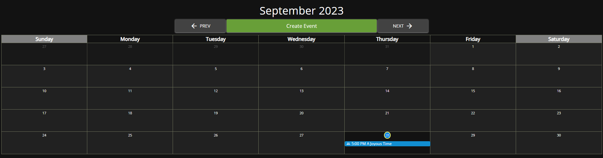
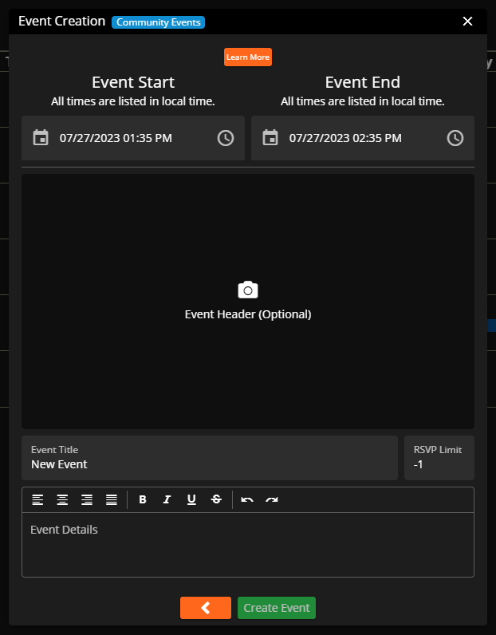
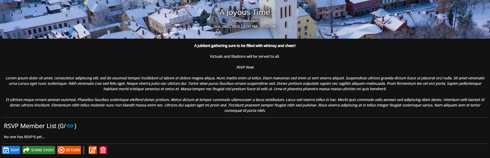
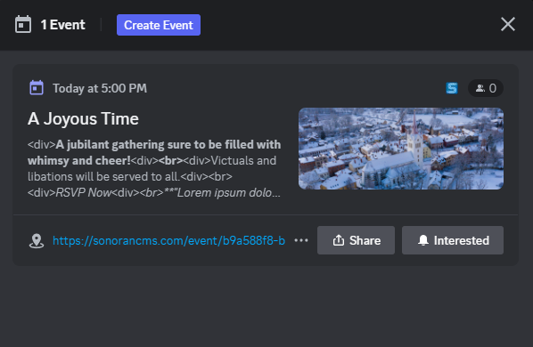

# Calendar Events

<figure><figcaption>
Sonoran CMS - Community Events
</figcaption></figure>



Community Events allow you to organize and plan events for your community to further engage with your members. Events allow you to plan the start & end time, title, description and an optional header image for each. Events also allow your members to RSVP to track who's attending your event.

<figure><figcaption>
Sonoran CMS - Community Calendar - Event View
</figcaption></figure>

## Create an Event

To access the Community Calendar navigate to the top toolbar and select "Calendar".

To create an event click the "Create Event" button along the top to the right of the month selection. This will open the Event Creation dialog, and from there select the Calendar Category that you're wanting to create an event for.

<figure><figcaption>
Sonoran CMS - Community Calendar - Create an Event Modal
</figcaption></figure>

Once you've got the create an event dialog  you can now input all of the event information that you'd like to associate with this event, once the event is created it can be edited if any information is no longer correct.

<figure><figcaption>
Sonoran CMS - Created Calendar Event
</figcaption></figure>

#### Regarding RSVP Limit

Setting the RSVP Limit from anything but -1 will restrict the total RSVP spots available, setting it to -1 will allow for an unlimited spots for RSVP.

Once you're satisfied with the information inputted for the event you can publish event, this will now add the event to the calendar to be accessed by your community.

### RSVPing for Events

To RSVP for an event navigate to the Community Calendar, select the event you're wanting to RSVP to and click the "RSVP" green button on the bottom left of the event view. This will now mark  yourself as attending the event, at any time you can remove yourself from the RSVP for the event by navigating to the event and clicking the same button.

### Sharing Events

To share an event to your community members you can simply click the "Share Event" button located on the event, this will copy the share URL to your clipboard. You can now share this URL with members of your community to view.

<figure><figcaption>
Sonoran CMS - Shared Community Event - Public View
</figcaption></figure>

### Editing Events

To edit an event simply navigate to the event and click the yellow pencil paper button located on the bottom row. This will open up a dialog to edit details of the event.

<figure><figcaption>
Sonoran CMS - Community Calendar - Edit Event Dialog
</figcaption></figure>

Once you're satisfied with all of the event details you can click the green "Save Event" button and it will be saved.&#x20;

## Removing Events

To remove an event simply navigate to the event and click the red trash can button located on the bottom row. Once you click it, it will be removed from the community calendar.

## Discord Integration

If you have linked you community to our [Discord Bot](https://info.sonoranbot.com/en/tutorials/getting-started), creating an event in CMS will automatically create an event within your community's Discord channel making it easy to coordinate community events across multiple platforms!

By clicking the `Interested` button, you will be automatically RSVP'd in CMS.

<figure><figcaption>
Sonoran CMS - Calendar Events Discord Integration
</figcaption></figure>
