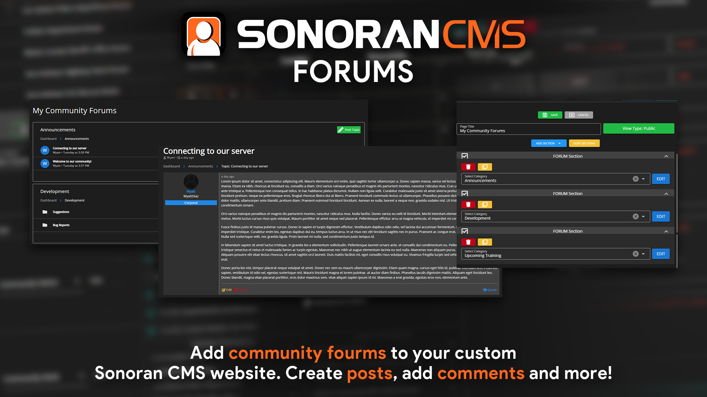

# Forums

<figure><figcaption>
CMS Fourms Preview
</figcaption></figure>



The Sonoran CMS Forum System is a custom page element allowing you to create and organize your forum(s) to fit the needs of your community. Easily add Forum Categories to any custom page, create or use existing categories across multiple pages. Each category has the ability to manage permissions to **Create a Topic**, **Remove Topics**, and **Remove Topic Replies**.


**Note:** Currently all members of your Sonoran CMS community will have access to view and reply to all topics in categories they can access through custom pages. Additional permissions are planned.


### Creating Forum Categories & Adding Forum Elements

To create a Forum Category navigate to the Custom Page Editor located at Administrative Panel > Customization > Custom Page Editor. Once you've located the editor, add a **Forum Section** to your Custom Page.

Now that you added a Forum Section you can select from existing Forum Categories or create a new one. If you're looking to create a category, simply click the blue **CREATE** button. This will display a popup with various inputs, fill in the category label and select the permission preferences that apply. Once the category fits the needs that you like click the green outline **SAVE** button.

<figure><figcaption>
Sonoran CMS - Forum Category Dialog Creation
</figcaption></figure>

Once you have saved the Custom Page you can now view the page with the Forum element added.&#x20;

### Creating Forum Sub-Categories

To create Forum Sub-Categories navigate to the Custom Page Editor located at Administrative Panel > Customization > Custom Page Editor. Once you've located the editor, select a page that has a **Forum Section** already.

Now that you're at an already set up Forum Category you can easily add sub-categories to it, at the bottom left there's a button labeled, **Add Sub-Category**, in green. Click this button and it will prompt you with the sub-category label. Input that sub-category label that you would like and click **OK**. This will add the sub-category to your forum category, sub-categories can be created on sub-categories to create a forum category depth of your choosing.


Currently there's no addtional permission settings for Forum Sub-Categories. Anyone that can see the root forum category will have the same permissions across all topics and sub-categories within it.


### Viewing & Creating Topics

<figure><figcaption>
Sonoran CMS - Forum System - Forum Category Topics Table
</figcaption></figure>

To view forum topics navigate to a Custom Page that has a Forum element added. Once you've located a page you will be shown a table with all of the topics in the forum category. Click the topic table row to open up the topic for viewing and replying.

To create a forum topic simply click the green plus button located on the Forum Topics table, this will display a topic creation dialog. Fill in the appropriate information for the topic you're wanting to create. Once the topic information suffices your needs simply click the green outline **CREATE TOPIC** button to create the topic. Once it's created it'll automatically navigate you to the topic. This will allow you to edit and reply to the topic.

<figure><figcaption>
Sonoran CMS - Forum System - Viewing a Topic
</figcaption></figure>

#### Topic Creation - Forum Topic Attachments

Forum topics can attach image(s) to their topic upon creation, these will act as attachments for the topic. To add attachments to your topic upon creation head over to a Forum Category, locate the green topic creation button and click it. At the bottom/middle of the popup dialog there should be an uploader there to upload your attachments. Select the images you would like to attach and create the topic, these attachments will be shown under the topic content.


Topic Attachments are currently only available on topic creation, they cannot be modified once they've been uploaded. Topic Attachment Management is planned in a future release.


### Creating Private Topics

Private topics allow individuals to create forum topic(s) that can only be seen by the ranks the individual specifies. This allows for better permission management of individual topics that you may want to hide within a more public category. In order to create private topics within a category you must be granted permission on the root category's permissions. If you want a rank to be able to create a private topic in your category you must add that rank to the **Can Create Private Topics** permission section in the forum section editor.

<figure><figcaption>
Sonoran CMS - Forum System - Forum Category Dialog - Can Create Private Topics Highlight
</figcaption></figure>

To create a private topic you will need to locate a Forum Category and click the green button in the top right, this should provide you with a popup dialog to create a topic. On the bottom there should be settings for private topics as well as a switch to toggle this topic as private. Flip the switch to toggle the topic as private on and add the ranks that you would like to view and reply to the topic.

<figure><figcaption>
Sonoran CMS - Create Topic - Private Topic Highlight
</figcaption></figure>

### Topic Actions: Pin & Lock

To improve the organization of your forum, you can pin and lock topics. Pinning a topic will move it to the top of the forum category, and locking a topic will prevent any new replies from being added. You can access these options by right-clicking on a topic from the list view, or by using the buttons next to the edit and remove options while viewing a specific topic. These features will help keep your forum organized and on-topic.

### Forum Sub-Categories

Each Forum Category can have it's own sub-categories created for it, this allows for better organization and design of your forum categories.

<figure><figcaption>
Sonoran CMS - Forum System Category Table - Sub-Categories
</figcaption></figure>

### Dedicated Forum Category Page

To get a complete view of all the topics in a specific forum category, you can navigate to its dedicated page. This page can be shared with other members through a link, so they can easily access it as well. You can access the dedicated page without having to use a custom page element, so it's quick and easy to view all the topics in a particular category.

<figure><figcaption>
Sonoran CMS - Dedicated Forum Category Page
</figcaption></figure>

To view the dedicated page for a particular forum category, first locate the custom page forum element that contains that category. Then, click on the category's name at the top-left corner of the topics table. This will take you to the dedicated page for that category, where you can see all of the topics it contains.

<figure><figcaption>
Sonoran CMS - Custom Page Forum Element - Expanding Forum Category into Full Category Page View
</figcaption></figure>
