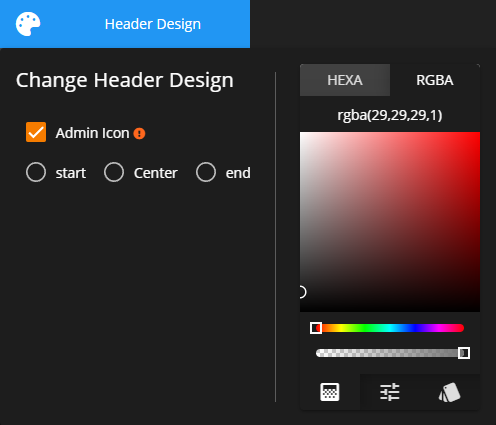
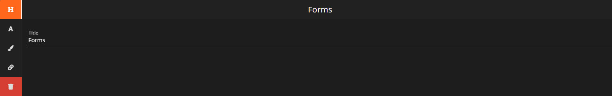
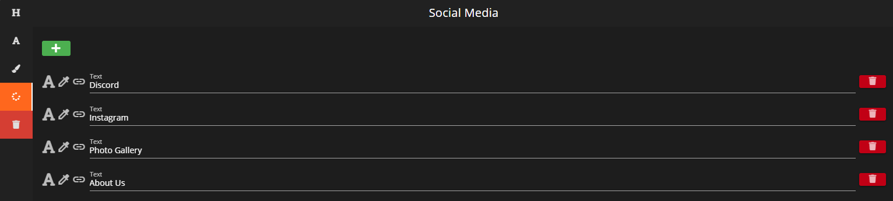
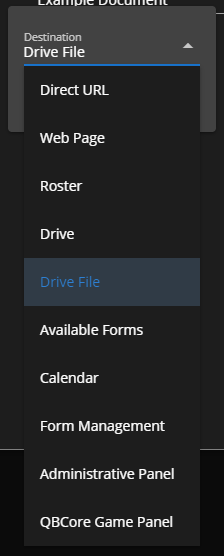

# Toolbar Customization

Sonoran CMS allows you to customize the top toolbar with buttons to link your users to whatever your community needs.

To customize your community's toolbar head over to the `Administrative Panel` > `Website Builder`. From there you can add buttons, dropdowns and community image with various options.  If you would like to reorder items in the toolbar, simply drag and drop them into the deisred posisiton.

Each button and drop down option has a label and link associated with it, with these set they will be displayed to all community users.&#x20;

If you make any changes, it will automatically save.


Privatized pages will not show up in the toolbar or in a dropdown in the toolbar for any user that lacks the required permissions to view them.


### Styling & Customization

The blue `Header Design` button opens a menu that will let you customize the group alignment, background color and admin cog setting. You can also drag and drop elements to change the display order. &#x20;

<figure><figcaption>
Sonoran CMS - Toolbar Customization - Header Design
</figcaption></figure>

You can also customize the title, font, color and specific links for any button or dropdown menu. To open the design panel, simply click on any button or dropdown in the Toolbar Customization editor.&#x20;

<figure><figcaption>
Sonoran CMS - Toolbar Customization - Element Design Panel
</figcaption></figure>

### Destination Options

In the design panel of any element, you can customize where said element links to by clicking on the `Destination` button signified by the chain link icon.

<figure><figcaption>
Sonoran CMS - Toolbar Customization - Dropdown Destination Settings
</figcaption></figure>

Within any button or dropdown you are give the option to link a variety of different things, from another page in the community, to external pages, to documents in your community's drive to management panels and more!

To change the destination link itself, click on the chain icon to the left of the text section. All of the available link types are displayed below:

<figure><figcaption>
Sonoran CMS - Toolbar Customization - Destination Options
</figcaption></figure>
