# Website Builder

.png>)



To access the website builder, navigate to `Administration Panel` > `Website Builder`

## Page Editing

To start editing a page, either add a new page or click on an existing page in the page to open up the page editor.

## View Your Page

Once your page is created and saved, you can [add it to the toolbar](website-builder.md#toolbar) or copy the URL to access it.


On public pages you can copy the URL after going to a page and share it with anybody, they don't even have to be part of the Sonoran CMS community!


To add sections to your web page, simply drag and drop your desired section type in from the left hand side. The following section types are available to use:

<table><thead><tr><th width="208">Element Type</th><th>Description</th></tr></thead><tbody><tr><td>Text</td><td>The text section includes a rich editor for including blocks of text. In this editor, you are able to set font sizes, bold, italic, underline, strike-through, and more!</td></tr><tr><td>Image</td><td>Image sections allow you to insert one image into your page, just paste a link to the image in the text box.</td></tr><tr><td>Image Carousel</td><td>Allows you to insert multiple images in the space of one, automatically cycling between them.</td></tr><tr><td>Video</td><td>The video section can be used to insert YouTube links into your custom page, just paste a regular YouTube link (or a shortened one) into the text box.</td></tr><tr><td>Forum Category</td><td>Forum Category sections allow you to have a section to display all associated posts to the selected forum category.</td></tr><tr><td>Button</td><td>Button sections allow you to put individual buttons on your page that can be directed to an external page, custom form, or custom page.</td></tr><tr><td>Button Group</td><td>Button Group sections allow you to have a group of buttons together on your page that can be directed to an external page, custom form, or custom page.</td></tr><tr><td>Card</td><td>Allows you to add and customize "cards" which can be configured to display information on members or characters as well as links.</td></tr><tr><td>Information Block</td><td>Information Block sections allow you to add multiple blocks to provide information for, these can be configured to grab "Total Community Members", "Total Department Members" or "Custom". "Custom" allows for customizable text.</td></tr><tr><td>Gallery</td><td>Gallery sections are the first element for the gallery system, this allows you to show all posts in the gallery category.</td></tr><tr><td>HTML</td><td>If you know HTML you can further customize your page by directly adding HTML code. To edit the HTML you must click on the element and input your HTML into the text box for. Please not you are <a href="website-builder.md#html-elements-limits">limited to certain element types</a>.</td></tr></tbody></table>

### Basic Information

From the website builder's toolbar you can change the page's title, path slug, and privacy setting. Additionally, you're able to add new sections, and change the preview size of the editor to visualize different size settings.

<figure>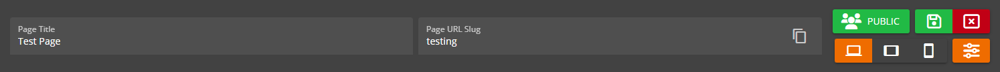<figcaption>
Sonoran CMS - Webpage Toolbar
</figcaption></figure>

The device preview feature allows you to choose from a list of devices, or set your own custom resolution to give you further control over designing your community's website with mobile responsiveness in mind!&#x20;

<figure>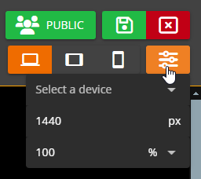<figcaption>
Sonoran CMS - Webpage Toolbar - Device Preview
</figcaption></figure>

### Section-Specific Styling

Sections are containers for elements that exist within a webpage. You can add multiple sections and resize / move them however you'd like.&#x20;

You can customize the margin and background styling of specific sections.

**Margin** refers to the space outside an section. It can be used to create space between sections on a page or to push elements away from the edges of the page. In your page editor, you can change margin options for different areas, such as top, bottom, left and right.

<figure>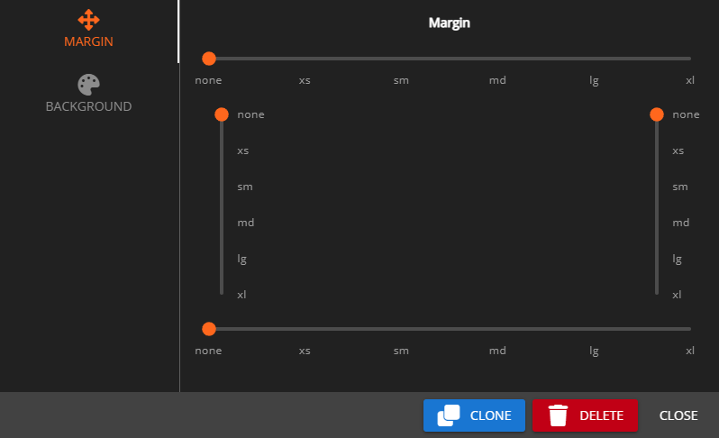<figcaption>
Sonoran CMS - Website Builder -  Edit Section Margins
</figcaption></figure>

You can also dynamically resize and position sections by clicking any of the boxes around the edges and dragging them to your desired position.&#x20;

<figure>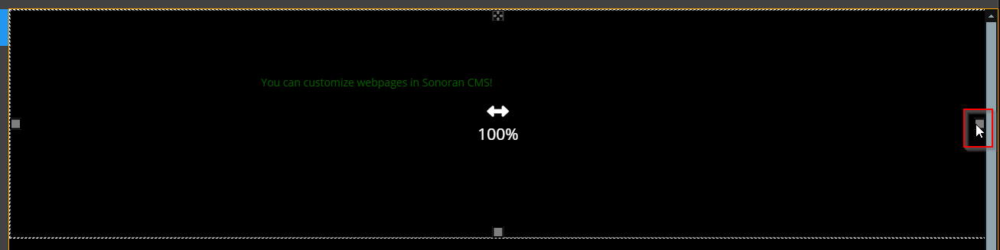<figcaption>
Sonoran CMS - Website Builder - Resize Section
</figcaption></figure>

There is also a button at the top of the section that allows you to click and drag to move the section:

<figure>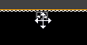<figcaption>
Sonoran CMS - Website Builder - Move Section
</figcaption></figure>

### Element Sizes, Alignment and Background

You can also control the size of individual elements using the same method above, and you can click and drag to move any element wherever you'd like.

Elements will also snap to center lines within their respective section to assist with positioning.

<figure>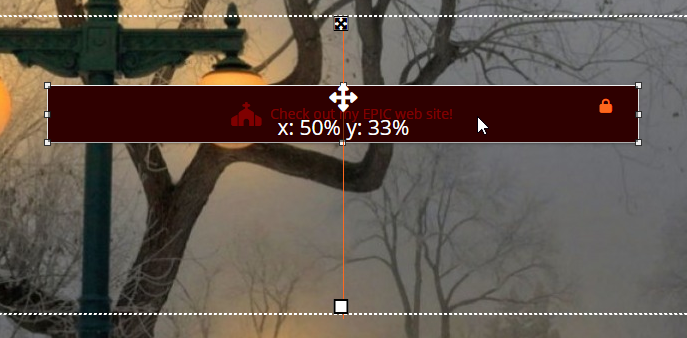<figcaption>
Sonoran CMS - Website Builder - Resize &#x26; Reposition Element
</figcaption></figure>

In the top right corner of the button element above, you can see an orange lock icon. This means that this element is locked to the section its in. To move an element to another section, you can click this button to unlock the element, drag it to the section you desire, and then re-lock it.

### Buttons

If you wish to add buttons to your page, you can add a button or button group section to your page. Each button has several settings that define how the button looks like and acts. Each button can be direct users to external websites, custom forms and custom pages.

Button elements can have individual styles and button group elements can have all group styles.

You can customize by clicking on it. The styling of a button is set in the `Styles` tab, the target link a button leads to is set in the `Target` tab.

<figure>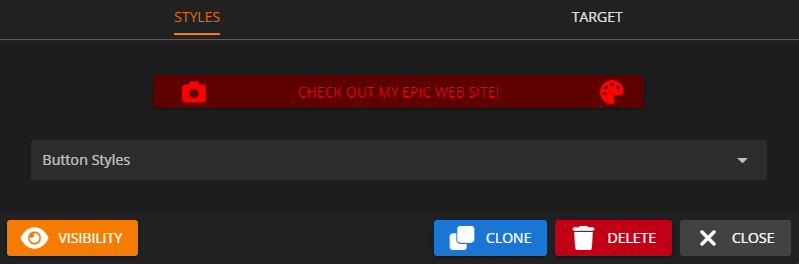<figcaption>
Sonoran CMS - Website Builder - Button Editor
</figcaption></figure>

For Button Group elements, you can add as many target links as you need, and re-order or delete them using the controls on the top right of each entry.

<figure>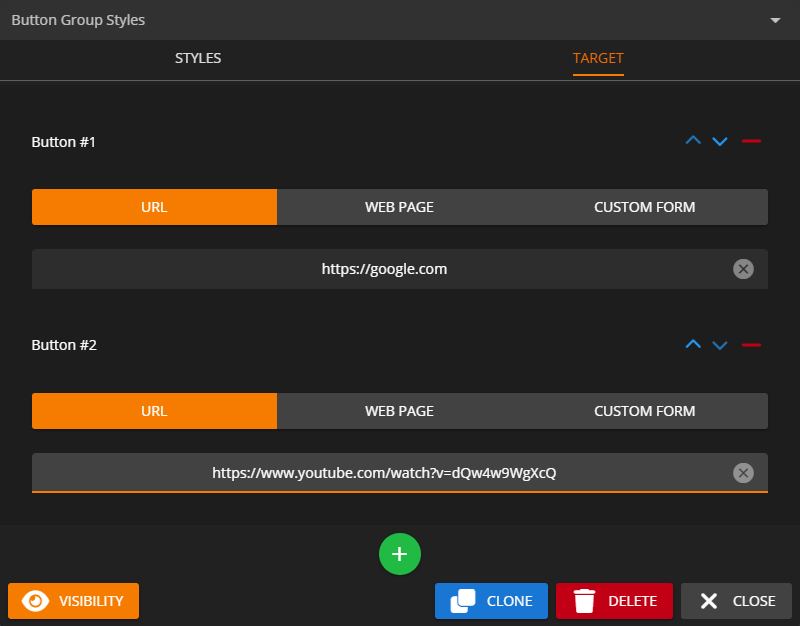<figcaption>
Sonoran CMS - Website Builder - Button Group Targets
</figcaption></figure>

## Privatized Pages


Only Private Pages will have customizable permissions in the Department Editor


Pages can now be privatized and require permissions to view. When editing a page, you can select whether the page is public (and can thus be viewed by anyone in the community) or private.

<figure><figcaption>
Sonoran CMS - Visibility Button
</figcaption></figure>

If it's set to Private, you can use the dropdown to the right to select what ranks are allowed to view this page.

<figure><figcaption>
Sonoran CMS - Open Rank Selector
</figcaption></figure>

<figure><figcaption>
Sonoran CMS - Select Rank to View Page
</figcaption></figure>

## Default / Landing Page

Sonoran CMS allows you to easily customize the landing page/dashboard for your community, this page is the first page your members will see from signing into your community. This allows the full customization of a custom page for your landing page.

<figure>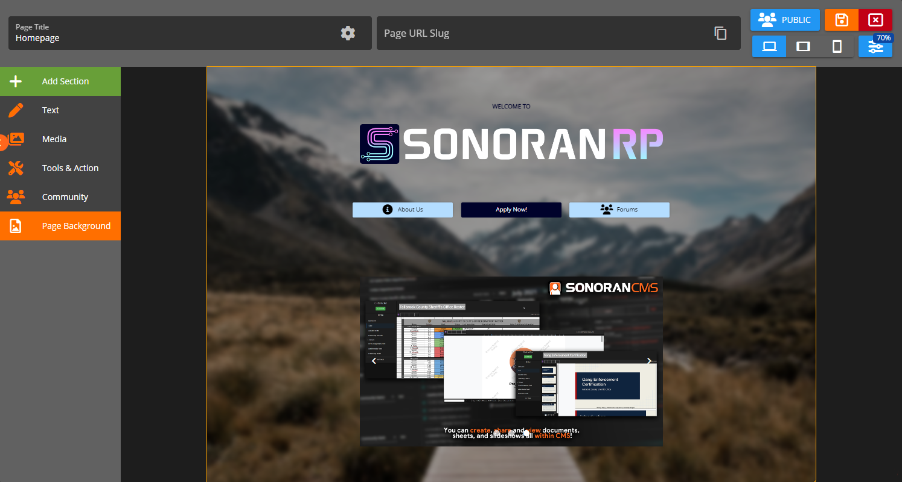<figcaption>
Sonoran CMS Custom Page as Dashboard Page
</figcaption></figure>

To set a Custom Page as your homepage, navigate to the main page for the Website Builder and look under the section titled `Website Pages`. Locate the page you wish to use as your homepage and press the grey home button, this will turn it orange and set it as the landing page.

<figure><figcaption>
Sonoran CMS - Set Homepage
</figcaption></figure>

## Custom Page Paths

Custom Pages can now have a custom path to the page, this path will append to the Sonoran CMS URL. If you're using a custom domain it'll detect that and provide the proper URL.

<figure><figcaption>
Sonoran CMS - Page URL Slug
</figcaption></figure>

## Page SEO

Clicking on the cog on the right side of the `Page Title` box will open the SEO panel. Here you can set a custom image and description for the website's page. These will show in embeds, such as when you paste the link in Discord.

<figure>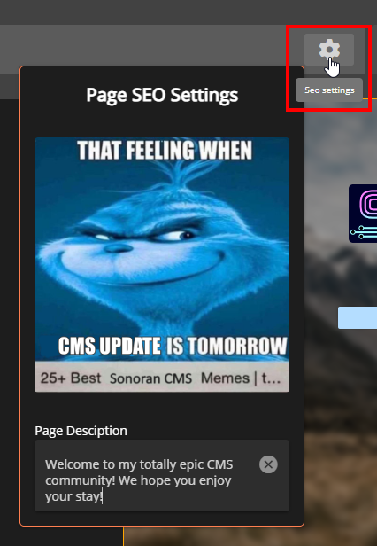<figcaption>
Sonoran CMS - SEO Panel
</figcaption></figure>

If you have a **Standard** subscription or higher, the "Sonoran CMS" branding in the title will be removed.

Please be aware that Discord will locally cache the embed info - so updates may not show right away.

<figure>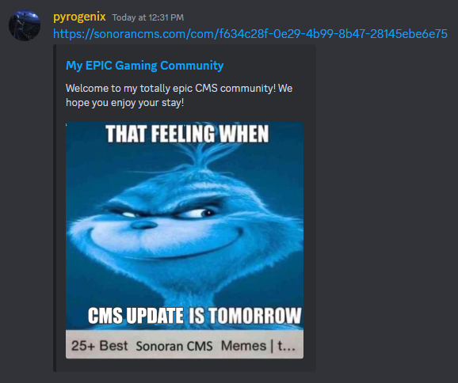<figcaption>
Sonoran CMS - SEO Discord Embed
</figcaption></figure>

Additionally, there are third party sites such as [HEY META](https://www.heymeta.com/) that can be used to check your page's "meta" tags and show it, without caching like Discord would. After you've saved the page, you can use this to verify that the image and description display how you want.

## Custom Domain

Sonoran CMS allows you to display your community website [on your own domain](../customization/custom-domain.md)!

## Toolbar

Sonoran CMS allows you to [customize the top toolbar](toolbar-customization.md) with buttons to link your users to whatever your community needs.

## HTML Elements Limits

HTML elements get sanitized before they're saved, displayed or manipulated.

* **Allowed Tags**: A wide range of HTML tags for different purposes including:
  * Structural elements like `header`, `footer`, `main`, `nav`, `section`.
  * Text formatting tags such as `h1` through `h6`, `strong`, `em`, `b`, `i`.
  * List elements like `ul`, `ol`, `li`.
  * Table components including `table`, `th`, `td`, `thead`, `tbody`, `tfoot`.
  * Media embedding tags `img` and `iframe`.
  * Inline elements like `span`, `br`, `mark`, `small`.
  * Text semantic tags such as `time`, `code`, `var`, `samp`.
* **Attributes**:
  * Allows `style` universally.
  * For `a`: `href`, `name`, `target`.
  * For `img`: `src`, `srcset`, `alt`, `title`, `width`, `height`, `loading`.
  * For `iframe`: `src`, `height`, `width`, `name`.
* **Styles**:
  * Permits a wide range of CSS properties with any value for basic layout and visual styling such as `width`, `height`, `border`, and more.
  * Specific regex patterns are set for `color`, `text-align`, and `font-size` to control text styling and coloring with precise formats.
