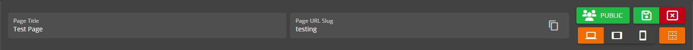
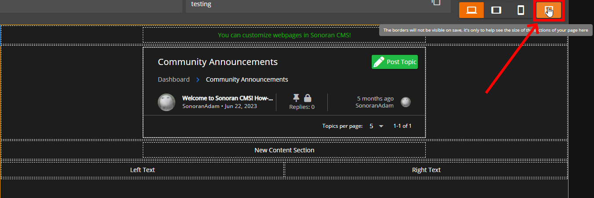
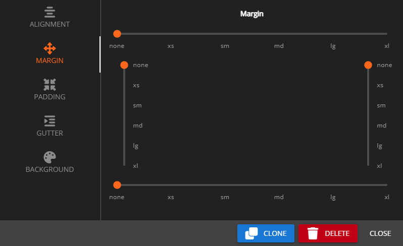
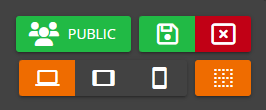
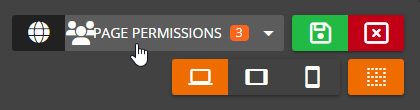
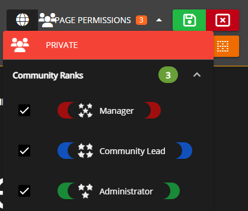

# Website Builder




To access the website builder, navigate to `Administration Panel` > `Website Builder`

## Page Editing

To start editing a page, either add a new page or click on an existing page in the page to open up the page editor.


## View Your Page

Once your page is created and saved, you can [add it to the toolbar](website-builder.md#toolbar) or copy the URL to access it.



On public pages you can copy the URL after going to a page and share it with anybody, they don't even have to be part of the Sonoran CMS community!


To add sections to your web page, simply drag and drop your desired section type in from the left hand side. The following section types are available to use:

<table><thead><tr><th width="208">Element Type</th><th>Description</th></tr></thead><tbody><tr><td>Text</td><td>The text section includes a rich editor for including blocks of text. In this editor, you are able to set font sizes, bold, italic, underline, strike-through, and more!</td></tr><tr><td>Image</td><td>Image sections allow you to insert one image into your page, just paste a link to the image in the text box.</td></tr><tr><td>Image Carousel</td><td>Allows you to insert multiple images in the space of one, automatically cycling between them.</td></tr><tr><td>Video</td><td>The video section can be used to insert YouTube links into your custom page, just paste a regular YouTube link (or a shortened one) into the text box.</td></tr><tr><td>Forum Category</td><td>Forum Category sections allow you to have a section to display all associated posts to the selected forum category.</td></tr><tr><td>Button</td><td>Button sections allow you to put individual buttons on your page that can be directed to an external page, custom form, or custom page.</td></tr><tr><td>Button Group</td><td>Button Group sections allow you to have a group of buttons together on your page that can be directed to an external page, custom form, or custom page.</td></tr><tr><td>Card</td><td>Allows you to add and customize "cards" which can be configured to display information on members or characters as well as links.</td></tr><tr><td>Information Block</td><td>Information Block sections allow you to add multiple blocks to provide information for, these can be configured to grab "Total Community Members", "Total Department Members" or "Custom". "Custom" allows for customizable text.</td></tr><tr><td>Gallery</td><td>Gallery sections are the first element for the gallery system, this allows you to show all posts in the gallery category.</td></tr><tr><td>HTML</td><td>If you know HTML you can further customize your page by directly adding HTML code. To edit the HTML you must click on the element and input your HTML into the text box for. Please not you are <a href="website-builder.md#html-elements-limits">limited to certain element types</a>.</td></tr></tbody></table>

### Basic Information

From the website builder's toolbar you can change the page's title, path slug, and privacy setting. Additionally, you're able to add new sections, change the preview size of the editor to visualize different size settings, and toggle the borders for the different sections of your page.

<figure><figcaption><p>Sonoran CMS - Webpage Toolbar</p></figcaption></figure>

The borders can be useful for visualizing the size of different sections on the page and will not show up on the viewable version of the page.

<figure><figcaption><p>Sonoran CMS - Website Builder - Toggle Borders</p></figcaption></figure>

### Section-Specific Styling

With recent updates to the Custom Page Editor you're now able to customize the margin, padding, gutter, alignment and background styling of sections.

**Padding:** Padding refers to the space between an element's content and its border. It can be used to increase the visual space around a section, or to create separation between sections on a page. In your page editor, you can change padding options for different areas, such as top, bottom, left and right.

**Margin:** Margin refers to the space outside an section. It can be used to create space between sections on a page or to push elements away from the edges of the page.  In your page editor, you can change margin options for different areas, such as top, bottom, left and right.

**Horizontal alignment:** Horizontal alignment refers to the positioning of a section horizontally within the page. It can be used to center a section or align it to the left or right side of its container. In the page editor, we offer horizontal alignment options such as "start", "center", "end", "around", "between", and "evenly" to allow users to adjust the horizontal alignment of their section.

**Vertical alignment:** Vertical alignment refers to the positioning of an section vertically within the page. It can be used to align an element to the top, middle, or bottom of its container. In the page editor, we offer vertical alignment options such as "top", "middle", or "bottom" to allow users to adjust the vertical alignment of their section.

**Gutters:** Gutters refer to the space between elements in a section. They can be used to create visual separation between elements or to adjust the overall layout of a page.

It's important to note that the use of padding, margin, and alignment can greatly affect the design and layout of a page, so it's important to use them thoughtfully and consistently throughout your design. I hope this explanation helps your users better understand these concepts.

<figure><figcaption><p>Sonoran CMS - Edit Section Margins</p></figcaption></figure>

### Element Sizes, Alignment and Background

Using the three align buttons, different size settings and background options you are able to control the styling of said element.

These three size options; Desktop, Tablet, and Mobile are all different widths your element can have while being under those specific screen size conditions. You can preview how the size changes depending on settings by exiting the element edit modal and switch between the preview size selector above in blue.


### Buttons

If you wish to add buttons to your page, you can add a button or button group section to your page. Each button has several settings that define how the button looks like and acts. Each button can be direct users to external websites, custom forms and custom pages.

Button elements can have individual styles and button group elements can have all group styles.

<figure><figcaption><p>Sonoran CMS - Button Editor</p></figcaption></figure>

## Privatized Pages


Only Private Pages will have customizable permissions in the Department Editor


Pages can now be privatized and require permissions to view. When editing a page, you can select whether the page is public (and can thus be viewed by anyone in the community) or private.

<figure><figcaption><p>Sonoran CMS - Visibility Button</p></figcaption></figure>

If it's set to Private, you can use the dropdown to the right to select what ranks are allowed to view this page.

<figure><figcaption><p>Sonoran CMS - Open Rank Selector</p></figcaption></figure>

<figure><figcaption><p>Sonoran CMS - Select Rank to View Page</p></figcaption></figure>

## Default / Landing Page

Sonoran CMS allows you to easily customize the landing page/dashboard for your community, this page is the first page your members will see from signing into your community. This allows the full customization of a custom page for your landing page.

<figure><figcaption><p>Sonoran CMS Custom Page as Dashboard Page</p></figcaption></figure>

To set a Custom Page as your homepage, navigate to the main page for the Website Builder and look under the section titled `Website Pages`. Locate the page you wish to use as your homepage and press the grey home button, this will turn it orange and set it as the landing page.

<figure><figcaption><p>Sonoran CMS - Set Homepage</p></figcaption></figure>

## Custom Page Paths

Custom Pages can now have a custom path to the page, this path will append to the Sonoran CMS URL. If you're using a custom domain it'll detect that and provide the proper URL.

<figure><figcaption><p>Sonoran CMS - Page URL Slug</p></figcaption></figure>

## Custom Domain

Sonoran CMS allows you to display your community website [on your own domain](../customization/custom-domain.md)!

## Toolbar

Sonoran CMS allows you to [customize the top toolbar](toolbar-customization.md) with buttons to link your users to whatever your community needs.

## HTML Elements Limits

HTML elements get sanitized before they're saved, displayed or manipulated. There's several HTML tags that are stripped and now allowed, below is the list of allowed HTML tags:

```
[
  "address", "article", "aside", "footer", "header", "h1", "h2", "h3", "h4",
  "h5", "h6", "hgroup", "main", "nav", "section", "blockquote", "dd", "div",
  "dl", "dt", "figcaption", "figure", "hr", "li", "main", "ol", "p", "pre",
  "ul", "a", "abbr", "b", "bdi", "bdo", "br", "cite", "code", "data", "dfn",
  "em", "i", "kbd", "mark", "q", "rb", "rp", "rt", "rtc", "ruby", "s", "samp",
  "small", "span", "strong", "sub", "sup", "time", "u", "var", "wbr", "caption",
  "col", "colgroup", "table", "tbody", "td", "tfoot", "th", "thead", "tr", "iframe",
  "img"
]
```
