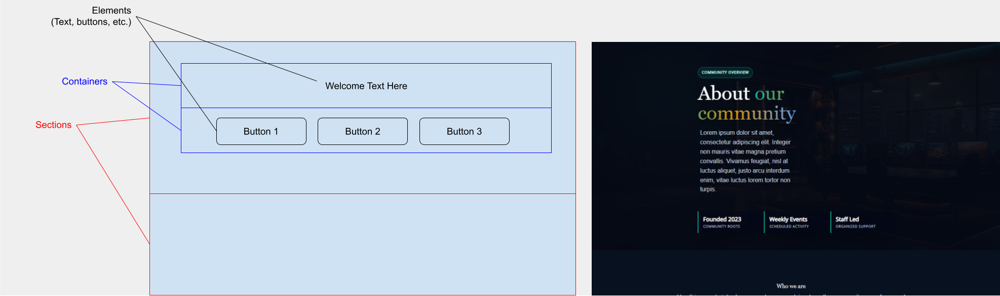
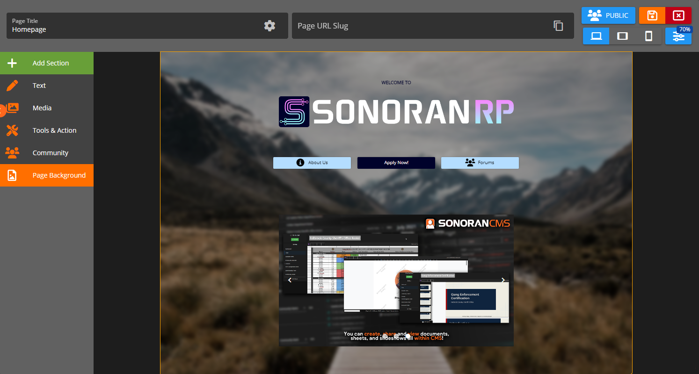
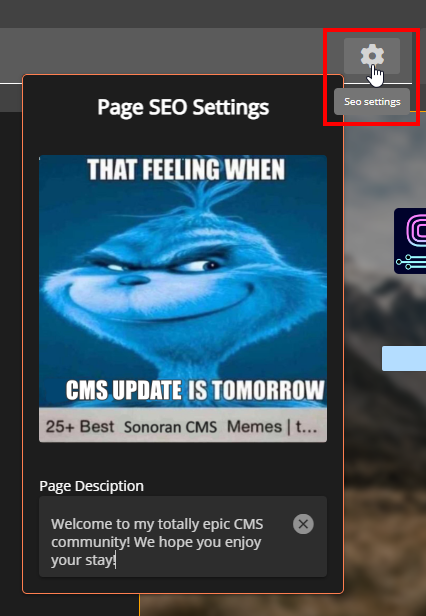
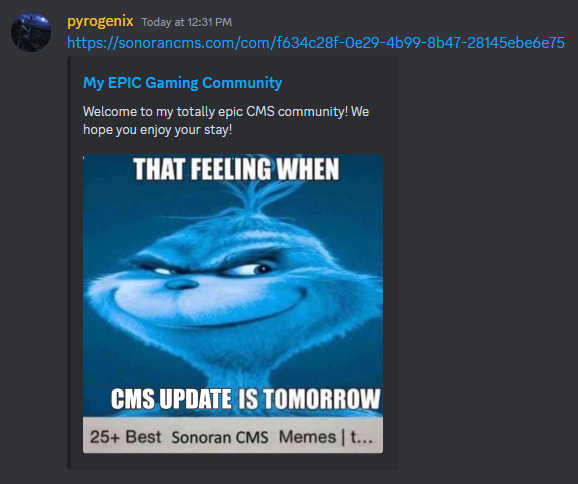

# Website Builder

<figure><figcaption></figcaption></figure>

## Page Editing

To access the website builder, navigate to **Administration Panel** > **Website Builder**

Select an existing or **Add New Page** to open the website editor.

<figure><figcaption></figcaption></figure>

### Sections and Containers

Website Sections and Containers

Custom webpages are made up of two main structural elements, sections and containers.

Sections are blocks inside the webpage. These contain multiple other containers and elements like text or images.

Containers are used to group multiple elements together, align elements horizontally or vertically, and handle spacing between elements. Containers can be nested&#x20;

<figure><figcaption></figcaption></figure>

**Section Styling**

Select the gear icon on a section to open the editor. Sections can have customized backgrounds, colors, sizing, margin, and more.

<figure><figcaption></figcaption></figure>

**Container Styling**

Similarly, select the gear icon on a container to open the editor. Here, you can customize the ordering, alignment, and spacing for the elements inside the container. Or, customize background colors, padding, etc.

<figure><figcaption></figcaption></figure>

### Elements

Webpage Elements

Elements are items like text blocks, images, buttons, etc. Elements can be dragged-and-dropped inside of a container or section from the toolbox on the right.

Once on the page, click an element to open up the editor. Or, use the resize buttons on the edges to customize the size and positioning.

<figure><figcaption></figcaption></figure>

Button Elements

If you wish to add buttons to your page, you can add a button or button group section to your page. Each button has several settings that define how the button looks like and acts. Each button can be direct users to external websites, custom forms and custom pages.

Button elements can have individual styles and button group elements can have all group styles.

You can customize by clicking on it. The styling of a button is set in the `Styles` tab, the target link a button leads to is set in the `Target` tab.

<figure><figcaption>
Sonoran CMS - Website Builder - Button Editor
</figcaption></figure>

For Button Group elements, you can add as many target links as you need, and re-order or delete them using the controls on the top right of each entry.

<figure><figcaption>
Sonoran CMS - Website Builder - Button Group Targets
</figcaption></figure>

### Screen Size Preview

Screen Size Page Preview

The top right of the page allows you to quickly view your webpage on a desktop, tablet, or mobile size. You can also zoom in and out to ensure your pages look great on all devices.

<figure><figcaption></figcaption></figure>

### Title and URL Slug

Page Title and URL Slug

At the top of the editor you can name your custom page and enter an optional custom slug. The slug (ex: `home`) defines the custom URL path to view this page.

Select the copy button in the URL slug box for the public page link.

<figure><figcaption></figcaption></figure>

## Page Permissions, SEO, and Other Options

### Privatized Pages

Private Website Pages (Rank Restricted)


Only Private Pages will have customizable permissions in the [**Rank Editor**](../user-management/creating-departments.md)


Pages can now be privatized and require permissions to view. When editing a page, you can select whether the page is public (and can thus be viewed by anyone in the community) or private.

<figure><figcaption>
Sonoran CMS - Visibility Button
</figcaption></figure>

If it's set to Private, you can use the dropdown to the right to select what ranks are allowed to view this page.

<figure><figcaption>
Sonoran CMS - Open Rank Selector
</figcaption></figure>

<figure><figcaption>
Sonoran CMS - Select Rank to View Page
</figcaption></figure>

## Default / Home Landing Page

Setting the CMS Homepage

Sonoran CMS allows you to easily customize the landing page/dashboard for your community, this page is the first page your members will see from signing into your community. This allows the full customization of a custom page for your landing page.

<figure><figcaption>
Sonoran CMS Custom Page as Dashboard Page
</figcaption></figure>

To set a Custom Page as your homepage, navigate to the main page for the Website Builder and look under the section titled `Website Pages`. Locate the page you wish to use as your homepage and press the grey gear icon then the grey home icon, this will turn it orange and set it as the landing page.

<figure><figcaption>
Sonoran CMS - Set Homepage
</figcaption></figure>

## Page SEO

Page SEO (Embed Content)

Clicking on the cog on the right side of the `Page Title` box will open the SEO panel. Here you can set a custom image and description for the website's page. These will show in embeds, such as when you paste the link in Discord.

<figure><figcaption>
Sonoran CMS - SEO Panel
</figcaption></figure>

If you have a **Standard** subscription or higher, the "Sonoran CMS" branding in the title will be removed.

Please be aware that Discord will locally cache the embed info - so updates may not show right away.

<figure><figcaption>
Sonoran CMS - SEO Discord Embed
</figcaption></figure>

Additionally, there are third party sites such as [HEY META](https://www.heymeta.com/) that can be used to check your page's "meta" tags and show it, without caching like Discord would. After you've saved the page, you can use this to verify that the image and description display how you want.

## Custom Domain

Sonoran CMS allows you to display your community website [on your own domain](../customization/custom-domain.md)!


[custom-domain.md](../customization/custom-domain.md)


## Toolbar

Sonoran CMS allows you to [customize the top toolbar](toolbar-customization.md) with buttons to link your users to whatever your community needs.


[toolbar-customization.md](toolbar-customization.md)


## HTML Elements Limits

HTML Elements Limits (Sanitization)

HTML elements get sanitized before they're saved, displayed or manipulated.

* **Allowed Tags**: A wide range of HTML tags for different purposes including:
  * Structural elements like `header`, `footer`, `main`, `nav`, `section`.
  * Text formatting tags such as `h1` through `h6`, `strong`, `em`, `b`, `i`.
  * List elements like `ul`, `ol`, `li`.
  * Table components including `table`, `th`, `td`, `thead`, `tbody`, `tfoot`.
  * Media embedding tags `img` and `iframe`.
  * Inline elements like `span`, `br`, `mark`, `small`.
  * Text semantic tags such as `time`, `code`, `var`, `samp`.
* **Attributes**:
  * Allows `style` universally.
  * For `a`: `href`, `name`, `target`.
  * For `img`: `src`, `srcset`, `alt`, `title`, `width`, `height`, `loading`.
  * For `iframe`: `src`, `height`, `width`, `name`.
* **Styles**:
  * Basic layout and visual styling such as `width`, `height`, `border`, `padding`, `margin`, `background`, `display`, `opacity`, `overflow` and `visibility`.
  * Specific regex patterns are set for `color`, `text-align`, and `font-size` to control text styling and coloring with precise formats.

