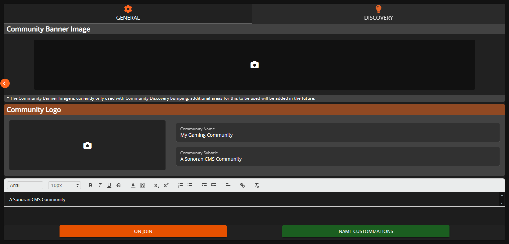
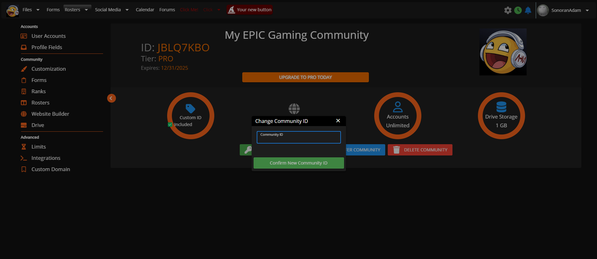
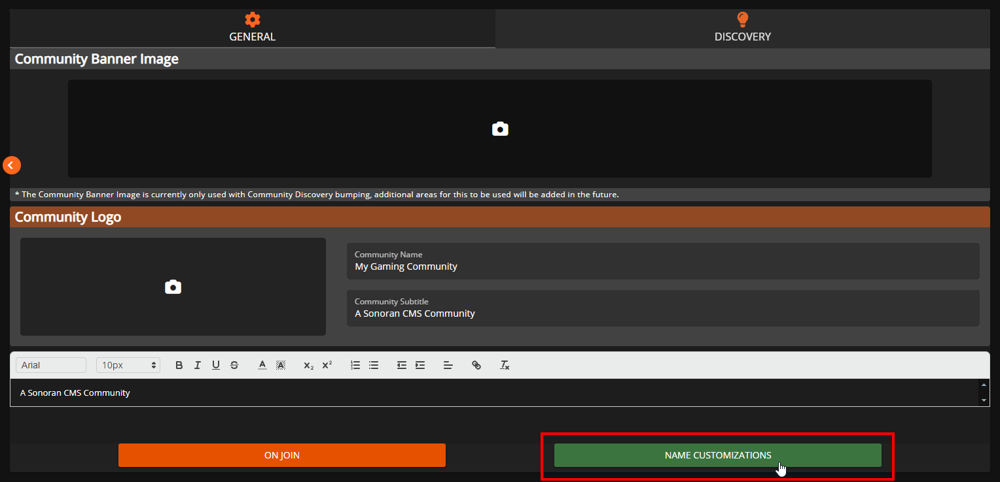
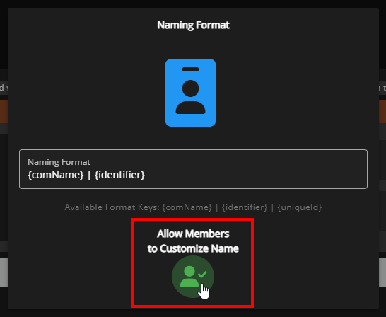
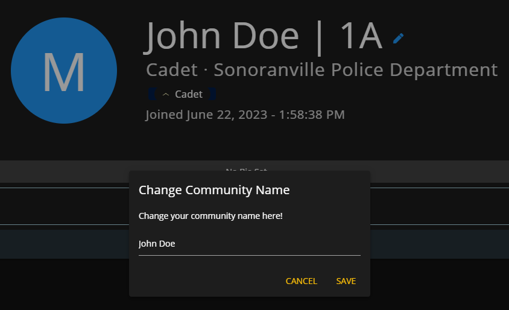
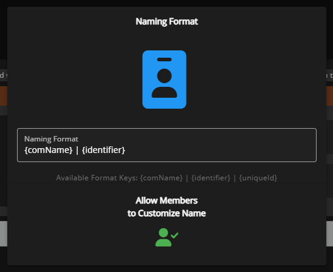
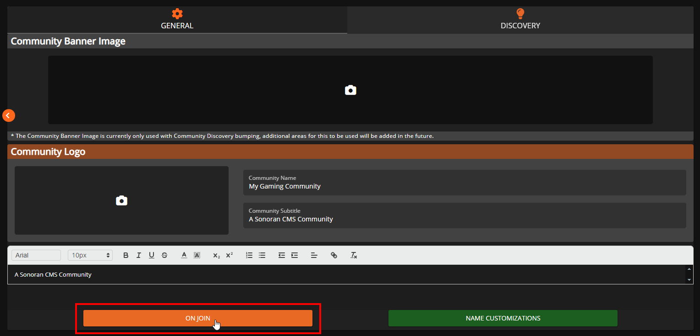
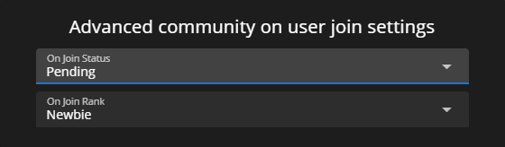

# Community Branding and Settings



## Branding Removal

Looking to remove Sonoran CMS branding on your website?


[branding-removal.md](../../pricing/pricing-faq/branding-removal.md)


## Community Information

The admin customization info section allows you to customize your community's image, name, and more! These settings can be found by navigating to `Administrative Panel` > `Customization`

| Community Logo           | 
A link to your community's logo.

This will be displayed on your community card, community dashboard, and more!
        |
| ------------------------ | ---------------------------------------------------------------------------------------------------------------------------------- |
| Banner Image             | A link to your community's banner image. This will be displayed primarily through Community Discovery advertisement notifications. |
| Community Name           | 
This is your community's name.

This will be displayed on your community card and community dashboard.
                 |
| Community Subtitle       | This is the text displayed below your community name on your community card.                                                       |
| Community Description    | This is the text displayed on your community dashboard.                                                                            |
| Website                  | This is a link to your community website, to be displayed on the community dashboard.                                              |
| Discord                  | This is a link to your community discord, to be displayed on the community dashboard.                                              |
| Name & Identifier Format | This is the format that your community users will be displayed as, for example on their profile.                                   |


**Admin Icon** will display a cog icon next to a user's Notification Center icon in the top right of the toolbar.


## Community ID and Vanity URL


Custom community IDs require the **Standard** version of Sonoran CMS or higher.\
For more information, see our [pricing](https://sonorancms.com/#/pricing) or view how to check your community [limits](../administrative/view-your-limits.md).


### **Looking to change your community ID?**

Navigate to **Administrative Panel** > **Limits**\
Click the **Change Community ID** button and enter your new community ID.

Community IDs also customize your [vanity URL](custom-domain.md#vanity-urls).\
`ID.sonorancms.com`

## Allowed Login Methods

Some communities may only want specific login methods to be available to their users. Each method can be enabled or disabled in the customization menu.

<figure><figcaption></figcaption></figure>

## Community Name Customization

Sonoran CMS allows you to set whether your member's can customize their community name or not, within the Customization editor there's a misc. setting to allow and disallow members customizing their community name.

To change this setting, click `Name Customizations` in the `General` tab.

<figure><figcaption>
Sonoran CMS - Community Customization - Advanced Misc. Settings
</figcaption></figure>

Within the `Name Customizations` tab, you can click the icon underneath where it says "Allow Members to Customize Name" to toggle whether or not members can freely change their name or not.

<figure><figcaption>
Sonoran CMS - Allow Changing Community Name
</figcaption></figure>

Members can customize their community names, if enabled, in their profile. And by clicking their name or the blue pencil icon next to it, it will then prompt to modify their community name.&#x20;

<figure><figcaption>
Sonoran CMS - Changing Community Name
</figcaption></figure>

### Naming Format

In the `Name Customizations` menu, you can also set the automatic naming format for your community. The naming format determines how a user's name is displayed in the community (e.g. on their profile, form submissions, etc.).&#x20;

<figure><figcaption>
Sonoran CMS - Naming Format Example
</figcaption></figure>

In the above image, you can see that the name is displayed on the profile as `John Doe | 1A`. In this case, the user's Community Name is set as `John Doe`, and this user has an Identifier of `1A`. To display those together like this, you would set the naming format to `{comName} | {identifier}`.&#x20;

<figure><figcaption>
Sonoran CMS - Naming Format
</figcaption></figure>

Keep in mind that this is just an example, you can change the naming format to include whatever other text you'd like to input, though as of now `Community Name`, `Identifier`, and `Unique ID` are the only things it can automatically draw from.

<table><thead><tr><th>User Information</th><th>Naming Format Variable</th><th data-hidden></th><th data-hidden></th></tr></thead><tbody><tr><td>Community Name</td><td>{comName}</td><td></td><td></td></tr><tr><td>Identifier</td><td>{identifier}</td><td></td><td></td></tr><tr><td>Unique ID</td><td>{uniqueId}</td><td></td><td></td></tr></tbody></table>

### Discord Name Sync

With the Sonoran Bot integration, you can enforce your CMS name format in your Discord Guild(s)!



## Member On Join Settings

Sonoran CMS allows you to customize whether a user's community status is active or pending when they initially join. If you select for users to join as "ACTIVE" then you'll have the option to choose a rank in which they'll automatically be granted upon join.

<figure><figcaption>
Sonoran CMS - Member On Join Settings - Button Location
</figcaption></figure>

<figure><figcaption>
Sonoran CMS - Member On Join Settings
</figcaption></figure>
