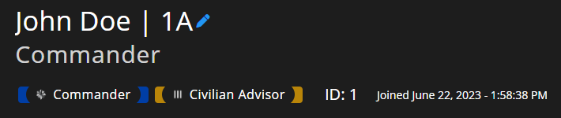

# Community Branding and Settings



## Branding Removal

Looking to remove Sonoran CMS branding on your website?


[branding-removal.md](../../pricing/pricing-faq/branding-removal.md)


## Community Information

The admin customization info section allows you to customize your community's image, name, and more! These settings can be found by navigating to `Administrative Panel` > `Customization`

.png>)

| Community Logo        | 
A link to your community's logo.

This will be displayed on your community card, community dashboard, and more!
                                                          |
| --------------------- | ------------------------------------------------------------------------------------------------------------------------------------------------------------------------------------ |
| Community Name        | 
This is your community's name.

This will be displayed on your community card and community dashboard.
                                                                   |
| Community Subtitle    | This is the text displayed below your community name on your community card.                                                                                                         |
| Name Customizations   | 
This allows customization of how community names are formatted. Many RP communities use a specific naming style. Example: <strong>Format:</strong> <code>{uniqueId}</code>
 |
| Allowed Login Methods | This controls which login methods are available for signing into the CMS community. For example, if you only want users to log in with Discord, you can disable all other options.   |
| On Join Actions       | This configures automatic actions that occur when new members join your community.                                                                                                   |


**Admin Icon** will display a cog icon next to a user's Notification Center icon in the top right of the toolbar.


## Community ID and Vanity URL


Custom community IDs require the **Standard** version of Sonoran CMS or higher.\
For more information, see our [pricing](https://sonorancms.com/#/pricing) or view how to check your community [limits](../administrative/view-your-limits.md).


### **Looking to change your community ID?**

Navigate to **Administrative Panel** > **Limits**\
Click the **Change Community ID** button and enter your new community ID.

Community IDs also customize your [vanity URL](custom-domain.md#vanity-urls).\
`ID.sonorancms.com`

.png>)

## Allowed Login Methods

Some communities may only want specific login methods to be available to their users. Each method can be enabled or disabled in the customization menu.

<figure><figcaption></figcaption></figure>

### Naming Format

In the `Name Customizations` area, you can also set the automatic naming format for your community. The naming format determines how a user's name is displayed in the community (e.g. on their profile, form submissions, etc.).

<figure><figcaption>
Sonoran CMS - Naming Format Example
</figcaption></figure>

In the above image, you can see that the name is displayed on the profile as `John Doe | 1A`. In this case, the user's Community Name is set as `John Doe`, and this user has an Identifier of `1A`. To display those together like this, you would set the naming format to `{comName} | {identifier}`.

<figure><figcaption>
Sonoran CMS - Naming Format
</figcaption></figure>

<table><thead><tr><th>User Information</th><th>Naming Format Variable</th><th data-hidden></th><th data-hidden></th></tr></thead><tbody><tr><td>Community Name</td><td>{comName}</td><td></td><td></td></tr><tr><td>Identifier</td><td>{identifier}</td><td></td><td></td></tr><tr><td>Unique ID</td><td>{uniqueId}</td><td></td><td></td></tr></tbody></table>

### Discord Name Sync

With the Sonoran Bot integration, you can enforce your CMS name format in your Discord Guild(s)!



## Member On Join Actions

Sonoran CMS lets you define what happens when users join your community — from assigning specific ranks automatically to sending a welcome message via Discord DM. You have complete control over the actions that occur when new members join.

<figure><figcaption>
Sonoran CMS - Member On Join Settings - Button Location
</figcaption></figure>

<figure><figcaption>
Sonoran CMS - Member On Join Settings
</figcaption></figure>
