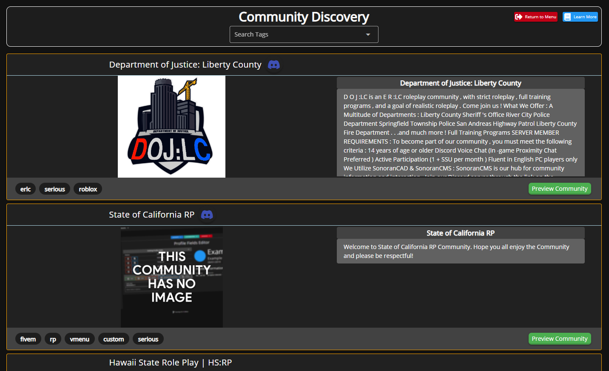
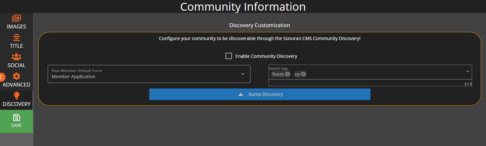

# Community Discovery



<figure><figcaption>
Sonoran CMS - Community Discover
</figcaption></figure>

Discovering and joining new communities is made simple with Sonoran CMS, when joining a community through the discovery portal you'll be greeted with the community's new member application, this will allow you to be streamlined into community's application process!


Not all communities will have the default new member application form set, if none is set you will be redirected to the community's dashboard upon join.


## Configuring Community Discovery

To begin setting up community discovery, locate the `Administrative Panel` > `Customization`. From here, click on the `Community Discovery` tab along the left-hand menu.

Once enabled your community will be shown to the thousands of users that use Sonoran CMS through the Community Discovery portal. You can also set a "New Member Application" form to be automatically shown when a user joins your community through the discovery portal.

<figure><figcaption>
Sonoran CMS - Community Discovery Configuration
</figcaption></figure>

You can also set predefined tags that better categories your community for community discovery.&#x20;


Ensure you save your Community Discovery settings by clicking the green "Save" button located at the bottom of the left-hand menu.


## Community Discovery Bump System

Head to your community customization settings located at `Administrative Panel` > `Customization`. From here, click on the `Community Discovery` tab along the left-hand menu.

If enabled, you can bump your community's discoverability every twenty (20) hours. You can bump your community by clicking the blue `Bump Discovery` button. Bumping your community will put your community at the top of the Community Discovery list.

Bumping your community will also send a predefined community advertisement in the [#advertise-here](https://ptb.discord.com/channels/611781170895781888/682365995503190028) channel in the [Sonoran Software Systems LLC's Official Discord server](https://discord.sonoransoftware.com/).

<figure><figcaption>
Sonoran CMS - Discord Official Community Advertisement
</figcaption></figure>
