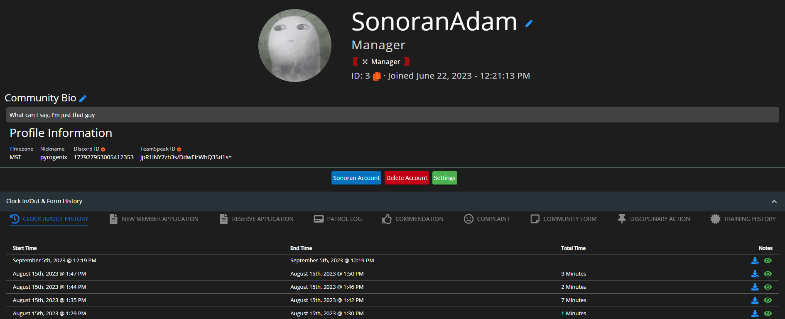
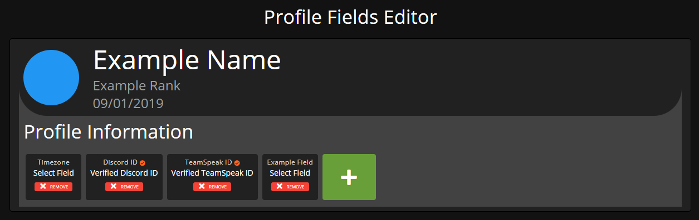
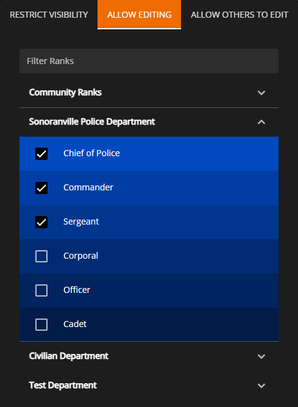
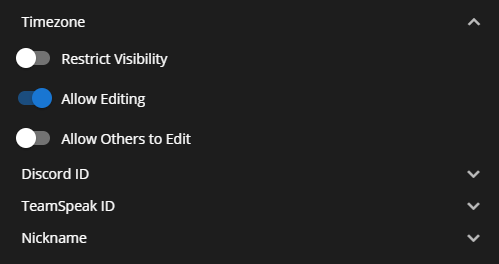
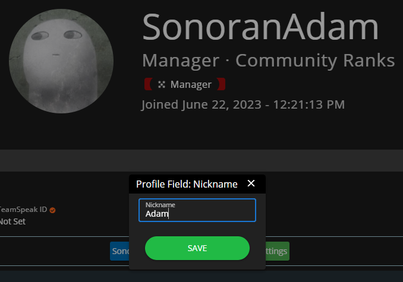
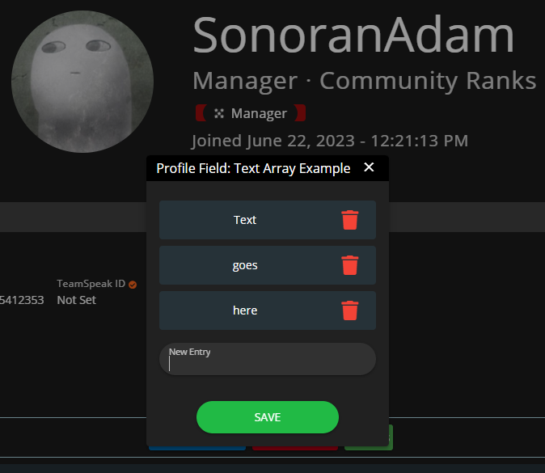

# Profile Fields



<figure><figcaption>
Sonoran CMS - Profile View - Profile Information / Profile Fields
</figcaption></figure>

Profile Fields allow communities to put direct information onto member's profiles that can be restricted to certain viewers, editors, etc. with rank permissions. Profile Fields are dynamically displayed on profiles depending on what ranks the profile you're viewing holds.

<figure><figcaption>
Sonoran CMS - Profile Fields Editor
</figcaption></figure>

Easily create and edit profile fields to your liking to fit your community's needs. Each field can be customized to have a different type and label with more to come in the future. Additionally, you can drag and drop profile field blocks to change the order in which they display on user's profiles.

### Creating Profile Fields

To start creating profile fields go to the `Administrative Panel` > `Profile Fields`.

Once you've located the editor you can start by clicking the green **New** button, this will enable the creation process. From here you'll customize the label, type, and options (if you have chosen the field type of **select**).

If you choose the field type of **select** you'll be required to enter at least one option, once you type in an option press **Enter** on your keyboard and a new option will be added.

Once you're satisfied with the customizations you made to the field you can click the orange **Save** button.

Now that you've created a field you'll want to move onto the next section detailing the permissions associated with fields.


All existing profile fields will display on the preview profile, this is how they'll appear in the member profile view.


### Managing Profile Field Permissions

Profile Field Permissions are essential to managing your fields for your members, permissions create "settings" for each field that accounts abide by when viewing profiles. Understanding these permissions will allow you to better leverage the use of Profile Fields.

Below we've outlined each permission and how they work with fields:

<table><thead><tr><th width="240">Permission</th><th width="509">Explanation</th></tr></thead><tbody><tr><td>Restrict Visibility</td><td>Only users with specified ranks are allowed to view this field.</td></tr><tr><td>Allow Editing</td><td>Users are allowed to edit this field on their profile.</td></tr><tr><td>Allow Others to Edit</td><td>Users with specified ranks are allowed to modify this field on another's profile.</td></tr></tbody></table>

In the Profile Fields editor, you can select the specific ranks that you want to apply this permission to. Click on the profile field you would like to edit, then click on `Edit Permissions` at the bottom of the box.&#x20;

This will open a box where you can select which permission you would like to modify, and within it you can select which ranks you would like to grant this permission to. In the following example, the ranks "Chief of Police", "Commander", and "Sergeant" are given permission to edit this field on their profiles.

<figure><figcaption>
Sonoran CMS - Profile Fields - Edit Permissions
</figcaption></figure>

You can also control these permissions from the Rank editor. To do this, navigate to `Administrative Panel` > `Ranks`.

Select the rank that you'd like to edit and review the permissions below while selecting which permissions you'd like to grant to the rank.

<figure><figcaption>
Sonoran CMS - Department Editor - Profile Fields Permissions
</figcaption></figure>

These permissions integrate with the permission settings in the Profile Fields editor, toggling a permission in the rank editor will automatically check the rank's box inside the Profile Fields permission editor.&#x20;

### Editing Profile Fields

<figure><figcaption>
Sonoran CMS - Member Profile - Hover on Profile Field
</figcaption></figure>

While viewing a profile you can hover over them to determine if you have edit permissions or not. Hovering over a field that you can edit will display the tooltip as shown above.

<figure><figcaption>
Sonoran CMS - Member Profile - Editing Profile Field
</figcaption></figure>

Once you've clicked a field it will give you a pop-up to begin editing the field's value. Depending on what field type it is it will display the relevant field input type. Once you're satisfied with the fields new value you can click the green **Save** button to save it on the profile.

#### Text Array Profile Field Editing

The `text array` profile field allows for multiple strings of text to be added to an individual profile field, this is useful to store notes, Steam IDs, IPs, etc.

To edit, click the "Expand" expansion located under the Profile Field Label. This will display all entries of the array. Click in the middle of the entries or if you have none, you can press the "Click Me" button. Once you're satisfied with the field's new value(s) you can click the green **Save** button to save it on the profile.


**TIP:** You can organize the order in which the entries are sorted by dragging and dropping them in the order of your preference.


<figure><figcaption>
Editing a Text Array Profile Field within Profile
</figcaption></figure>
