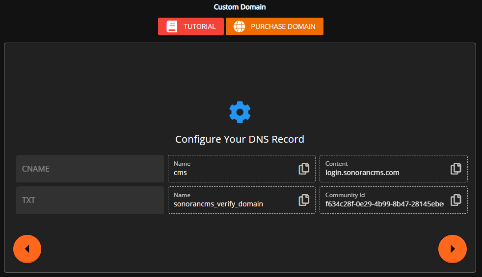

# Custom Domain / Vanity URL




Only the **Community Owner** will have access to change and view Custom Domain settings.



Custom domains require the **pro** version.\
For more information, see our [pricing](../../pricing/pricing-faq/) or view how to check your community [limits](../administrative/view-your-limits.md).



Looking for VPS, web, or dedicated hosting? Check out our official [server hosting](../../other-products/server-hosting.md)!


## Vanity URL's

Each community gets a **FREE** vanity URL, vanity URLs allow all communities to get access to the community homepage without a login.

You can also [customize your Community ID](community-branding-and-settings.md#community-id-and-vanity-url).

Your community's vanity URL can be found in your `Administrative Panel > Custom Domain`.

<figure><figcaption>
Sonoran CMS - Vanity URL
</figcaption></figure>

The vanity URL will take users to the home page created in the website builder.

<figure><figcaption>
Sonoran CMS - Homepage
</figcaption></figure>

## Custom Domain


Custom Domain requires a **Pro** subscription.


### 1. Enter your Domain Name

This can be a root domain `sonoranroleplay.com` or a subdomain `cms.sonoranroleplay.com`

<figure><figcaption>
Sonoran CMS - Custom Domain
</figcaption></figure>

### 2. Configure DNS Records for your Domain


**If you are unsure how to add a DNS record, you will need to contact your domain registrar.**\
Or, you may purchase a new domain name with [Sonoran Servers](https://sonoranservers.com/cart.php?a=add\&domain=register).


<figure><figcaption>
Sonoran CMS - DNS Record Settings
</figcaption></figure>

In your domain's DNS records, add a `CNAME` type record with:


Due to [DNS requirements](https://blog.cloudflare.com/introducing-cname-flattening-rfc-compliant-cnames-at-a-domains-root), if you wish to use the Apex / root domain instead of a subdomain  (i.e. dojrp.com vs cms.dojrp.com), you must have a domain registered with Cloudflare, or otherwise[ transfer your existing domain to Cloudflare](https://developers.cloudflare.com/dns/zone-setups/full-setup/setup/).


* `Name` set to the subdomain or `@` for the root domain (see above note)
* `Content` set to `login.sonorancms.com`.


**Some DNS providers are different!**\
\
Check with your DNS provider if using a "root domain" (i.e. sonoranroleplay.com instead of cms.sonoranroleplay.com) to see what to add as the `name`. \
\
Typically it is `@` or left blank.


You will also need to add a `TXT` type record with:

* `Name` set to `sonorancms_verify_domain`
* `Content` set to your community's UUID, which is displayed in the Custom Domain prompt.

The example record below sets `cms.sonoranroleplay.com` as the custom login page URL.

<figure><figcaption>
Cloudflare - DNS Record 
</figcaption></figure>


**Cloudflare Users:** Be sure to have the **DNS record proxy DISABLED** - and set to `DNS Only`.


If you are using Sonoran Servers, our company's server hosting, for your domain name please note the differences in how to enter the settings pictured below. Each DNS provider is a bit different and requires different input for the Host Name.&#x20;

Typically the Host Name is left blank or in this case a `@` is used to point the record at the root domain name of "`sonoranroleplay.com`"

<figure><figcaption>
Sonoran Servers - DNS Record 
</figcaption></figure>

### 3. Save the Custom Domain


When updating or changing an existing DNS record, it may take some time for the change to propagate (based on your TTL).\
\
You can try running `ipconfig /flushdns` in a Windows CMD window and restart your browser. Otherwise, you can test with other browsers/devices/users while you wait.


Press `Set Custom Domain` in the CMS to save.

<figure><figcaption>
Sonoran CMS - Set Custom Domain
</figcaption></figure>

Your new domain name will be shown below your vanity URL.

<figure><figcaption>
Sonoran CMS - Custom Domain Display
</figcaption></figure>

## Troubleshooting

### I can't see other communities when using a custom domain

Custom domains prevent other Sonoran CMS communities from being visible. You will need to use the root `sonorancms.com` domain to view multiple communities at once.
