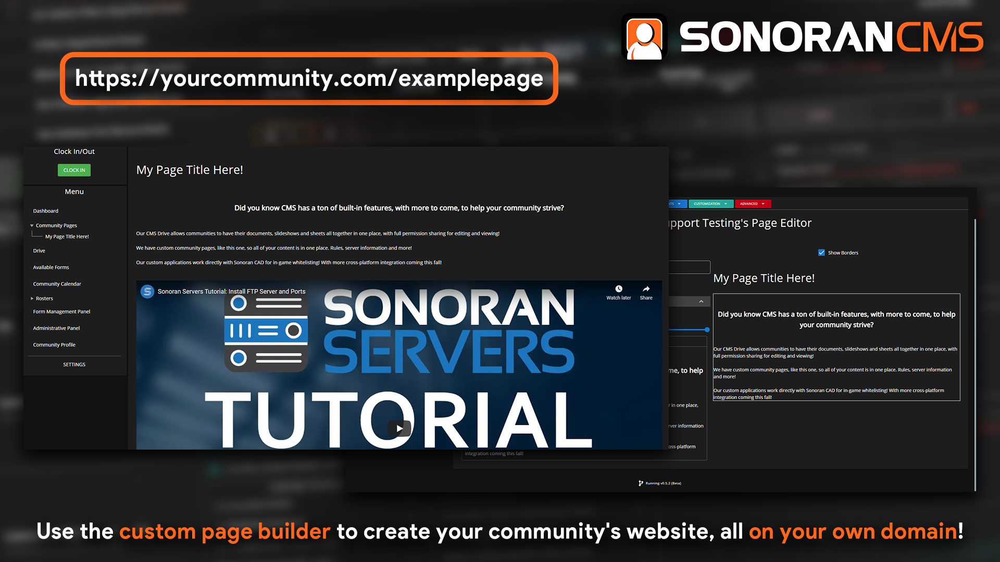

# Custom Pages

To add custom pages to your community, navigate to `Administration Panel -> Customization -> Custom Pages`

## View Your Page

Once your page is created and saved, a dropdown will appear on the dashboard showing all community pages. In this dropdown, you can select the page you want to open it up


All pages are public, you can copy the URL after going to a page and share it with anybody, they don't even have to be part of the Sonoran CMS community!


## Page Editing

To start editing a page, either add a new page or edit an existing page in the page editing admin menu.

| Section Type | Description                                                                                                                                                              |
| ------------ | ------------------------------------------------------------------------------------------------------------------------------------------------------------------------ |
| Text         | The text section includes a rich editor for including blocks of text. In this editor, you are able to set font sizes, bold, italic, underline, strike-through, and more! |
| Image        | Image sections allow you to insert one image into your page, just paste a link to the image in the text box.                                                             |
| Video        | The video section can be used to insert YouTube links into your custom page, just paste a regular YouTube link (or a shortened one) into the text box.                   |

### Section Sizes & Align

Using the slider and three align buttons, you are able to control the size and align of each section

### Custom HTML

If you wish to add custom HTML to your page, you can click the right most button of the rich text editor

In the HTML editor, you are able to write or insert your own HTML code that wouldn't be possible using the default editor.

## Toolbar

Custom pages can be setup as links from toolbar items

To setup links to community pages, go to `Admin` -> `Customization` -> `Toolbar Customization`. Create the button you'd like to see, check "Community Page Link," and select the page you want

## Custom Domain

Sonoran CMS allows you to display your community website [on your own domain](custom-domain.md)!
