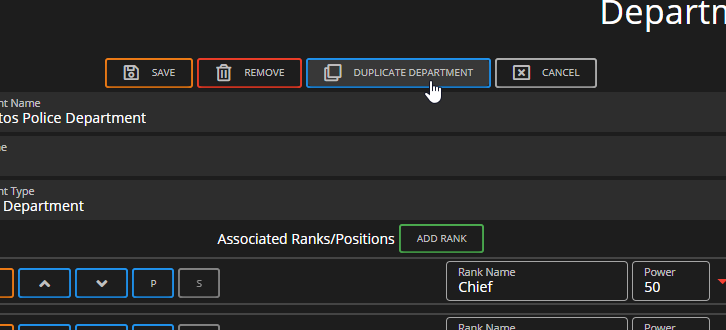
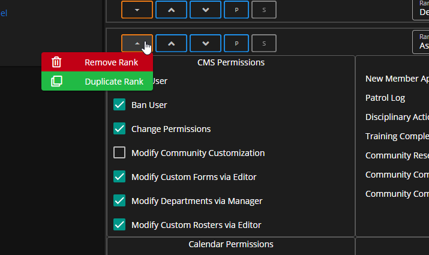

# Managing Rank Permissions

### What is the CMS Rank System?

Managing Rank Permissions can be a pain when you have several departments that all require several forms, rosters, etc. With Sonoran CMS, we've made improvements to make your life a little easier when managing permissions on ranks.

### Default Department Permissions

Each department is able to have default permissions, these permissions are applied to all ranks within the department upon permission evaluation. These are the same set of permissions that are able to be given to ranks individually.

### Duplicating Ranks & Departments

By allowing users to duplicate an entire department or a single rank, it will make creating and managing departments much easier. Duplicating a whole department will allow you to edit a department before you save the duplicated department. If you do not want to duplicate an entire department and just need to add more ranks to a department, you can duplicate a rank by hitting the orange outlined button next to the move buttons on a rank.

### Permission Copy & Paste System

While modifying or even creating ranks, you'll want to share permissions across them; you can easily copy and paste permissions across ranks by right-clicking the header permission (ex. "System," "Navigation," etc.). You can also copy an all permissions from a department and/or a rank.

### Permission Explanations

All permissions within the Department Editor have been laid out and detailed with what they do, this should aide in configuring the correct permissions for your community's needs:

#### Community System Permissions

<table><thead><tr><th width="240">Permission</th><th width="509">Explanation</th></tr></thead><tbody><tr><td>Kick Users</td><td>Granting this permission will allow a user with this rank to kick another user from the community.</td></tr><tr><td>Ban Users</td><td>Granting this permission will allow a user with this rank to ban another user from the community.</td></tr><tr><td>Change Permissions</td><td>Granting this permission will allow a user with this rank to modify another user's permissions and account details from the community.</td></tr><tr><td>Modify Community Customization</td><td>Granting this permission will allow a user with this rank to customize aspects of the Sonoran CMS platform such as Name, Image, Name/Identifier Format, etc.</td></tr><tr><td>Modify Departments via Manager</td><td>Granting this permission will allow a user with this rank to customize departments and ranks like you are doing now.</td></tr><tr><td>Modify Custom Forms via Editor</td><td>Granting this permission will allow a user with this rank to customize the custom form templates that are used when users submit forms.</td></tr><tr><td>Modify Custom Rosters via Editor</td><td>Granting this permission will allow a user with this rank to customize the roster templates that are used to display the community's roster data.</td></tr><tr><td>Modify Discord Logging Webhooks</td><td>Granting this permission will allow a user with this rank to customize the Discord webhook settings for the community.</td></tr><tr><td>Modify API Integration</td><td>Granting this permission will allow a user with this rank to customize and retrieve API credentials.</td></tr><tr><td>Modify Toolbar</td><td>Granting this permission will allow a user with this rank to customize the toolbar settings for the community.</td></tr><tr><td>Modify Pages</td><td>Granting this permission will allow a user with this rank to customize the pages for the community.</td></tr><tr><td>Modify All Documents (Drive)</td><td>Granting this permission will allow a user with this rank to manage all documents within the Sonoran CMS Community Drive.</td></tr></tbody></table>

#### Form Permissions

<table><thead><tr><th width="240">Permission</th><th width="509">Explanation</th></tr></thead><tbody><tr><td>View Submitted</td><td>Granting this permission will allow a user with this rank to view all submitted forms of this type.</td></tr><tr><td>Edit Own Form</td><td>Granting this permission will allow a user with this rank to edit their submissions of this type of form.</td></tr><tr><td>Change Form Stage</td><td>Granting this permission will allow a user with this rank to change the stage of a submitted form of this type.</td></tr><tr><td>Enable/Disable Replies</td><td>Granting this permission will allow a user with this rank to change the reply settings of a submitted form of this type.</td></tr><tr><td>Basic Reply Access</td><td>Granting this permission will allow a user with this rank to reply to a submitted form of this type if the reply settings allow for Basic replies.</td></tr><tr><td>Mod Reply Access</td><td>Granting this permission will allow a user with this rank to reply to a submitted form of this type if the reply settings allow for Basic or Mod replies.</td></tr><tr><td>Admin Reply Access</td><td>Granting this permission will allow a user with this rank to reply to a submitted form of this type if the reply settings allow for Basic, Mod, or Admin replies.</td></tr><tr><td>Submit Form</td><td>Granting this permission will allow a user with this rank to submit a form of this type.</td></tr><tr><td>Admin Delete</td><td>Granting this permission will allow a user with this rank to fully delete a submission of this form.</td></tr></tbody></table>

#### Roster Permissions

<table><thead><tr><th width="240">Permission</th><th width="509">Explanation</th></tr></thead><tbody><tr><td>View</td><td>Granting this permission will allow a user with this rank to view this roster.</td></tr><tr><td>Add Primary Row</td><td>Granting this permission will allow a user with this rank to add a user to the roster as a Primary Row (sorted initially before secondary rows).</td></tr><tr><td>Add Secondary Row</td><td>Granting this permission will allow a user with this rank to add a user to the roster as a Secondary Row (sorted after primary rows).</td></tr><tr><td>Edit Primary Row</td><td>Granting this permission will allow a user with this rank to edit a primary row in this roster.</td></tr><tr><td>Edit Secondary Row</td><td>Granting this permission will allow a user with this rank to edit a secondary row in this roster.</td></tr><tr><td>Remove Primary Row</td><td>Granting this permission will allow a user with this rank to remove a primary row from the roster.</td></tr><tr><td>Remove Secondary Row</td><td>Granting this permission will allow a user with this rank to remove a secondary row from the roster.</td></tr><tr><td>View Mod Hidden Column(s)</td><td>Granting this permission will allow a user with this rank to view roster column(s) that are marked as Mod only.</td></tr><tr><td>View Admin Hidden Column(s)</td><td>Granting this permission will allow a user with this rank to view roster column(s) that are marked as Admin only.</td></tr></tbody></table>

#### Calendar Category Permissions

<table><thead><tr><th width="240">Permission</th><th width="509">Explanation</th></tr></thead><tbody><tr><td>View</td><td>Granting this permission will allow a user with this rank to view events within this calendar category.</td></tr><tr><td>Create</td><td>Granting this permisison will allow a user with this rank to create events within this calendar category.</td></tr><tr><td>Remove</td><td>Granting this permission will allow a user with this rank to remove events within this calendar category.</td></tr><tr><td>Edit Others</td><td>Granting this permission will allow a user with this rank to edit events within this calendar category.</td></tr></tbody></table>

#### Servers Permissions

<table><thead><tr><th width="240">Permission</th><th width="509">Explanation</th></tr></thead><tbody><tr><td>Allow Whitelist</td><td>Granting this permission will allow a user with this rank to be allowed through the API whitelist (if a user holds the block permission for this server they'll be blocked as block takes precedence).</td></tr><tr><td>Block Whitelist</td><td>Granting this permission will block a user with this rank to be allowed through the API whitelist (if a user holds the allow permission for this server they'll still be blocked as it takes precedence).</td></tr></tbody></table>

#### Profile Field Permissions

<table><thead><tr><th width="240">Permission</th><th width="509">Explanation</th></tr></thead><tbody><tr><td>Attaches to Profile</td><td>Granting this permission will attach this profile field to all member's profiles that hold this rank. This will allow anyone who views your profile to see it unless either of the next two permissions are applied.</td></tr><tr><td>Hides Field from Profile Owner</td><td>Granting this permission will hide the field from the member's profile that hold's this rank.</td></tr><tr><td>Require Mod Power to View on Profile</td><td>Granting this permission will require a member to have the "View Field on Other Profiles - Mod Power" in order to view the field on a profile.</td></tr><tr><td>Require Admin Power to View on Profile</td><td>Granting this permission will require a member to have the "View Field on Other Profiles - Admin Power" in order to view the field on a profile.</td></tr><tr><td>View Field on Other Profiles - Mod Power</td><td>Granting this permission will allow a member to view this field on a profile with "Mod Power" in mind. See above permissions for association.</td></tr><tr><td>View Field on Other Profiles - Admin Power</td><td>Granting this permission will allow a member to view this field on a profile with "Admin Power" in mind. See above permissions for association.</td></tr><tr><td>Allow Profile Owner to Edit</td><td>Granting this permission will allow the member that holds this rank to edit this field on their profile. If the "Hides Field from Profile Owner" permission is granted it will ignore this permission as it won't be visible.</td></tr><tr><td>Edit Field on Other Profiles</td><td>Granting this permission will allow the member that holds this rank to edit this field on any member profiles that their able to view.</td></tr></tbody></table>
