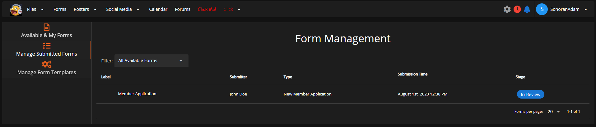

# Managing Forms



The "**Admin Delete**" permission granted under the "**Forms**" permission section allows users to delete and manage deleted forms. Once a form is "deleted" it will no longer be recognized in the system as "valid", these "deleted" forms are filtered separately from all other forms.


**Admin Delete** is a separate permission for each form template, this is not a global permission for all forms.


<figure><figcaption>
Sonoran CMS - Form Management - Deleted Forms Filter
</figcaption></figure>

Deleting & Managing Deleted Forms is all handled through the **Form Management Panel**, simply manage a form by right clicking the form's row in the table. This will allow you to either **Delete** or **Undo Delete** a form depending on what state is currently is in.


If a "**Patrol Log**" type of form is deleted it will no longer be calculated with the rest of the "patrol logs" for hour calculation.

