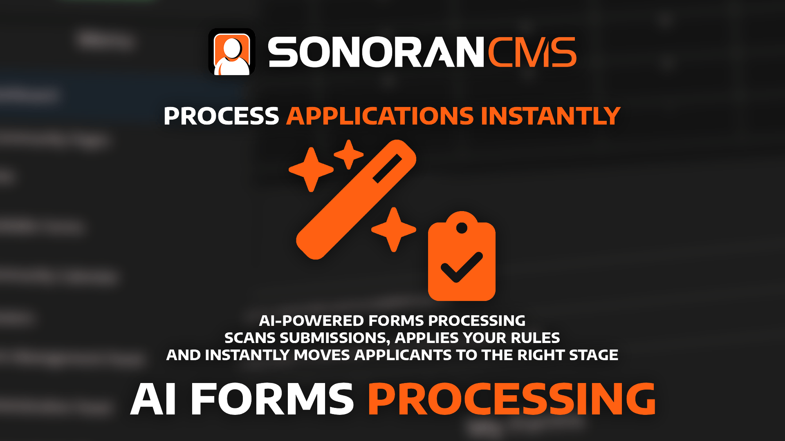

# AI Form Processing

<figure><figcaption></figcaption></figure>

## AI Forms Processing


**AI form processing is only enabled with a Pro Subscription!**

Learn more about our [paid plans](../../pricing/pricing-faq/create-and-manage-a-subscription.md).

To prevent abuse, communities are limited to **100 AI form processes per day**. If your community is actively (or realistically intends to) surpass this limit with legitimate traffic, [contact our support team](https://support.sonoransoftware.com/)!


Stop wasting time manually reviewing applications. With Sonoran CMS, your community can set custom rules to automatically score forms and seamlessly move them through the right workflow stage.

### Understanding AI Processing Stages

When a form enters a specific stage (e.g., _Awaiting Review_), you can define how the AI should evaluate the submission’s responses. Based on the scoring criteria you set, the AI will automatically advance the form to the next stage—such as _Accepted_ or _Denied_.

### Setting Section Criteria

For each section of your form, you can define criteria for the AI to score responses. Criteria can be marked as **required** or **preferred**, and each section can be assigned a **scoring weight** to determine its importance. Every section visible to the user (see: [form dependencies](creating-custom-forms.md#conditional-sections)) will be scored.

To set this up:

1. Select **Add Section**.
2. Choose the section from the drop-down.
3. Assign a weight (how much this section should influence the overall score).
4. Add your custom criteria.

Some criteria can act as **deal-breakers**. For example, if applicants must be 18+ regardless of other answers, mark that criterion as **required**.

<figure><figcaption></figcaption></figure>

### Setting Scoring Rules

In the **Scoring** section, the dropdown lets you specify a stage if any **required criteria** are missed. For example, if your application requires applicants to be 18+ but the user is underage, the form can automatically be moved to the **Denied** stage regardless of other responses.

Rules are applied according to their hierarchy and can be reordered using drag-and-drop.

Next, define the **scoring rules** that determine how forms progress:

1. Select **Add Rule**.
2. Enter the **minimum score**.
3. Enter the **maximum score**.
4. Choose the **form stage** to move to.

<figure><figcaption></figcaption></figure>

#### **Disciplinary Points & Account Flags** Rules can also include limits on disciplinary points and account flags:

* [**Account Flags**](../administrative/security-center/#account-flags) are added when alternate accounts are detected.
* [**Disciplinary Points**](../administrative/disciplinary-panel.md) are assigned by staff when users have prior infractions.

For example, you may want to prevent a form from being automatically accepted if the applicant has a flagged account or too many disciplinary points.

<figure><figcaption></figcaption></figure>

### AI Processing Reason

When the AI updates a form’s stage, it will leave a private comment on the submission explaining its scoring rationale. These private comments are visible to anyone with the `Access Private Comments` [permission](../user-management/creating-departments.md) on that form.

Additionally, the AI’s reasoning can be included in any stage action—such as a Discord webhook—to provide context on why the form was advanced to a new stage.

<figure><figcaption></figcaption></figure> <figure><figcaption></figcaption></figure> <figure><figcaption></figcaption></figure>

## Limits

To prevent abuse, all Pro communities are limited to **100 AI form submissions per 24-hour period**. Current usage can be tracked in the [**Community Limits panel**](../administrative/view-your-limits.md).

If your community requires more than 100 submissions within 24 hours for legitimate purposes, please [contact our support team](https://support.sonoransoftware.com/) to request an increased limit.

## Tips and Tricks

### Using "Likely" Accepted/Denied Stages

**AI form processing** is a powerful way to handle the majority of submissions. It can quickly filter out low-quality responses and highlight the best applications.

For critical applications—especially those that automatically add or remove ranks—it’s recommended to route them to **“Likely Accepted”** or **“Likely Denied”** stages. This ensures the AI speeds up the process while still allowing a **final human review** before a decision is made.

### Account Flags

[**Account Flags**](../administrative/security-center/account-flags.md) help protect your community against alternate accounts and ban evasion. If an applicant has active flags on their account, it’s recommended to route their submission to a **Manual Review** stage for further investigation before approval.

### Form Submission Limits

Because AI-powered forms can be processed in seconds, it’s important to guard against abuse. To prevent users from “brute forcing” submissions, communities can set limits on how often a form type can be re-submitted.

The form editor provides two control options:

* [**Submission limits**](creating-custom-forms.md#limits) – Set a maximum number of submissions allowed within a defined timeframe.
* [**Cooldown period**](creating-custom-forms.md#limits) – Require a minimum waiting time between individual submissions.

## Troubleshooting

<code>{form_ai_response}</code> variable is 'N/A'

Whenever a form is moved to a stage—whether manually or by the AI—**the stage’s actions fire immediately**.

The `{form_ai_response}` variable is automatically populated with the **latest AI reasoning reply**.

This variable is only available when the **AI itself** has moved the form from one stage to another.

<figure><figcaption></figcaption></figure>

AI is Not Moving the Stage

AI form processing applies **only** to the specific form stage where it is configured.\
To trigger AI processing, the form must be in that configured stage. Once active, the AI will:

1. Evaluate the form submission.
2. Post a response in the submission comments.
3. Move the form to the next stage (if applicable).

✅ **Valid flow:**\
`[Stage with AI Rules] → [New Stage]`

❌ **Invalid flow:**\
`[Stage without AI] → [Stage with AI]`

#### **Loop Prevention**

If the AI moves a form from **Stage A** to **Stage B**, the AI processing rules configured on **Stage B** will **not** run automatically.

This safeguard prevents recursive AI loops that could continuously move the form back and forth between stages.

