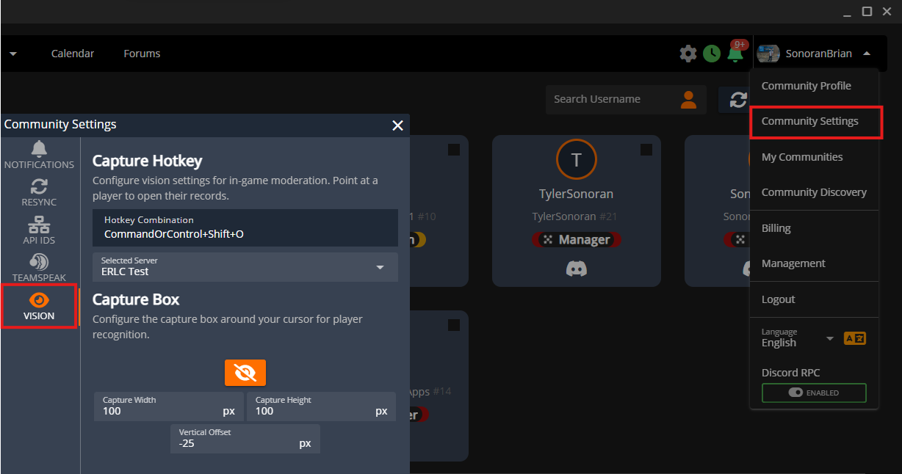

# Creating Forms



## Create a New Form

In the `Forms` panel, select the green `+` button to create a new form.

<figure><figcaption>
Create New Form
</figcaption></figure>

## Form Customization

<figure><figcaption>
Form Editor: Diagram
</figcaption></figure>

Form Editor Explained

(1) Form Title

(2) Form Type

* `New Member Application`: Allows pending users (with no ranks) to submit this form type.
* `General Form`: Any other form type, requires rank permissions to submit.

[(3) Form Settings](creating-custom-forms.md#form-settings)

(4) Save

(5) Section Header

[(6) Section Conditional](creating-custom-forms.md#conditional-sections)

(7) Question Title

(8) Question Type (Text, select, etc.)

(9) Add Section

(10) Add Question

(11) Question Subtext

[(12) Text Mask](creating-custom-forms.md#text-mask)

### Form Settings

Form settings allows you to lock and unlock submissions, set submission limits, restrict submission permissions, customize the submission board title format, and add a description.

<figure><figcaption></figcaption></figure>

#### Locking a Form

You can lock and unlock form submissions in the form settings, or from the main form editor panel. This prevents users from submitting new forms of this type.

<figure><figcaption>
Editor: Lock
</figcaption></figure> <figure><figcaption>
Forms: Lock
</figcaption></figure>

<figure><figcaption>
Available Forms: Locked Form Example
</figcaption></figure>

#### Icon or Image

The form icon/image is displayed in the available forms page and on [social embeds](../../pricing/pricing-faq/branding-removal.md#social-page-embeds).

#### Limits

Total: Restrict the maximum number of submissions per-user in the specified time window.

Cooldown: Specify the wait time between submissions within the specified time window.

<figure><figcaption>
Limits: Total
</figcaption></figure> <figure><figcaption>
Limits: Cooldown
</figcaption></figure>

#### Permissions

Easily customize what user ranks have access to submit applications, view submissions, change the form stage, and more.

<figure><figcaption>
Form Permissions
</figcaption></figure>

#### Submission Title

Customize submission titles on the form submission board with variables.

Click the `</>` icon to view available variables. Additionally, copy any form question ID (blue copy button on the question) and use that as a `{variable}` .

<figure><figcaption>
Title Format
</figcaption></figure> <figure><figcaption>
Title Variables
</figcaption></figure> <figure><figcaption>
Submission Board
</figcaption></figure>

#### Description

The form description is displayed at the top of the form when submitting. Additionally, the description will be displayed in [social embeds](../../pricing/pricing-faq/branding-removal.md#social-page-embeds) when sharing a link.

### Text Mask

Text masks allow you to force a specific format on form questions.

Ex: Mask `(###) ### - ####` forces the input to be all numbers, formatted as `(123) 456 - 7890`

| Token | Description                                        |
| ----- | -------------------------------------------------- |
| `#`   | Numeric                                            |
| `S`   | Letter, a to z, case insensitive                   |
| `N`   | Alphanumeric, case insensitive for letters         |
| `A`   | Letter, transformed to uppercase                   |
| `a`   | Letter, transformed to lowercase                   |
| `X`   | Alphanumeric, transformed to uppercase for letters |
| `x`   | Alphanumeric, transformed to lowercase for letters |

#### Conditional Sections

Sections can be displayed conditionally, based on the answer or selection of a previous section's question.

Toggle the conditional section on, select the question it will be conditional on, and enter or select the values that must be met.

<figure><figcaption></figcaption></figure>

## Form Stages

Form stages allow for automated actions when the form status/stage is changed.

Ex: When changing a user's membership application from `Pending` to `Accepted` you can send them an automated message, apply ranks, and more.

### Customizing Stages

Stages can be customized in the submission board.

<figure><figcaption>
Form Editor: Go To Submissions
</figcaption></figure>

Select the desired form to view the available stages.

Stages can be reordered via drag-and-drop.

A new stage can be added by pressing the green `+` button at the end of the row.

An existing stage can be customized by hitting the gear icon.

<figure><figcaption>
Submission Board: Add and Edit Stages
</figcaption></figure> <figure><figcaption>
Stage Editor: Style
</figcaption></figure>

The `Actions` tab allows you to customize automated actions that will occur when a submission is set to this stage.

<figure><figcaption>
Stage Editor: Actions
</figcaption></figure>

### Conditional Stages

Form stage actions can be conditional, meaning they will only trigger if a certain question response was selected.

The example action below shows that the email will only be sent if the form submitter selects `Yes` to the question `Would you like us to email you more information?`&#x20;

<figure><figcaption>
Stage Action: Conditional Question
</figcaption></figure> <figure><figcaption>
Form Submission: Conditional Question
</figcaption></figure>

### Form Submissions: Submit, View, and Change Stages


[form-submissions.md](form-submissions.md)

