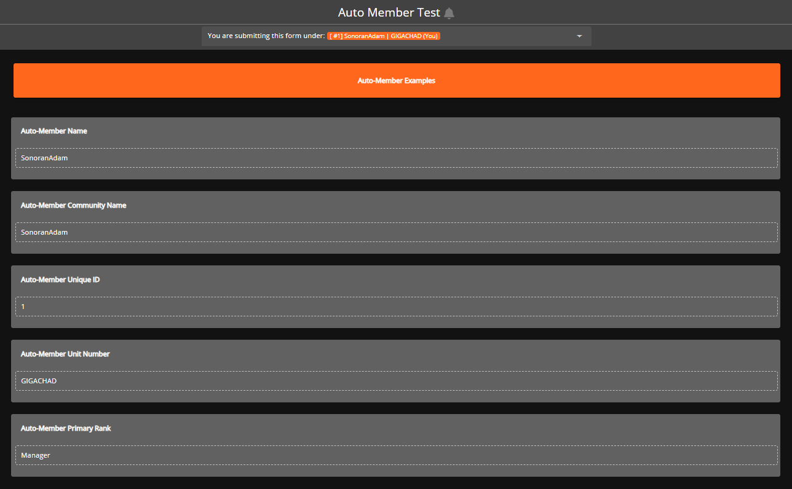
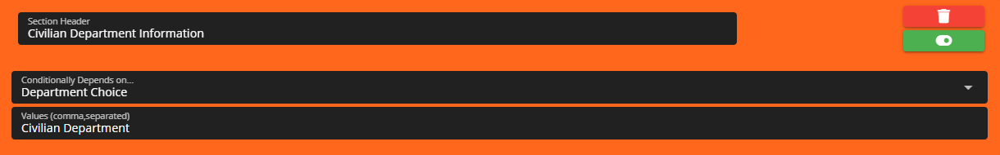

# Creating Custom Forms



Navigate to the Custom Form Editor

`Administrative Panel` > `Forms`

Within the Form Editor panel you'll be able to create custom forms designed to your liking. Here you can craft your own forms using a variety of custom field types and premade sections and will further enhance the functionality of your CMS by eliminating the need for external form sites and keeping it all in-house.


Whenever you create new custom forms you will need to explicitly give ranks permissions to the new custom forms to be used by other individuals. This can be done in the [Department Manager](../user-management/creating-departments.md).

If a user has permissions for a specific form they'll be able to see those forms in the "Available Forms" panel which is accessible on the left side bar. If a user has the permission to approve or deny a specific form they'll be able to see those forms in the "Form Management" panel which is accessible on the left side bar.


## Form Stages

Form Stages allow you to control the process (or stages) of your form. Depending on the `Form Type` you selected while creating the form, default form stages may automatically populate.&#x20;

Any form requires at least one stage in order to be used.

To begin customizing form stages, click the orange "Go To Submissions" button in the top right hand of the Form Editor page.

<figure><figcaption>
Sonoran CMS - Form Editor - Go To Submissions
</figcaption></figure>

When users submit the form, their submissions will show up underneath their corresponding stage, and administrators will drag-and-drop submissions under other stages to change the stage. This is covered in more detail in [Changing Form Stages](creating-custom-forms.md#changing-form-stages).&#x20;

You can add a new stage using the green plus button to the right, and you can customize any existing stage by clicking on the settings cog.

<figure><figcaption>
Sonoran CMS - Form Editor - Form Stage Template
</figcaption></figure>

Within a stage's settings, there will be two tabs: `Info` and `Actions`. The `Info` tab allows you to customize the stage's name, description, color, and icon.&#x20;

<figure><figcaption>
Sonoran CMS - Form Stage Editor - Info Tab
</figcaption></figure>

The `Actions` tab allows you to add "actions" that are performed when a submission is moved to that stage and is explained in [the section below](creating-custom-forms.md#form-stage-actions).

You can drag and drop stages to re-order them. The first stage will always be the "Default" stage, i.e. the stage initially given upon submission.

If you have integrated your community with our [Discord Bot](https://info.sonoranbot.com/en/tutorials/getting-started), users can be pinged when a submitted form or application has changed stages.

### Form Stage Actions

You can add actions to any stage you create. Simply click the green plus button to add actions to a new stage.

<figure><figcaption>
Sonoran CMS - Form Stages - New Action
</figcaption></figure>

The list of possible actions you can add is shown in the image below:

<figure><figcaption>
Sonoran CMS - Form Stages - Actions List
</figcaption></figure>

### Action Explanation: Change Submitter's Department/Rank

This action will allow you to modify the submitter's ranks. Additionally this allow you to set the ranks to also expire after a certain amount of time after they've been granted the rank by the action.


Checks for rank expirations are done upon each fetch of the account and not **currently** periodically checked.


This allows you to select any rank you would like to add, and any rank you would like to remove. To apply an expiration to the rank(s) simply press the dropdown button located on the rank button, this will provide you with the option to access it's Expiration Settings.

By default, it will apply these rank changes to the submitter of the form,

<figure><figcaption>
Sonoran CMS - Stages Editor - Modify Submitter's Rank
</figcaption></figure>

### Changing Form Stages

When users submit forms, their submissions will be displayed in a way that makes it simple to track what stage each submission is in.

To view all form submissions, click the orange `Go To Submissions` button in the top right hand of the Form Editor page.

<figure><figcaption>
Sonoran CMS - Form Editor - Go To Submissions
</figcaption></figure>

Once there, you can select the form whose submissions you'd like to manage on the left side, and then you will see all submissions and which stage they are in.

<figure><figcaption>
Sonoran CMS - Form Submission Manager
</figcaption></figure>

If you have the **Admin Delete** permission for a given form, you can also delete any submissions by right clicking them and selecting `Delete Form`.

<figure><figcaption>
Sonoran CMS - Delete Form Submission
</figcaption></figure>

## Question Field Types

Within a form section is its questions. These questions can take inputs from the user in a variety of formats, such as text, checkboxes, dropdown menus, date/time selectors, or can simply display information as a "label" without taking any input. Sections and questions can be re-ordered by dragging and dropping from the top-middle point.

<figure><figcaption>
Sonoran CMS - Custom Form - Example Question of type "Text"
</figcaption></figure>

### Premade Field Types

Premade sections are pre-defined sections for forms that have underlying functions. These sections will allow you to leverage further possibilities in a custom form. Below is a list of all premade sections and how they work:

**Clock In/Out**

This premade section allows your form submitters to import direct clock in entries, this will also allow integration with rosters via for the roster column type "Time Log Hours".

<figure><figcaption>
Sonoran CMS - Custom Form - Clock In/Out Section
</figcaption></figure>

#### Uploader

This upload type allows users to attach files from their computer to the form. It it compatible with PDF, Image, and Audio files, and you can choose to allow all three or only one file type.

<figure><figcaption>
Sonoran CMS - Custom Form - Uploader Section
</figcaption></figure>

#### Audio Recorder

This upload type allows users to record and embed audio directly into the form.

<figure><figcaption>
Sonoran CMS - Custom Form - Audio Recorder Input
</figcaption></figure>

### Special Input Types

Special Input Types are inputs that have underlying functions. These input types will allow you to leverage further possibilities in a custom form. Below is a list of all special input types and how they work:

**Member Selector**

This special input type allows form submitters to select **ONE** user from your community, these users are formatted with preferred format set in Community Customization. This special input type can be referenced in an "Auto Member" type question.

#### Multi-Member Selector

This special input type allows form submitters to select **MULTIPLE** users from your community, these users are formatted with the preferred format set in Community Customization. This special input type **CANNOT** be referenced in an "Auto Member" type question.

#### Auto Member Types

These special input types allows input values to be automatically generated from a "Member Selector" input or from the form submitters account. When using these input in Custom Form creation ensure to select an option from the "Field/Source to Reference".

<figure><figcaption>
Sonoran CMS - Custom Form - Member Selector &#x26; Auto Member Input
</figcaption></figure>

## Sorting Forms

Sonoran CMS allows you to organize the order in which forms appear wherever they're listed, the main area forms are seen in a specific order would be when displaying the allowed forms in "Available Forms", this will allow you to organize the order of your forms for the best experience for your members.

To change the sort of your community's forms, you can change the "Sort Order" value for each form in its editor. Smaller values (including negative numbers) indicate that it should be sorted first. For example, if `Form 2` has a sort order of 0, and `Form 1` a sort order of 13, Form 2 would appear first.

## Conditional Sections

<figure><figcaption>
Sonoran CMS - Forms Editor - Conditional Switch
</figcaption></figure>

<figure><figcaption>
Sonoran CMS - Forms Editor - Conditional
</figcaption></figure>

Conditional sections allow you to make an individual section visible based on conditions.

To enable a section to be "Conditional" simply switch the Conditional switch to "on" state for the section you would like to make conditional. Once you do that a "Dependency" selector will appear, this will provide you with all eligible fields that can be used for conditional checks. Select the field that you want to be checked for the appearance of this section. Once you've chosen a field it'll provide you with an input, provide all value(s) that you wish to be checked upon on the field.

## Opening and Closing Form Submissions

You can easily lock or unlock individual forms when you wish to make them available to your members.

This can be done by toggling the lock icon in the admin form selector menu, or in the form editor.

<figure><figcaption>
Sonoran CMS - Form Submissions Locked from Main Editor Page
</figcaption></figure>

<figure><figcaption>
Sonoran CMS - Form Submissions Locked from Settings
</figcaption></figure>

<figure><figcaption>
Sonoran CMS - Locked Form Example
</figcaption></figure>

## Limiting Form Submissions

Limit settings allow you to limit the amount of submissions users in your community are able to complete. With these various settings you're able to limit the maximum number of submissions allowed per user and specify the mandatory waiting period between submissions within the specified time window.

<figure><figcaption>
Sonoran CMS - Custom Form Editor - Limit Settings
</figcaption></figure>

**Total**\
This number is the total amount of submitted versions of this form that are allowed for each community member. _Setting this to_ `-1` _will not limit form submissions at all._

**Time Window**\
This number is the amount of days prior that the total number of submissions will be counted for. For example, if this is set to `30` and `Total` is set to `3`, then the user will be limited to a maximum of 3 submissions in the last 30 days. _Setting this to_ `-1` _will ignore submission date checks, meaning the amount of times a user can submit is limited to whatever is specified in `Total`, regardless of how much time has passed._\
\
**Cooldown**\
This number is the amount of days a user must wait following a submission before being able to submit the form again. _Setting this to_ `-1` _will allow for an indefinite amount of submissions at once, with no cooldown in between them._

## Third-Party Form Submissions


The **Submit 3rd Party Application/Form** permission is required for a user to make a third-party form submission on any given form.


You can also submit forms in reference to or on the behalf of other users. To do this, simply select their user in the dropdown menu labeled "You are submitting this form under:".&#x20;

<figure><figcaption>
Sonoran CMS - Third Party Form Submissions
</figcaption></figure>

You can also toggle the bell button to the right to both notify this user that a form has been submitted under them, as well as display this form on their profile as shown below.

<figure><figcaption>
Sonoran CMS - Third Party Form Submissions (Profile View)
</figcaption></figure>

Viewing forms in the Submissions page or the "My Forms" tab will also show if it was submitted under another user.

<figure><figcaption>
Sonoran CMS - Third Party Form Submissions (Submission View)
</figcaption></figure>

## Custom Form Folders

Forms can now be organized within folders, these folders are purely for organizational purposes and doesn't serve any other function.

<figure><figcaption>
Sonoran CMS - Form Editor - Folders
</figcaption></figure>

To create a folder simply press the green plus button and select folder, this will prompt you to provide a name for the folder to then be created. Once the folder is created you can drag and drop forms into folders to easily organize them.

## Sharing Direct Submission Access

You can directly share a Custom Form via URL to be directly submitted on, if the URL is viewed it'll automatically navigate and provide the form to be submitted. You can get the direct submission access URL by viewing it in Available Forms and grabbing your browsers URL while viewing it or you can navigate to the Custom Form Editor. And before you select a form to edit just hit the settings cog then click green share button above the delete button.

<figure><figcaption>
Sonoran CMS - Form Settings Button
</figcaption></figure>

<figure><figcaption>
Sonoran CMS - Share Forms Button
</figcaption></figure>
