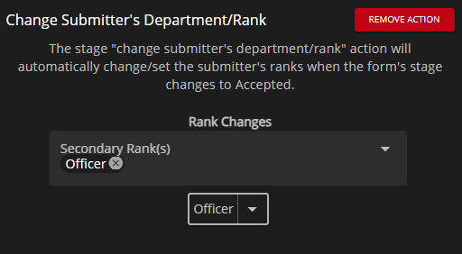

# Creating Custom Forms



Navigate to the Custom Form Editor

#### Administrative Panel > Customization > Community Forms

Within the Form Editor panel you'll be able to create custom forms designed to your liking. Although this is very similar to the Website Builder there are some specific features that have been added. For example, there are a few custom field types and premade sections that will further the functionality of your CMS.


Whenever you create new custom forms you will need to explicitly give ranks permissions to the new custom forms to be used by other individuals. This can be done in the [Department Manager](../user-management/creating-departments.md).

If a user has permissions for a specific form they'll be able to see those forms in the "Available Forms" panel which is accessible on the left side bar. If a user has the permission to approve or deny a specific form they'll be able to see those forms in the "Form Management" panel which is accessible on the left side bar.


## Form Stages

Form Stages allow you to control the process (or stages) of your form. Each for is required to have at least one stage before it can be used.

<figure><figcaption>
Form Stages Editor - Edit the flow of your forms!
</figcaption></figure>

To begin, you can either create a new stage or add an existing stage to a form. If there are no other stages, this will be the stage that is first assigned when a person submits this form (the default stage).

After pressing "Create New Stage" (or pressing "Edit" on an existing stage), you're shown an editor to modify the look and actions of that stage.

If you have integrated your community with our Discord Bot, users can be pinged when a submitted form or application has changed stages.


**Stage Label** is shown when referenced in stage actions (upon execution), Form Management and Available Forms. **Internal Label** is shown when referenced anywhere in the Administrative Panel.


<figure><figcaption>
Stage Editor - Edit a single stage
</figcaption></figure>


Stages are not unique between forms, so if two forms use the same stage then editing that stage will affect both forms


### Action Explanation: Change Submitter's Department/Rank

This action will allow you to set the submitter's ranks. Additionally this allow you to set the ranks to also expire after a certain amount of time after they've been granted the rank by the action.


Checks for rank expirations are done upon each fetch of the account and not **currently** periodically checked.


This will change the submitter's rank (and department but that's behind the scenes). To apply an expiration to the rank(s) simply press the dropdown button located on the rank button, this will provide you with the option to access it's Expiration Settings.

<figure><figcaption>
Change Submitter's Department/Rank Stage Action
</figcaption></figure>

## Sections & Fields

### Premade Sections

Premade sections are pre-defined sections for forms that have underlying functions. These sections will allow you to leverage further possibilities in a custom form. Below is a list of all premade sections and how they work:

**Patrol Start/End**

This premade section allows your form submitters to import direct clock in entries, this will also allow integration with rosters via for the roster column type "Patrol Log Hours".

### Special Input Types

Special Input Types are inputs that have underlying functions. These input types will allow you to leverage further possibilities in a custom form. Below is a list of all special input types and how they work:

**Member Selector**

This special input type allows form submitters to select **ONE** user from your community, these users are formatted with preferred format set in Community Customization. This special input type can be referenced in a "auto member x" input.

#### Multi-Member Selector

This special input type allows form submitters to select **MULTIPLE** users from your community, these users are formatted with the preferred format set in Community Customization. This special input type **CANNOT** be referenced in a "auto member x" input.

#### Auto Member Types

These special input types allows input values to be automatically generated from a "Member Selector" input or from the form submitters account. When using these input in Custom Form creation ensure to select an option from the "Field/Source to Reference".

<figure><figcaption>
Sonoran CMS - Custom Form - Member Selector &#x26; Auto Member Input
</figcaption></figure>

## Sorting Forms

Sonoran CMS allows you to organize the order in which forms appear wherever they're listed, the main area forms are seen in a specific order would be when displaying the allowed forms in "Available Forms", this will allow you to organize the order of your forms for the best experience for your members.

To change the sort of your community's forms, you can change the "Sort Order" value for each form in its editor. Smaller values (including negative numbers) indicate that it should be sorted first. For example, if `Form 2` has a sort order of 0, and `Form 1` a sort order of 13, Form 2 would appear first.

## Conditional Sections

<figure><figcaption>
Sonoran CMS - Forms Editor - Conditional
</figcaption></figure>

Conditional sections allow you to make an individual section visible based on conditions.

To enable a section to be "Conditional" simply switch the Conditional switch to "on" state. Once you do that a "Dependency" selector will appear, this will provide you with all eligible fields that can be used for conditional checks. Select the field that you want to be checked for the appearance of this section. Once you've chosen a field it'll provide you with an input, provide all value(s) that you wish to be checked upon on the field.


If the field that will be checked is a **checkbox** it will simply check if it's "checked", there won't be any reason to provide a value.


## Limiting Form Submissions

Newly introduced limit settings allow you to limit the amount of submissions users in your community are able to complete. With these various settings you're able to lock it down within the last X days, ignore archived submissions and even add a cooldown in-between form submissions.

<figure><figcaption>
Sonoran CMS - Custom Form Editor - Limit Settings
</figcaption></figure>

**# of Allowed Submissions**\
This number is the total amount of submitted versions of this form that are allowed for each community member. _Setting this to_ `-1` _will not limit form submissions at all._\
\
**Limit Submissions Within Last X Days**\
This number is the amount of days prior that submissions will be searched for, for limiting. For example, if this is set to `3` then it will only check for submissions 3 days prior from now. _Setting this to_ `-1` _will check all-time submitted versions of this form and not within the last X days._\
\
**Submission Cooldown**\
This number is the amount of days between submissions of this form. For example, if this is set to `3` then the member will have to wait three days between submitting versions of this form.\
\
**Ignore Archived Submissions**\
If checked this will not check for any submissions that are currently set to a stage that is the type of "Archived". So if a form is "Archived" it will not be searched for.

<figure><figcaption>
Sonoran CMS - Available Forms - Block Example
</figcaption></figure>

Forms that are blocked from being submitted at the current time will be shown this blocked view till the block is lifted based on the settings set for limiting. The member will not be able to submit any version of the form till they no longer meet any requirements to be blocked due to the settings.

## Custom Form Folders

Forms can now be organized within folders, these folders are purely for organizational purposes and doesn't serve any other function.

<figure><figcaption>
Sonoran CMS - Form Editor - Folders
</figcaption></figure>

To create a folder simply press the green plus button and select folder, this will prompt you to provide a name for the folder to then be created. Once the folder is created you can drag and drop forms into folders to easily organize them.

## Sharing Direct Submission Access

You can directly share a Custom Form via URL to be directly submitted on, if the URL is viewed it'll automatically navigate and provide the form to be submitted. You can get the direct submission access URL by viewing it in Available Forms and grabbing your browsers URL while viewing it or you can navigate to the Custom Form Editor. And before you select a form to edit just hit the green share button to the left of the delete button.

<figure><figcaption>
Sonoran CMS - Share Forms Button
</figcaption></figure>
