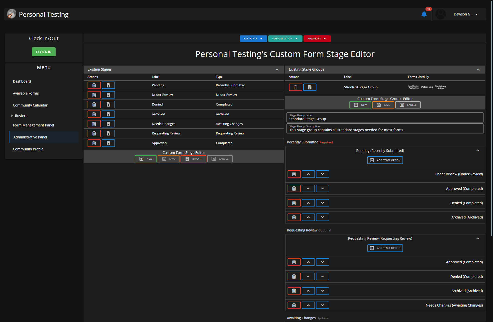
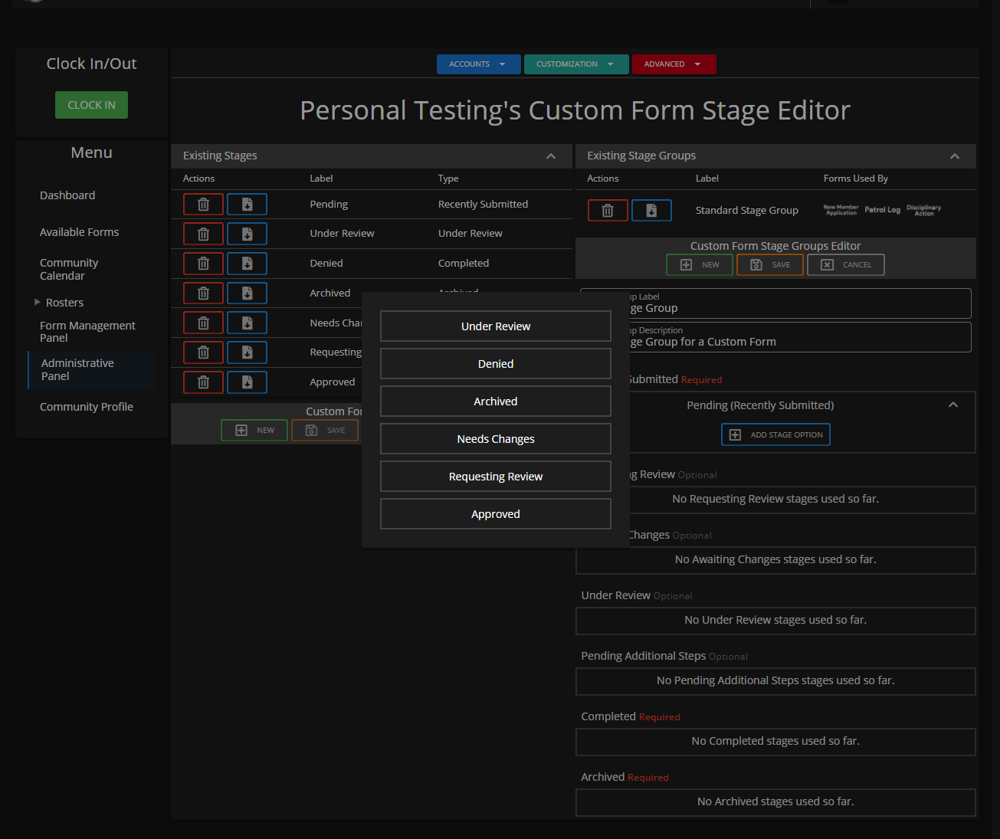

# Creating Custom Form Stage Groups


Be sure you've already [created a custom form stage](creating-custom-form-stages.md) before following this guide.



**What are Custom Form Stage Groups?**

Custom Form Stage Groups are a rough, pre-determined route a form is required to take. Think of this as how you want the form stages to play out.

If you would like for the person changing stages to have "Needs Changes", "Approved" and "Denied" while on the "Pending" stage you can.

Groups allow you to choose what stage(s) are shown at each stage the form has the potential of being on.


#### Administrative Panel > Customization > Custom Form System > Custom Form Stage Editor

Within this "Custom Form Stage Editor" panel you'll be able to create custom stage groups that have stages in a rough, pre-determined route.

You can choose what stage(s) are available depending on what the current stage is for the form.&#x20;


Custom Form Stage Groups must be set on forms via the Custom Form Editor in order for the group stages to be used.


## Creating Stage Groups Guide

### 1. Press New & Fill out Information

Fill out the various inputs with information that you will want to use:

1. Stage Group Label (Example: Community Form Stage Group)
2. Stage Group Description (Example: This stage group contains all standard stages needed for most forms.)

### 2. Begin Setting Stages

1. Select `Click to Set Recently Submitted Stage` to begin. These popups will only display stages that are available for that type.
2. Expand the newly created stage and select `Add Stage Option`.&#x20;
3. Select the desired options to be shown to the user when their form is in that stage.
4. Continue this for all of the required stages and ensure every stage has a complete route.\
   Ex: _Recently Submitted -> Completed/Archived_

_"Recently Submitted" is the only stage type on the group editor that allows you to click the text to select a stage. From here, stages are only available to be added as "Stage Options."_

_"Stage Options" are the stages set to be available to an individual when they attempt to change the stage of a form that is currently set to use that stage group and is on that specific stage._

_For example, suppose Form A is using stage group, Standard. In that case, when that form is on the "Under Review" stage, I can choose only to have "Approved," "Denied," "Needs Corrections," etc., only available to the individual changing the form's stage._

