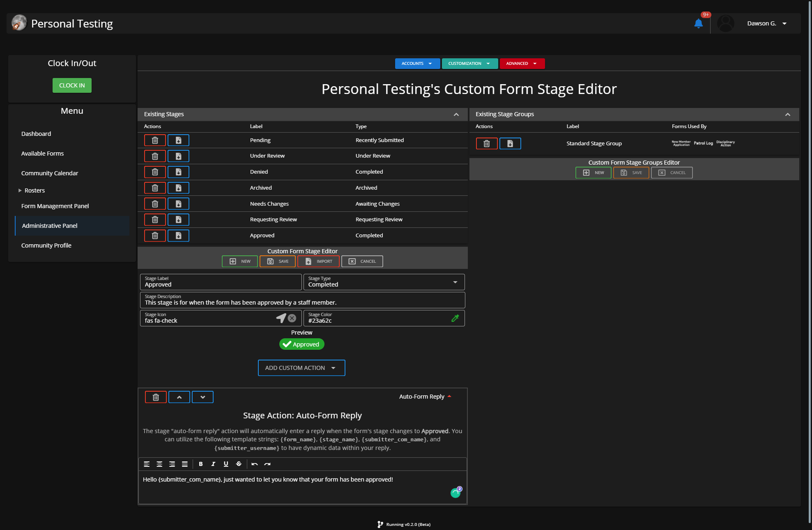
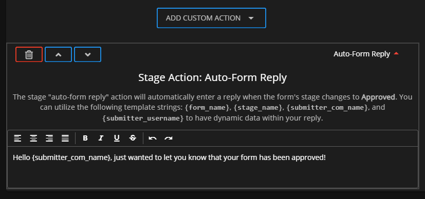

# Creating Custom Form Stages


**What are Custom Form Stages?**

Custom Form Stages are different statuses a custom form can go through. Each "stage" can have customizable action(s) and functions.\
\
These stages eventually get used in Stage Actions that are explained in the next guide.


## Navigate to the Custom Form Stage Editor

#### Administrative Panel > Customization > Custom Form System > Custom Form Stage Editor

Within this "Custom Form Stage Editor" panel you'll be able to create custom stages.

Custom stages each have configurable actions. These stages can also be looked at as different statuses a form can go through while executing customizable actions.


**Custom Form Stages** are powerless on their own, they must be put into a custom form stage group to be used in a custom form setting.

Additionally, once the group has been created it must be selected and saved on a specific form to be used on that form. Each group can be used on more than just one form.


## Creating Stages Guide

### 1. Press New & Fill out Information

Fill out the various inputs with information that you will want to use:

1. Stage Label (Example: Approved)
2. Stage Type (Example: Completed)
3. Stage Description (Example: This stage is for when the form has been approved by a staff member.)
4. Stage Icon (Example: [fas fa-check](https://fontawesome.com/v5.15/icons/check?style=solid))
5. Stage Color (Example: <mark style="color:green;">#23a62c</mark>)

Once you've filled out all of that information the stage has been created. However you can add custom action(s).

### 2. Add Custom Action(s)

Click the blue "Add Custom Action" button.

Here you'll be prompted with several different types of actions. For this guide we'll go with Auto-Form Reply.

Simply fill out the information it's asking for in the respective custom action. You can add multiple actions per stage if your Sonoran CMS plan allows it.
